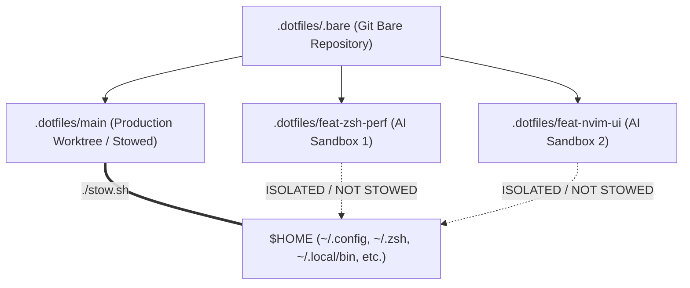
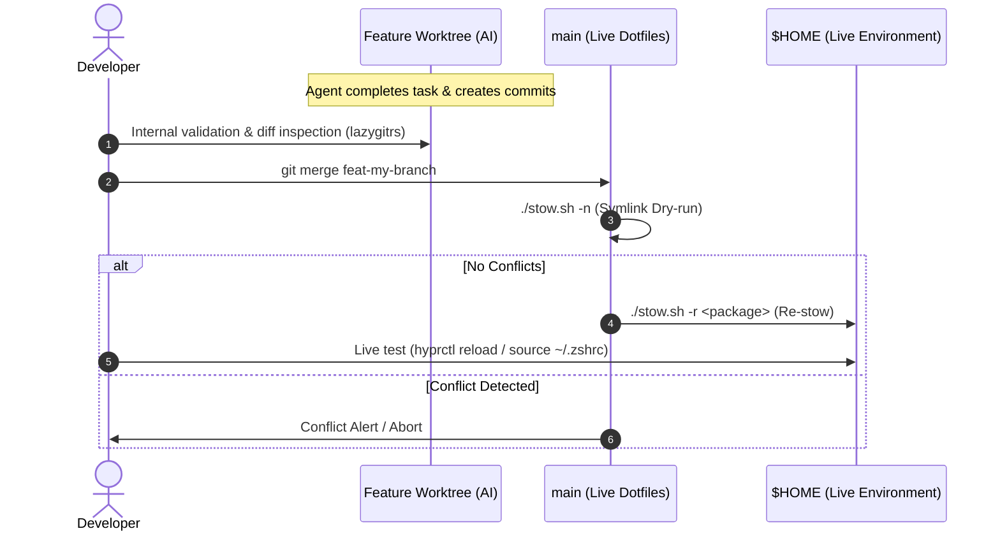
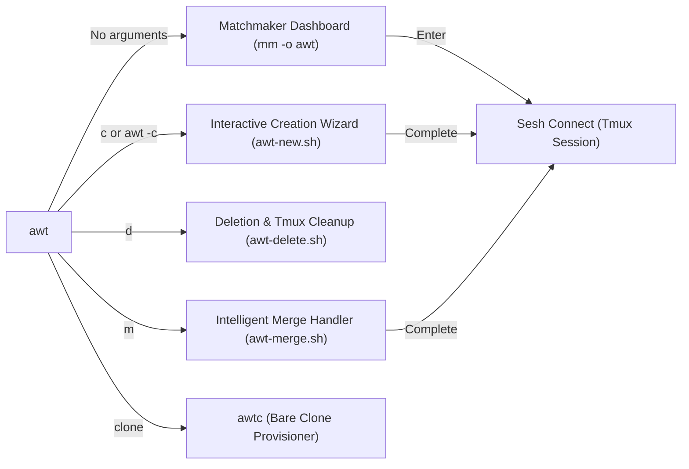
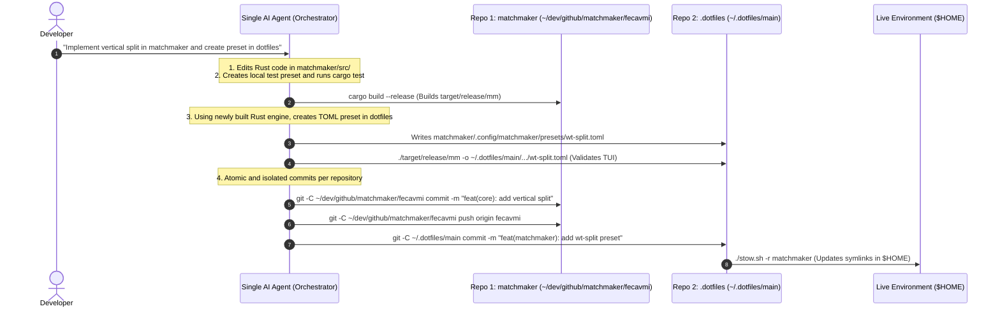

# Git Worktree Workflow for Multi-Agent AI Development

This document defines the architectural, ergonomic, and operational standard for parallel development with multiple AI agents in dotfiles and satellite repositories.

---

## 1. Repository Architecture: `.bare` + Worktrees

### The Problem with Traditional Git vs. The Superiority of the `.bare` Model

In conventional Git (`git clone`), the project root contains both the hidden `.git` folder and the active branch's source code. When creating worktrees in this format, the developer is forced to:
1. Create subdirectories inside the repository itself (polluting `git status` and search indexing); or
2. Create detached external directories with inconsistent file paths.

With the **`.bare` Container Model**, the repository is cloned in bare mode (`.bare`), transforming the project root into a **Sibling Worktree Container**:

```
~/dev/github/matchmaker/ (Project Container)
├── .bare/               (Shared Git object database)
├── main/                (Main branch worktree)
├── feat-preview/        (Sibling worktree - AI Agent 1)
└── fix-parser/          (Sibling worktree - AI Agent 2)
```

#### Advantages of the `.bare` Model:
* **Isometry and Symmetry**: The `main` branch and feature branches share identical structural status.
* **Complete Isolation**: Removing a branch (`wt remove feat-x`) simply deletes the sibling folder `feat-x/`, with zero risk of corrupting the Git object database in `.bare/`.
* **Zero Pollution**: No file or build artifact from one branch ever leaks into another branch.
* **Ideal for Dotfiles (GNU Stow)**: Allows only `main/` to be stowed to `$HOME`, while all other worktrees operate as **safe AI sandboxes**.



### Fundamental Security Rules in Dotfiles
1. **`main/` is the only Stowed Worktree**: `$HOME` strictly symlinks to `~/.dotfiles/main/`.
2. **Feature Worktrees are Sandboxes**: AI agents operate in isolated worktrees (`~/.dotfiles/<branch>`). Hallucinations, syntax errors, or accidental file deletions never break the live desktop environment.
3. **Mandatory Symlink Validation**: Before merging any changes into `main`, running `./stow.sh -n` (dry-run) is strictly required to verify link integrity.

---

## 2. Tmux + Sesh Topology: Session Mapping and Ergonomics

The ergonomic model is **1 Worktree = 1 Tmux Session (via `sesh`)**.

```
tmux (Server)
├── Session: dotfiles@main (Production / Live)
│   ├── Window 1: Primary Shell
│   ├── Window 2: lazygitrs
│   └── Window 3: Logs / Tests
│
├── Session: dotfiles@feat-zsh-perf (AI Agent 1)
│   ├── Window 1: AI Agent (agy / opencode)
│   └── Window 2: Local worktree tests
│
└── Session: dotfiles@feat-nvim-ui (AI Agent 2)
    ├── Window 1: AI Agent (claude / agy)
    └── Window 2: Neovim sandbox
```

### Why 1 Session per Worktree?
- **CWD Isolation**: Each session operates at the root of its respective worktree.
- **Fluid Transition**: Instant switching via `Prefix + s` or the Matchmaker picker (`mm -o awt`).
- **Automated Hooks**: `sesh.toml` configurations launch sandboxes (`ai-jail agy`) automatically upon attaching to the session.

---

## 3. Merge and Testing Strategies in `main`

Because only `main/` is linked to `$HOME`, testing changes in the active system requires integration with the main branch.



### Operational Step-by-Step Guide:
1. **Switch to the `main` worktree**:
   ```bash
   sesh connect ~/.dotfiles/main
   # or via terminal
   cd /home/fecavmi/.dotfiles/main
   ```
2. **Execute the merge**:
   ```bash
   git merge feat-my-branch
   ```
3. **Validate and Re-stow**:
   ```bash
   ./stow.sh -n           # 1. Verify link integrity (dry-run)
   ./stow.sh -r <package> # 2. Update symlinks in $HOME
   ```
4. **Reload the affected component**:
   - Hyprland: `hyprctl reload`
   - Zsh: `source ~/.zshrc`
   - Waybar: `killall waybar; waybar &`

---

## 4. Rollback and Reversion Management

If after merging and testing in `$HOME` you need to undo a change or revert a feature commit:

```mermaid
graph TD
    A["Merged into main & Tested in $HOME"] --> B{"Satisfied with result?"}
    B -->|Yes| C["wt remove feat-branch && git branch -d feat-branch"]
    B -->|No| D{"Has main already been pushed?"}
    
    D -->|No (Local)| E["In main: git reset --hard HEAD~1"]
    E --> F["./stow.sh -r <package> (Restores previous $HOME)"]
    F --> G["In feature branch: fix or git revert <commit>"]
    
    D -->|Yes (Remote)| H["In main: git revert -m 1 <merge-commit>"]
    H --> I["./stow.sh -r <package> && git push origin main"]
    I --> J["In feature branch: apply incremental fixes"]
```

### Scenario A: `main` is Local-Only (Most Common in Dotfiles)
1. **Undo the merge in `main`**:
   ```bash
   git reset --hard HEAD~1
   ./stow.sh -r <package>
   ```
   *Your `$HOME` immediately returns to the previous stable state.*

2. **Adjust in the feature branch**:
   In the feature worktree session:
   - To discard the last commit: `git reset --hard HEAD~1`
   - To revert an intermediate commit: `git revert <commit-hash>`
   - To refactor: Ask the AI agent to correct the desired logic.

3. **Re-test**:
   Perform a new merge into `main` and re-stow.

### Scenario B: `main` Has Already Been Pushed to Remote
1. **Revert the merge commit in `main`**:
   ```bash
   git revert -m 1 HEAD
   ./stow.sh -r <package>
   git push origin main
   ```
2. **Work on the feature branch**:
   Create new fix commits (`fix: ...`) before attempting a new integration.

---

## 5. Division of Responsibilities: AI vs. Manual

| Action | Who Executes? | Rationale |
| :--- | :---: | :--- |
| **Branch creation and code authoring** | 🤖 **Autonomous AI** | Fast, sandbox-isolated, zero risk to `$HOME`. |
| **Commit generation** | 🤖 **AI with Conventional Commits** | Adheres to `.commitlintrc.json` and `git/GC_SGC.md`. |
| **Diff inspection and review** | 👤 **Developer (via lazygitrs)** | Visual inspection with TUI popup (`Prefix + g`). |
| **Merge into `main` and Re-stow** | 🤖 **Supervised AI / 👤 Developer** | AI can execute when requested, but **must always run `./stow.sh -n` first** and confirm before applying. |
| **Rollbacks and destructive resets** | 👤 **Developer or Assisted AI** | Prevents unintended `git reset` loops. |

---

## 6. Where to Configure Each Responsibility?

1. **`AGENTS.md` (Ground Truth / Inviolable Rules)**:
   - Contains constraints all agents read prior to executing any action (e.g. "Never stow feature worktrees to $HOME", "Always validate symlinks with `./stow.sh -n`").
2. **`docs/GIT_WORKTREE_AGENTIC_WORKFLOW.md` (This Document)**:
   - Complete architectural guide referenced by `AGENTS.md` and available for human and agent reference.
3. **Skills (`~/.agents/skills/` or `.agents/skills/`)**:
   - Operational skills for specific commands (e.g. automated worktree creation, assisted merge with lint and stow verification).

---

## 7. The `awt` (Agent Worktree) Ecosystem with Matchmaker & Sesh

`awt` is the unified worktree and AI agent orchestrator, built natively on top of **Matchmaker (`mm`)**, **Sesh**, **Tmux**, and **Worktrunk (`wt`)**.



---

### A. Interactive Matchmaker Dashboard (`awt.toml` / `mm -o awt`)

Executed by running `awt` without arguments in the terminal:

```text
┌──────────────────────────────────────────────────────────────────────────────────────────┐
│ BRANCH            BASE    STATUS    MAIN ↕   REMOTE ⇅   AGE     COMMIT   SESSION         │
│ @ feature/wtmm    main    ✔         Synced   Synced     2h      a011829  matchmaker/...  │
│ ^ main            -       ✔         Synced   Synced     1d      61026ee  matchmaker/main │
│   feat/oauth2     main    ? ✗ (+2)  ↑1       ⇣2         45m     f492ac1  matchmaker/...  │
└──────────────────────────────────────────────────────────────────────────────────────────┘
```

#### Dashboard Features:
1. **Active Nav Mode**: Fast Vim-style navigation (`j`, `k`, `g`, `G`) with clean navigation bar.
2. **Visual Markers**:
   - ` <branch>` (Cyan / Bold): Currently active worktree attached to your terminal.
   - `󰊢 <branch>` (Yellow / Bold): Primary base branch (`main` / `master`).
3. **Rich Colored Metadata**:
   - `BASE`: Git-configured base branch (`branch.<name>.base`).
   - `STATUS`: Clean (`󰄬` green) or Modified with change count (`󰅖 (+N)` red).
   - `MAIN ↕`: Divergence relative to `main` (`󰞕N` ahead green, `󰞒N` behind red).
   - `REMOTE ⇅`: Divergence relative to remote upstream (`󰞕N` unpushed, `󰞒N` unpulled).
   - `AGE` & `COMMIT`: Relative time since last commit and abbreviated hash.
4. **Multi-Layout Real-Time Previews (`p` / `ctrl-p`)**:
   - **Tab 1**: `Git Status & Local Changes` + Commit Graph (`git log --graph`).
   - **Tab 2**: `Diff vs Main` (Comparative Merge Base).
   - **Tab 3**: `Commit History & Stats` (File change statistics).

---

### B. Interactive Branch Creation Wizard (`c` / `ctrl-n` / `awt-new.sh`)

Triggered by pressing **`c`** inside Matchmaker or by running **`awt -c`**:

```text
[Step 1: Type via mm]  ◄──(Esc)──  [Step 2: Branch Name]  ◄──(Esc)──  [Step 3: Base via mm]
          │                                 │                                   │
          └──(Enter)────────────────────────┴──(Enter)──────────────────────────┴──(Enter)──► 🚀 Sesh
```

#### 4-Step Architecture:

1. **Step 1: Conventional Type Selection (`mm -o awt-type`)**:
   - Uses the modular preset [`awt-type.toml`](file:///home/fecavmi/.dotfiles/main/awt/.config/matchmaker/presets/awt-type.toml).
   - Presents conventional types in unified single columns with matching ANSI colors and Nerd Font icons:
     ` feat`, ` fix`, `󰣪 refactor`, `󰓅 perf`, ` ci`, ` chore`, `󰧮 docs`, `󰙨 test`, `󰏖 build`, `󰓹 custom`.
   - `Esc`: Aborts and returns directly to the main `awt` dashboard.

2. **Step 2: Branch Name via Native Matchmaker Prompt (`mm -o awt-prompt`)**:
   - Opens a dedicated Matchmaker prompt with the selected type icon and prefix pre-filled:
     ```text
      Branch name: feat/auth-oauth2_

      [Enter] Confirm  •  [Esc] Back
     ```
   - **Full Line Editing**: Native cursor navigation, backspace, and clipboard paste powered by Matchmaker's engine.
   - **Instant `Esc`**: Returns to Step 1 (`awt-type`).
   - **Instant `Enter`**: Submits the branch name to Step 3 (`awt-base`).
   - **State Memory**: Navigating back from Step 3 preserves the previous slug in the input buffer.

3. **Step 3: Base Branch Selection (`mm -o awt-base`)**:
   - Uses the modular preset [`awt-base.toml`](file:///home/fecavmi/.dotfiles/main/awt/.config/matchmaker/presets/awt-base.toml).
   - **Dynamic Row 0 Pre-selection**: The currently focused or active branch is automatically highlighted at **Row 0** (` <branch> current base`), followed by ` main (default base)` and all other local branches with commit hashes.
   - **Single Keypress Confirmation**: If you want to branch from the selected branch, simply press **`Enter`** (1 stroke).
   - `Esc`: Returns to Step 2 with the branch name pre-filled.

4. **Step 4: Provisioning, Hooks & Automated Session Switch**:
   - Creates the sibling worktree via `wt switch --create "$branch" --base "$base"` or `git worktree add`.
   - Saves base branch configuration: `git config branch.<name>.base "$base"`.
   - Executes the [`post-create.sh`](file:///home/fecavmi/.dotfiles/main/awt/.config/matchmaker/hooks/post-create.sh) lifecycle hook (replicating `.env` and triggering repo-level setup).
   - Connects instantly via `sesh connect "$target_dir"`, launching **`agy`** (Antigravity CLI) in the new session.
   - Automatically closes the floating popup modal (`tmux display-popup -C`) with clean signal trapping (`trap 'exit 0' HUP INT TERM`), landing you directly inside the new workspace without error banners or duplicate commands.

---

### C. Smart Tmux Session Connection & Single-Execution Guard

To prevent Sesh from re-triggering `startup_command = "agy"` in sessions that already exist or during worktree provisioning, the [`awt`](file:///home/fecavmi/.dotfiles/main/awt/.local/bin/awt) CLI binary and [`awt-popup.sh`](file:///home/fecavmi/.dotfiles/main/awt/.config/tmux/awt-popup.sh) modal implement **direct session resolution & creation guards**:

1. **Preset Emits Name and Path**: `awt.toml` outputs `{=session}\t{=path}\t{=raw}` (e.g. `matchmaker/feature-images\t/home/fecavmi/...\tfeature/images`).
2. **Already in Active Session**: If the selected session is the currently focused terminal, Matchmaker closes cleanly without altering buffer or AI conversation history.
3. **Background Session**: Sesh connects directly by **session name** (`sesh connect "matchmaker/feature-images"`), switching clients without re-injecting startup commands.
4. **Provisioning Guard**: `awt-new.sh` manages worktree creation and Sesh connection with a temporary guard file (`/tmp/awt_new_created_$USER`), preventing the parent `awt-popup.sh` from triggering a duplicate `sesh connect` call upon exit.

---

### D. Safe Deletion Handler with Native Action Box (`d` / `ctrl-d` / `awt-delete.sh`)

When pressing **`d`** on any row in `awt`:

1. **Base Protection**: Instantly blocks deletion of the default base branch (`main` or `master`).
2. **Native Instant Action Box (`Confirm(...)`)**:
   Opens the native Matchmaker popover drawn directly on the TUI canvas:
   ```text
   [ 🗑️ Delete worktree feat/auth? (Enter/Esc) ]
   ```
   - **`Enter`**: Confirms deletion, removes worktree, terminates Tmux session, and reloads the list immediately (`Reload`).
   - **`Esc` or `q`**: Instantly cancels and closes the popover without modifying files.
3. **Complete Git Cleanup**: Executes `wt remove` / `git worktree remove -f` and deletes the branch (`git branch -D`).
4. **Redirection and Session Cleanup**:
   - **Current Active Session**: Runs `sesh last` (or `tmux switch-client -l`) to redirect to the previous session before killing the deleted session (`tmux kill-session`).
   - **Background Session**: Kills the Tmux session and automatically triggers Matchmaker's `Reload` macro without closing the picker!

---

### E. Intelligent Worktree Merge Handler (`m` / `awt-merge.sh`)

When pressing **`m`** on any row in `awt`:

1. **Flexible Source & Target Detection**:
   - **Merge into Base / Main**: If cursor is on the active branch (`@`), target is automatically the configured base branch (`branch.<name>.base` or `main`).
   - **Merge into Any Other Branch**: Moving cursor to any branch in the list (e.g. `fecavmi`, `staging`, `main`) sets that branch as the **exact target** of the merge!
2. **Native Action Box Confirmation**:
   ```text
   [ 🔀 Merge into fecavmi? (Enter/Esc) ]
   ```
3. **Safe Execution and Session Transition**:
   - Executes merge (`wt merge <target>` or `git merge`).
   - **On Success**:
     - Removes source worktree directory (`wt remove`).
     - Deletes merged branch in Git (`git branch -d`).
     - Switches active Tmux session to target branch (`sesh connect`).
     - Terminates old feature Tmux session.
   - **On Conflict**:
     - Keeps both worktrees intact and alerts the terminal for safe conflict inspection and resolution.

---

### F. Repository Cloning in Bare Mode (`awtc` / `awt clone`)

Zsh function in [functions.zsh](file:///home/fecavmi/.dotfiles/main/zsh/.zsh/utils/functions.zsh) provisioning new repositories with `.bare` container + worktree architecture:

```bash
# Clone from GitHub (user/repo):
awtc fcmiranda/matchmaker

# Or via integrated subcommand:
awt clone fcmiranda/matchmaker

# Clone from full URL (HTTPS or SSH):
awtc https://github.com/astral-sh/uv.git
awtc git@github.com:joshmedeski/sesh.git
```

#### Automated Steps:
1. Creates container folder `~/dev/github/<repo>/`.
2. Clones repository in bare mode to `~/dev/github/<repo>/.bare`.
3. Sets `remote.origin.fetch` refspec to guarantee remote branch tracking.
4. Identifies default branch (`main`, `master`, etc.) and creates primary worktree `~/dev/github/<repo>/<default_branch>`.
5. Dispatches `sesh connect`, launching the Tmux session with AI agent environment ready.

---

### G. Native Action Box & Interactive Prompt System

With the introduction of the native **`Confirm(...)`** and **`Prompt(...)`** actions in Matchmaker's engine, rich inline TUI interactions operate without subprocess overhead:

#### 1. Native `Confirm(...)` & `Prompt(...)` Syntax
```toml
[binds]
# Binary confirmation (Enter/Esc)
"@confirm_action" = '''Confirm({color,style:ICON} Confirmation Question? (Enter/Esc) | command_to_execute "{=placeholder}")'''

# Interactive text input with initial value and {input} replacement
"@prompt_action" = '''Prompt({color,style:ICON} Input Label: | command_to_execute "{input}" "{=placeholder}" | {=initial_value})'''
```
- **Zero Sub-processes**: Draws popover widgets directly via Ratatui over the active canvas.
- **Dynamic Pre-fill**: Supports initial input buffers (e.g. pre-filling `{=branch}` when renaming).
- **`{input}` Substitution**: Automatically replaces `{input}` with the trimmed user-entered text upon pressing `Enter`.
- **Safe Cancellation**: Pressing `Esc` or `q` closes the box instantly without firing the command.

#### 2. Native Interactive Worktree Actions:

| Shortcut | Action Name | Bind Syntax | Behavior |
| :---: | :--- | :--- | :--- |
| **`m`** | **Merge Worktree** | `Confirm({magenta,bold:} Merge into {=branch}? (Enter/Esc) \| awt-merge.sh ...)` | Merges current branch into target, cleans worktree, and switches session. |
| **`d`** | **Delete Worktree** | `Confirm({red,bold:󱓌} Delete worktree {=branch}? (Enter/Esc) \| awt-delete.sh ...)` | Removes worktree, deletes branch, terminates Tmux session, and reloads. |
| **`r`** | **Rename Branch** | `Prompt({cyan,bold:} Rename branch to: \| awt-rename.sh "{=branch}" "{=path}" "{input}" \| {=branch})` | Opens popover pre-filled with current name; renames branch, folder, and Tmux session. |
| **`R`** *(Shift+R)* | **Rebase on Base** | `Confirm({yellow,bold:󱓎} Rebase {=branch} onto {=base}? (Enter/Esc) \| awt-rebase.sh ...)` | Safely auto-stashes changes and rebases feature branch onto its configured base branch. |

---

### H. Worktree Lifecycle Hooks Architecture (`post-create` and `post-merge`)

The `awt` ecosystem provides automated lifecycle hooks located in `~/.config/matchmaker/hooks/`:

1. **`post-create.sh` (`<worktree_path> <branch_name> <base_branch>`)**:
   - Automatically copies `.env.example` (or `.env` from sibling worktree) to the newly created worktree.
   - Executes repository-level hooks (`<worktree>/.hooks/post-create` or `.git/hooks/post-worktree-create`) if present.
2. **`post-merge.sh` (`<target_worktree_path> <target_branch> <source_branch>`)**:
   - Automatically runs `./stow.sh -r` when merging changes into dotfiles `main`.
   - Executes repository-level hooks (`<target_worktree>/.hooks/post-merge` or `.git/hooks/post-worktree-merge`) if present.

---

### I. Automatic Stash & Dirty State Protection

To prevent accidental data loss during branch operations:
- **During Merge (`m`)**: If the current worktree has uncommitted files (`git status --porcelain`), an automatic safety stash (`awt-merge-autostash: <branch>`) is created before running the merge. If merge encounters conflicts, the worktree and stash are preserved for manual inspection.
- **During Rebase (`R`)**: Uncommitted changes are automatically stashed before rebasing and cleanly popped upon successful rebase.

---

## 8. Code Review Management with Dedicated Worktrees and `gh-dash`

### A. Why the `review/` Worktree is Isolated per Repository
Because Git worktrees share the underlying `.bare/` database, each project maintains its own dedicated `review/` directory:

```text
~/dev/github/matchmaker/ (Matchmaker Container)
├── .bare/
├── main/
├── feat-preview/
└── review/              <── Dedicated review worktree for this repo
```

### B. The `_main` Branch Technique
* **The Problem**: Git forbids checking out the same branch across multiple worktrees simultaneously (`fatal: 'main' is already checked out`).
* **The Solution**: Inside `review/`, create a mirror branch named `_main` (`git checkout -b _main origin/main`). This allows inspecting, rebasing, or comparing Pull Requests against `main` without locking the live production `main/` worktree.

### C. Configuration in `gh-dash` (`gh/.config/gh-dash/config.yml`)
`gh-dash` integrates keybindings for `lazygitrs` and `sesh`:

```yaml
# gh/.config/gh-dash/config.yml
keybindings:
  prs:
    - key: g
      name: lazygitrs
      command: cd {{.RepoPath}} && lazygitrs
    - key: s
      name: sesh
      command: sesh connect {{.RepoPath}}
  issues:
    - key: g
      name: lazygitrs
      command: cd {{.RepoPath}} && lazygitrs

repoPaths:
  fcmiranda/*: ~/dev/github/*/review
  */*: ~/dev/github/*/review
```

---

## 8. Architectural Comparison: `awt` vs `wt`

While low-level CLI utilities like `wt` (Worktree CLI) provide direct Git commands, **`awt` (Agent Worktree Manager)** is an end-to-end orchestration platform designed specifically for multi-agent developer workflows:

| Dimension | `wt` (Worktree CLI) | `awt` (Agent Worktree Manager) |
| :--- | :--- | :--- |
| **Primary Interface** | Pure text CLI flags (`wt switch -c feat/foo`). | **Golden Ratio Matchmaker TUI** (`mm -o awt`) + **Zero-Prefix Floating Popup** (`Ctrl+Shift+G`). |
| **Multiplexer & Sesh** | None (only changes shell directory). | **Native Session Lifecycle**: creates named Tmux sessions, connects via Sesh, and isolates agent buffers. |
| **Branch Creation** | Manual argument typing. | **4-Step Wizard**: Conventional Commits types (``, ``, `󰣪`), prompt box with memory, and base selector. |
| **Live Previews** | None. | **3 Real-time Preview Tabs** (`p`): Git status/graph, Diff vs Main, and commit statistics. |
| **Lifecycle Hooks** | None. | **Automated Lifecycle Hooks** (`post-create.sh`, `post-merge.sh`) for `.env` replication, build & stow. |
| **Dirty State Safety** | Fails or errors on uncommitted changes. | **Smart Auto-Stash**: automatically stashes dirty worktree files before merge/rebase and pops upon completion. |
| **Ergonomic Aliases** | Basic commands. | **Fast Shell Routing**: `awt new`, `awt switch`, `awt rm`, `awt merge`, `awt rebase`, `awt popup`, `awc`, `awp`. |

---

## 9. Quick Command Reference (Cheat Sheet)

### Shortcuts Inside the `awt` Dashboard (`mm -o awt`)

| Key | Action | Description |
| :---: | :--- | :--- |
| **`Enter`** | **Connect Sesh** | Switch to or create the Tmux session for the selected worktree. |
| **`c`** / **`ctrl-n`** | **New WT Wizard** | Open the 4-step interactive Conventional Commits wizard. |
| **`m`** | **Merge WT** | Merge active branch into selected branch (or base), run hooks, and clean up session. |
| **`R`** *(Shift+R)* | **Rebase WT** | Safely auto-stash and rebase feature branch onto its configured base branch. |
| **`r`** / **`ctrl-r`** | **Rename WT** | Prompt popover to rename branch in Git, sibling directory, and Tmux session. |
| **`d`** / **`ctrl-d`** | **Delete WT** | Delete worktree, terminate Tmux session, and redirect (`sesh last`). |
| **`p`** / **`ctrl-p`** | **Switch Preview** | Cycle through the 3 preview tabs (Status, Diff vs Main, Log Stats). |
| **`u`** / **`ctrl-u`** | **Fetch Remotes** | Run `git fetch --all --prune` on the selected worktree. |
| **`j`** / **`k`** | **Navigation** | Move cursor down / up (Nav Mode). |
| **`q`** / **`Esc`** | **Quit** | Close picker without performing actions. |

### Terminal Commands & Subcommands

| Action | Command / Shortcut | Description |
| :--- | :--- | :--- |
| **Floating Worktree Modal** | **`Ctrl + Shift + G`** / `awp` | Open floating AWT modal (`85% × 75%`) with live previews from anywhere in Tmux. |
| **Open Interactive Dashboard** | `awt` | Open Matchmaker picker (`mm -o awt`) in current pane. |
| **Launch Creation Wizard** | `awt -c` / `awt new` / `awc` | Launch interactive Conventional Commits creation wizard. |
| **Direct CLI Worktree Creation** | `awt -c <branch> [base]` | Create branch and immediately attach to Tmux session. |
| **Direct CLI Connect / Switch** | `awt <branch>` / `awt switch <branch>` | Jump directly to the Tmux session for specified worktree. |
| **Direct CLI Delete Worktree** | `awt rm <branch>` | Delete worktree directory, Git branch, and kill Tmux session. |
| **Direct CLI Rebase** | `awt rebase [base]` | Rebase active worktree onto base branch with auto-stash. |
| **Direct CLI Merge** | `awt merge [branch]` | Merge active worktree into base branch with lifecycle hooks. |
| **PR / Issue Dashboard** | `gh dash` | GitHub TUI dashboard. Press `g` for `lazygitrs` or `s` for `sesh`. |
| **Switch Tmux Sessions** | `Prefix + t` / `Prefix + s` | Fast session and window switcher via Sesh & Matchmaker. |
| **Validate Dotfile Symlinks** | `./stow.sh -n` | Mandatory dry-run check before any merge into `main`. |
| **Re-stow Updated Package** | `./stow.sh -r <package>` | Refresh symlinks in `$HOME` after merging into `main`. |

---

## 10. Multi-Repository Workflow with AI (Engine + Dotfiles)

When a task spans multiple interdependent repositories (e.g. developing a Rust feature in [`matchmaker`](file:///home/fecavmi/dev/github/matchmaker) and creating or updating corresponding presets in [dotfiles](file:///home/fecavmi/.dotfiles/main/matchmaker/.config/matchmaker/presets)), the **"Engine First, Config Second"** pattern applies.



### Operational Rules for AI in Multi-Repo Tasks:

1. **Single Coordinating Conversation**: A single AI session maintains the full context of both low-level implementation (Rust/Go/C) and high-level configuration (TOML/Lua/Zsh), preventing context fragmentation.
2. **Explicit Git Scoping (`git -C <path>`)**:
   * AI never assumes Git commands run in the global workspace; it explicitly scopes every `add`, `commit`, and `push` to the intended repository directory.
3. **Independent Commit Standards**:
   * The engine repository follows its own versioning and PR requirements.
   * The dotfiles repository strictly follows [`.commitlintrc.json`](file:///home/fecavmi/.dotfiles/main/.commitlintrc.json) and link validation via `./stow.sh -n`.
4. **Safe Deployment to `$HOME`**: Presets are only stowed to `$HOME` once the newly compiled binary is verified and available on the system.
