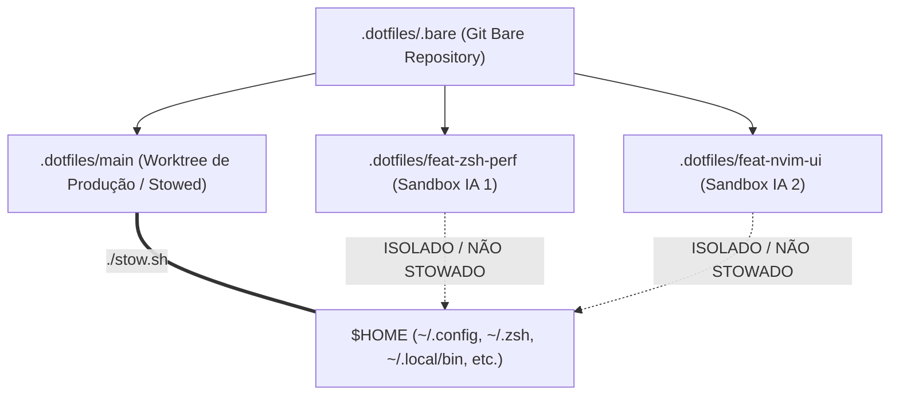
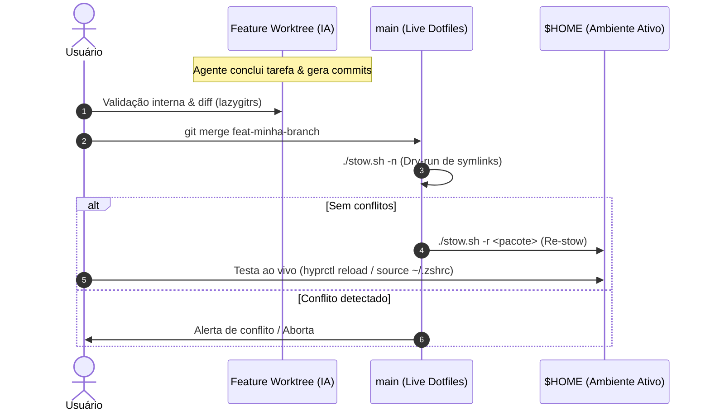
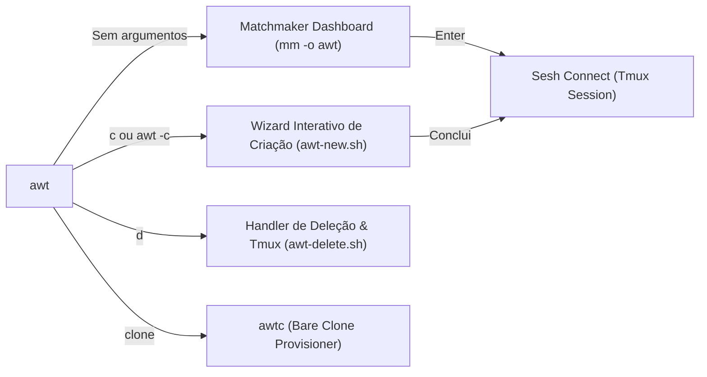
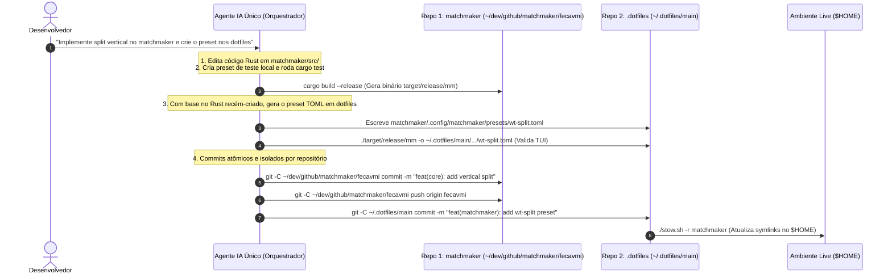

# Fluxo de Trabalho Git Worktree para Múltiplos Agentes de IA

Este documento define o padrão arquitetural, ergonômico e operacional para desenvolvimento paralelo com múltiplos agentes de IA no repositório de dotfiles e projetos satélites.

---

## 1. Arquitetura do Repositório: `.bare` + Worktrees

### O Problema do Git Tradicional vs. A Superioridade do Modelo `.bare`

No Git convencional (`git clone`), a pasta raiz do projeto contém tanto a pasta oculta `.git` quanto o código da branch ativa. Ao criar worktrees nesse formato, o desenvolvedor é forçado a:
1. Criar subpastas dentro do próprio repositório (poluindo o `git status` e ferramentas de busca); ou
2. Criar pastas externas soltas com caminhos inconsistentes.

Com o **Modelo `.bare` Container**, o repositório é clonado em modo bare (`.bare`) e a pasta raiz vira um **Container de Worktrees Irmãs**:

```
~/dev/github/matchmaker/ (Container do Projeto)
├── .bare/               (Banco de dados Git compartilhado)
├── main/                (Worktree da branch principal)
├── feat-preview/        (Worktree irmã - Agente IA 1)
└── fix-parser/          (Worktree irmã - Agente IA 2)
```

#### Vantagens do Modelo `.bare`:
* **Isometria e Simetria**: A branch `main` e as branches de feature têm exatamente o mesmo status estrutural.
* **Isolamento Total**: Excluir uma branch (`wt remove feat-x`) é simplesmente deletar a pasta irmã `feat-x/`, sem risco de corromper o histórico do Git em `.bare/`.
* **Zero Poluição**: Nenhum arquivo de uma branch vaza para outra branch.
* **Ideal para Dotfiles (GNU Stow)**: Permite que apenas `main/` seja stificada para `$HOME`, enquanto todas as outras worktrees funcionam como **sandboxes seguras de IA**.



### Regras Fundamentais de Segurança nos Dotfiles
1. **`main/` é a única Worktree Stowed**: O `$HOME` aponta estritamente para `~/.dotfiles/main/`.
2. **Feature Worktrees são Sandboxes**: Agentes de IA operam em worktrees isoladas (`~/.dotfiles/<branch>`). Alucinações, erros de sintaxe ou exclusões acidentais de arquivos não quebram o desktop ativo em tempo real.
3. **Validação Obrigatória de Symlinks**: Antes de qualquer merge na `main`, é obrigatório rodar `./stow.sh -n` (dry-run) para garantir integridade.


---

## 2. Topologia Tmux + Sesh: Mapeamento de Sessões e Ergonomia

O modelo ergonômico adotado é **1 Worktree = 1 Sessão no Tmux (via `sesh`)**.

```
tmux (Servidor)
├── Sessão: dotfiles@main (Produção / Live)
│   ├── Janela 1: Shell principal
│   ├── Janela 2: lazygitrs
│   └── Janela 3: Logs / Testes
│
├── Sessão: dotfiles@feat-zsh-perf (Agente IA 1)
│   ├── Janela 1: Agente de IA (agy / opencode)
│   └── Janela 2: Testes locais da worktree
│
└── Sessão: dotfiles@feat-nvim-ui (Agente IA 2)
    ├── Janela 1: Agente de IA (claude / agy)
    └── Janela 2: Neovim sandbox
```

### Por que 1 Sessão por Worktree?
- **Isolamento de CWD**: Cada sessão opera na raiz de sua respectiva worktree.
- **Transição Fluida**: Alternância instantânea via `Prefix + s` ou picker `mm -o awt`.
- **Hooks Automatizados**: Configurações no `sesh.toml` iniciam sandboxes (`ai-jail agy`) automaticamente ao conectar na sessão.

---

## 3. Estratégias de Merge e Teste na `main`

Como apenas `main/` está linkada ao `$HOME`, o teste de alterações no sistema ativo requer integração com a branch principal.



### Passo a Passo Operacional:
1. **Entrar na worktree `main`**:
   ```bash
   sesh connect ~/.dotfiles/main
   # ou via terminal
   cd /home/fecavmi/.dotfiles/main
   ```
2. **Executar o merge**:
   ```bash
   git merge feat-minha-branch
   ```
3. **Validar e Re-stowar**:
   ```bash
   ./stow.sh -n           # 1. Verifica se não há quebras
   ./stow.sh -r <pacote>  # 2. Atualiza os links simbólicos no $HOME
   ```
4. **Recarregar o componente afetado**:
   - Hyprland: `hyprctl reload`
   - Zsh: `source ~/.zshrc`
   - Waybar: `killall waybar; waybar &`

---

## 4. Gestão de Reversões e Rollbacks

Se após o merge e teste no `$HOME` você não gostar de uma alteração ou precisar reverter um commit da feature:

```mermaid
graph TD
    A["Merge feito na main & Testado no $HOME"] --> B{"Gostou do resultado?"}
    B -->|Sim| C["wt remove feat-branch && git branch -d feat-branch"]
    B -->|Não| D{"A main já foi enviada ao git push?"}
    
    D -->|Não (Local)| E["Na main: git reset --hard HEAD~1"]
    E --> F["./stow.sh -r <pacote> (Restaura $HOME anterior)"]
    F --> G["Na feature branch: corrigir ou git revert <commit>"]
    
    D -->|Sim (Remoto)| H["Na main: git revert -m 1 <merge-commit>"]
    H --> I["./stow.sh -r <pacote> && git push origin main"]
    I --> J["Na feature branch: aplicar correções incrementais"]
```

### Cenário A: A `main` é apenas local (Mais comum em Dotfiles)
1. **Desfazer o merge na `main`**:
   ```bash
   git reset --hard HEAD~1
   ./stow.sh -r <pacote>
   ```
   *Seu `$HOME` volta instantaneamente ao estado estável anterior.*

2. **Ajustar na branch da feature**:
   Na sessão da worktree da feature:
   - Se quiser descartar o último commit: `git reset --hard HEAD~1`
   - Se quiser desfazer um commit intermediário: `git revert <hash-do-commit>`
   - Se quiser refatorar: Peça ao agente de IA para corrigir o ponto indesejado.

3. **Re-testar**:
   Faça novo merge na `main` e re-stowe.

### Cenário B: A `main` já foi commitada e enviada ao remote
1. **Reverter o commit de merge na `main`**:
   ```bash
   git revert -m 1 HEAD
   ./stow.sh -r <pacote>
   git push origin main
   ```
2. **Trabalhar na branch**:
   Crie novos commits de correção (`fix: ...`) antes de tentar nova integração.

---

## 5. Divisão de Responsabilidades: IA vs. Manual

| Ação | Quem executa? | Justificativa |
| :--- | :---: | :--- |
| **Criação de branches e código na worktree** | 🤖 **IA Autônoma** | Rápido, isolado na sandbox, sem risco para o `$HOME`. |
| **Geração de commits** | 🤖 **IA com Conventional Commits** | Segue as regras do `.commitlintrc.json` e `git/GC_SGC.md`. |
| **Inspeção de diffs e revisão** | 👤 **Usuário (via lazygitrs)** | Inspeção visual com popup TUI (`Prefix + g`). |
| **Merge na `main` e Re-stow** | 🤖 **IA Supervisionada / 👤 Usuário** | A IA pode executar se solicitada, mas **deve sempre rodar `./stow.sh -n` primeiro** e confirmar antes de aplicar. |
| **Rollbacks e Reversões destrutivas** | 👤 **Usuário ou IA assistida** | Previne loops de `git reset` não intencionais. |

---

## 6. Onde configurar cada responsabilidade?

1. **`AGENTS.md` (Ground Truth / Regras Invioláveis)**:
   - Contém restrições que todos os agentes leem antes de cada ação (ex: "Nunca stowar feature worktrees para o $HOME", "Sempre validar symlinks com `./stow.sh -n`").
2. **`docs/GIT_WORKTREE_AGENTIC_WORKFLOW.md` (Este documento)**:
   - O guia completo de arquitetura, referenciado pelo `AGENTS.md` e disponível para consulta humana e de agentes.
3. **Skills (`~/.agents/skills/` ou `.agents/skills/`)**:
   - Skills operacionais para comandos específicos (ex: automação de criação de worktrees, merge assistido com verificação de lint e stow).

---

## 7. O Ecossistema `awt` (Agent Worktree) com Matchmaker & Sesh

O `awt` é o orquestrador unificado de worktrees e agentes de IA, construído inteiramente sobre o **Matchmaker (`mm`)**, **Sesh**, **Tmux** e **Worktrunk (`wt`)**.



---

### A. Dashboard Interativo do Matchmaker (`awt.toml` / `mm -o awt`)

Executado ao digitar `awt` sem argumentos no terminal:

```text
┌──────────────────────────────────────────────────────────────────────────────────────────┐
│ BRANCH            BASE    STATUS    MAIN ↕   REMOTE ⇅   AGE     COMMIT   SESSION         │
│ @ feature/wtmm    main    ✔         Synced   Synced     2h      a011829  matchmaker/...  │
│ ^ main            -       ✔         Synced   Synced     1d      61026ee  matchmaker/main │
│   feat/oauth2     main    ? ✗ (+2)  ↑1       ⇣2         45m     f492ac1  matchmaker/...  │
└──────────────────────────────────────────────────────────────────────────────────────────┘
```

#### Recursos do Dashboard:
1. **Nav Mode Ativo**: Navegação rápida estilo Vim (`j`, `k`, `g`, `G`) com barra de navegação limpa.
2. **Marcadores Visuais**:
   - `@ <branch>` (Ciano / Bold): Worktree ativa no terminal atual.
   - `^ <branch>` (Amarelo / Bold): Branch base principal (`main` / `master`).
3. **Metadados Ricos e Coloridos**:
   - `BASE`: Branch de origem configurada no Git (`branch.<name>.base`).
   - `STATUS`: Limpo (`✔` verde) ou Modificado com contagem (`? ✗ (+N)` amarelo/vermelho).
   - `MAIN ↕`: Divergência em relação à branch `main` (`↑N` ahead verde, `↓N` behind vermelho).
   - `REMOTE ⇅`: Divergência em relação ao upstream remoto (`⇡N` unpushed, `⇣N` unpulled).
   - `AGE` & `COMMIT`: Tempo relativo do último commit e hash abreviado.
4. **Previsões Multi-Layout em Tempo Real (`p` / `ctrl-p`)**:
   - **Aba 1**: `Git Status & Local Changes` + Gráfico de Commits (`git log --graph`).
   - **Aba 2**: `Diff vs Main` (Merge Base comparativo).
   - **Aba 3**: `Commit History & Stats` (Estatísticas de arquivos alterados).

---

### B. Wizard Interativo de Criação de Branches (`c` / `ctrl-n` / `awt-new.sh`)

Acionado ao pressionar **`c`** dentro do Matchmaker ou ao executar **`awt -c`**:

```text
[Passo 1: Tipo no mm]  ◄──(Esc)──  [Passo 2: Nome da Branch]  ◄──(Esc)──  [Passo 3: Base no mm]
         │                                  │                                    │
         └──(Enter)─────────────────────────┴──(Enter)───────────────────────────┴──(Enter)──► 🚀 Sesh
```

#### Arquitetura dos 4 Passos:

1. **Passo 1: Seleção do Tipo Convencional (`mm -o awt-type`)**:
   - Utiliza o preset modular [`awt-type.toml`](file:///home/fecavmi/.dotfiles/main/matchmaker/.config/matchmaker/presets/awt-type.toml).
   - Apresenta os tipos convencionais com ícones e descrições:
     `✨ feat`, `🐛 fix`, `♻️ refactor`, `⚡ perf`, `🔧 chore`, `📝 docs`, `🧪 test`, `📦 build`, `🏷️ custom`.
   - `Esc`: Aborta e retorna diretamente para o dashboard do `awt`.

2. **Passo 2: Digitação do Nome com GNU Readline & Event Loop (`awt-new.sh`)**:
   - Prompt customizado com o ícone do tipo:
     ```text
     ✨ Branch Name (feat/<name>): auth-oauth2

      [Enter] Confirm  •  [Esc / Empty] Back
     ```
   - **Zero Poluição de Tela**: Limpa o terminal (`clear >/dev/tty`) antes de desenhar, evitando textos fantasmas de passos anteriores.
   - **`Esc` Instantâneo**: Interceptação em baixo nível no `/dev/tty` (`read -r -s -n 1`), retornando imediatamente para o Passo 1.
   - **`Enter` Instantâneo**: Submete a branch para o Passo 3.
   - **Memória de Estado**: Se você voltar do Passo 3, o nome anterior é preservado no buffer.

3. **Passo 3: Seleção da Branch Base (`mm -o awt-base`)**:
   - Utiliza o preset modular [`awt-base.toml`](file:///home/fecavmi/.dotfiles/main/matchmaker/.config/matchmaker/presets/awt-base.toml).
   - Lista dinamicamente `main (default base)`, a branch selecionada no cursor e todas as branches locais do repositório com respectivos commits e papéis.
   - `Esc`: Volta para o Passo 2 com o nome da branch preenchido.

4. **Passo 4: Provisionamento e Conexão Automática**:
   - Cria a worktree irmã via `wt switch --create "$branch" --base "$base"` ou `git worktree add`.
   - Salva a branch base no Git config: `git config branch.<name>.base "$base"`.
   - Conecta instantaneamente via `sesh connect`, abrindo o **`agy`** (Antigravity CLI) na nova sessão.

---

### C. Conexão Inteligente de Sessões Tmux (Sem re-execução de prompts)

Para evitar que o Sesh execute o `startup_command = "agy"` em sessões que já existem ou onde o usuário já está trabalhando, a função [`awt`](file:///home/fecavmi/.dotfiles/main/zsh/.zsh/utils/functions.zsh#L433) implementa **resolução direta de sessões**:

1. **Preset Entrega Nome e Caminho**: O `awt.toml` cospe `{=session}\t{=path}` (ex: `matchmaker/feature-wtmm\t/home/fecavmi/...`).
2. **Já na Sessão Ativa**: Se a sessão selecionada for a mesma onde o terminal já está focado, o Matchmaker fecha sem mexer no buffer ou histórico de IA.
3. **Sessão Aberta em Background**: O Sesh conecta diretamente pelo **nome da sessão** (`sesh connect "matchmaker/feature-wtmm"`), alternando visualmente sem re-injetar o comando `agy`.
4. **Worktree Nova**: O Sesh recebe o caminho absoluto e cria a sessão Tmux com o `agy` inicializado do zero.

---

### D. Handler de Deleção Segura com Action Box Nativo (`d` / `ctrl-d` / `awt-delete.sh`)

Ao pressionar **`d`** em qualquer linha do `awt`:

1. **Proteção de Base**: Bloqueia imediatamente a exclusão da branch base principal (`main` ou `master`).
2. **Action Box Nativo Instantâneo (`Confirm(...)`)**:
   Abre o popover interno do Matchmaker desenhado diretamente na TUI:
   ```text
   [ 🗑️ Delete worktree feat/auth? (Enter/Esc) ]
   ```
   - **`Enter`**: Confirma a exclusão, remove a worktree, encerra a sessão Tmux e atualiza a lista na hora (`Reload`).
   - **`Esc` ou `q`**: Cancela instantaneamente e fecha o popover sem tocar nos arquivos.
3. **Limpeza Completa no Git**: Executa `wt remove` / `git worktree remove -f` e deleta a branch (`git branch -D`).
4. **Redirecionamento e Fechamento de Sessão Tmux**:
   - **Se for a sessão atual**: Executa `sesh last` (ou `tmux switch-client -l`) para redirecionar você para a sessão anterior e, em seguida, mata a sessão excluída (`tmux kill-session`).
   - **Se for uma sessão em background**: Mata a sessão no Tmux e executa o `Reload` automático do Matchmaker, removendo a linha da lista instantaneamente sem fechar o menu!

---

### E. Handler de Merge Inteligente de Worktrees (`m` / `awt-merge.sh`)

Ao pressionar **`m`** em qualquer linha do `awt`:

1. **Detecção Flexível de Origem e Destino**:
   - **Merge na Base / Main**: Se o cursor estiver na branch atual (`@`), o destino é automaticamente a branch base configurada (`branch.<name>.base` ou `main`).
   - **Merge em Qualquer Outra Branch**: Se você mover o cursor para qualquer outra branch da lista (ex: `fecavmi`, `staging`, `main`), o Matchmaker define essa branch como o **destino exato** do merge!
2. **Action Box de Confirmação Interativo**:
   ```text
   🔀  Merge 'feature/wtmm' into 'fecavmi'? >
   > 🚀 Yes, Merge & Cleanup (Merge feature/wtmm into fecavmi, remove feature/wtmm & switch session)
     🛡️  No, Cancel
   ```
3. **Execução Segura e Transição de Sessões**:
   - Executa o merge (`wt merge <destino>` ou `git merge`).
   - **Em caso de Sucesso**:
     - Remove a pasta da worktree de origem (`wt remove`).
     - Remove a branch mesclada no Git (`git branch -d`).
     - Alterna a sessão ativa do Tmux para a branch destino (`sesh connect`).
     - Encerra a sessão Tmux antiga da feature.
   - **Em caso de Conflito**:
     - Mantém ambas as worktrees intactas e emite um alerta claro no terminal para você inspecionar e resolver os arquivos conflitantes.

---

### F. Clonagem de Repositórios em Modo Bare (`awtc` / `awt clone`)

Função no [functions.zsh](file:///home/fecavmi/.dotfiles/main/zsh/.zsh/utils/functions.zsh) que provisiona novos repositórios na arquitetura de container `.bare` + worktree:

```bash
# Clone a partir do GitHub (user/repo):
awtc fcmiranda/matchmaker

# Ou via subcomando integrado:
awt clone fcmiranda/matchmaker

# Clone a partir de URL completa (HTTPS ou SSH):
awtc https://github.com/astral-sh/uv.git
awtc git@github.com:joshmedeski/sesh.git
```

#### O que ela executa automaticamente:
1. Cria a pasta container `~/dev/github/<repo>/`.
2. Clona o repositório em modo bare dentro de `~/dev/github/<repo>/.bare`.
3. Ajusta o refspec `remote.origin.fetch` para garantir rastreamento de branches remotas.
4. Identifica a branch padrão (`main`, `master`, etc.) e cria a worktree primária `~/dev/github/<repo>/<default_branch>`.
5. Dispara o `sesh connect`, abrindo imediatamente a sessão Tmux com o ambiente de IA pronto.

---

## 8. Gestão de Code Reviews com Worktree Dedicada e `gh-dash`

### A. Por que a Worktree `review/` é Isolada por Repositório?
Como as Git Worktrees compartilham o banco de dados `.bare/` de cada projeto, cada repositório possui sua própria pasta `review/`:

```text
~/dev/github/matchmaker/ (Container do Matchmaker)
├── .bare/
├── main/
├── feat-preview/
└── review/              <── Worktree de review deste repositório
```

### B. O Truque da Branch `_main`
* **O Problema**: O Git proíbe fazer checkout da mesma branch em duas worktrees simultâneas (`fatal: 'main' is already checked out`).
* **A Solução**: Dentro da pasta `review/`, crie uma branch de espelho chamada `_main` (`git checkout -b _main origin/main`). Isso permite inspecionar, rebasear ou comparar Pull Requests contra a `main` sem nunca bloquear a worktree `main/` de produção.

### C. Configuração no `gh-dash` (`gh/.config/gh-dash/config.yml`)
O `gh-dash` está integrado com atalhos para `lazygitrs` e `sesh`:

```yaml
# gh/.config/gh-dash/config.yml
keybindings:
  prs:
    - key: g
      name: lazygitrs
      command: cd {{.RepoPath}} && lazygitrs
    - key: s
      name: sesh
      command: sesh connect {{.RepoPath}}
  issues:
    - key: g
      name: lazygitrs
      command: cd {{.RepoPath}} && lazygitrs

repoPaths:
  fcmiranda/*: ~/dev/github/*/review
  */*: ~/dev/github/*/review
```

---

## 9. Guia Rápido de Comandos (Cheat Sheet)

### Atalhos dentro do Dashboard `awt` (`mm -o awt`)

| Tecla | Ação | Descrição |
| :---: | :--- | :--- |
| **`Enter`** | **Connect Sesh** | Alterna ou cria a sessão Tmux para a worktree selecionada. |
| **`c`** / **`ctrl-n`** | **New WT Wizard** | Abre o wizard interativo de 4 passos com Conventional Commits. |
| **`m`** | **Merge WT** | Faz merge da branch atual na branch selecionada (ou na base) e limpa a sessão. |
| **`d`** / **`ctrl-d`** | **Delete WT** | Deleta a worktree, mata a sessão Tmux e redireciona (`sesh last`). |
| **`p`** / **`ctrl-p`** | **Switch Preview** | Alterna entre as 3 abas de preview (Status, Diff vs Main, Log Stats). |
| **`u`** / **`ctrl-u`** | **Fetch Remotes** | Executa `git fetch --all --prune` na worktree selecionada. |
| **`j`** / **`k`** | **Navegação** | Move o cursor para baixo / cima (Nav Mode). |
| **`q`** / **`Esc`** | **Quit** | Fecha o picker sem realizar ações. |

### Comandos de Terminal

| Ação | Comando | Descrição |
| :--- | :--- | :--- |
| **Abrir Dashboard Interativo** | `awt` | Abre o picker Matchmaker (`mm -o awt`) com todas as worktrees. |
| **Wizard de Criação de Worktree** | `awt -c` | Dispara o assistente interativo de Conventional Commits. |
| **Criar Worktree via CLI Direto** | `awt -c <branch> [base]` | Cria branch e conecta imediatamente à sessão Tmux. |
| **Conectar / Alternar via CLI** | `awt <branch>` | Pula direto para a sessão Tmux da worktree indicada. |
| **Clonar repositório no modelo `.bare`** | `awtc <user/repo>` | Clona em modo bare, cria `main/` e abre a sessão com IA ativa. |
| **Dashboard de PRs / Issues** | `gh dash` | Painel TUI do GitHub. Pressione `g` para abrir o `lazygitrs` ou `s` para `sesh`. |
| **Alternar entre Sessões Tmux** | `Prefix + s` ou `Alt + s` | Alternador de sessões e projetos via Sesh. |
| **Validar Symlinks nos Dotfiles** | `./stow.sh -n` | Executa dry-run obrigatório antes de qualquer merge na branch `main`. |
| **Re-stow de Pacote Atualizado** | `./stow.sh -r <pacote>` | Atualiza os symlinks no `$HOME` após o merge na `main`. |

---

## 10. Fluxo de Trabalho Multi-Repositório com IA (Engine + Dotfiles)

Quando uma tarefa abrange múltiplos repositórios interdependentes (ex: desenvolver uma nova funcionalidade no código Rust do [`matchmaker`](file:///home/fecavmi/dev/github/matchmaker) e criar ou ajustar presets correspondentes nos [dotfiles](file:///home/fecavmi/.dotfiles/main/matchmaker/.config/matchmaker/presets)), adota-se o padrão **"Engine First, Config Second"**.



### Regras Operacionais para IA em Tarefas Multi-Repo:

1. **Uma Única Conversa Coordenadora**: Uma única sessão de IA mantém todo o contexto mental da alteração de baixo nível (Rust/Go/C) e da configuração de alto nível (TOML/Lua/Zsh), eliminando retrabalho de contexto.
2. **Scoping Explícito de Git (`git -C <caminho>`)**:
   * A IA nunca assume que comandos Git executam no repositório global; ela direciona explicitamente cada `add`, `commit` e `push` para o diretório correto.
3. **Padrões de Commit Independentes**:
   * O repositório da engine segue seu próprio versionamento e PRs.
   * O repositório de dotfiles segue as regras de [`.commitlintrc.json`](file:///home/fecavmi/.dotfiles/main/.commitlintrc.json) e validação de symlinks via `./stow.sh -n`.
4. **Deploy Seguro no `$HOME`**: O preset só é stowed para `$HOME` quando o novo binário compilado já estiver validado e disponível no sistema.


