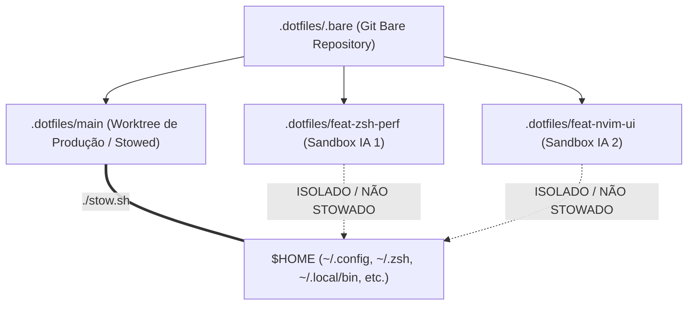
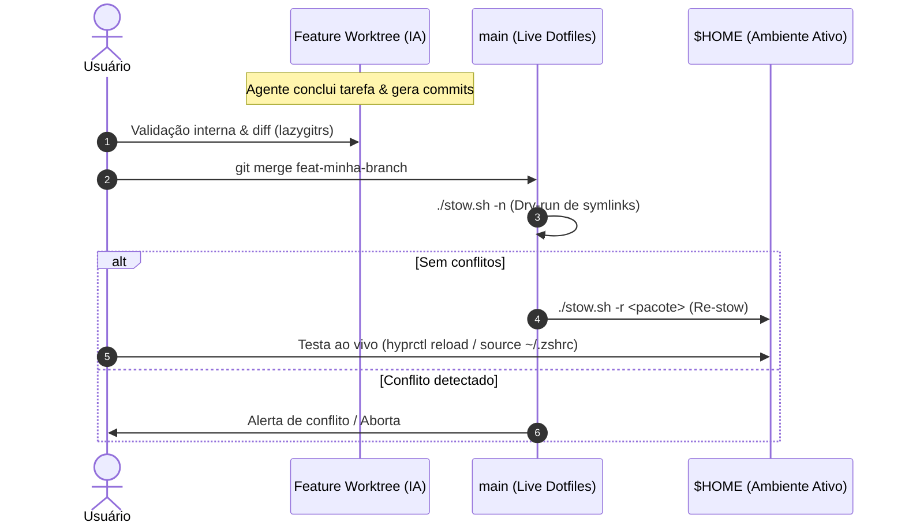
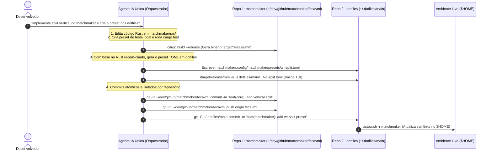

# Fluxo de Trabalho Git Worktree para Múltiplos Agentes de IA

Este documento define o padrão arquitetural, ergonômico e operacional para desenvolvimento paralelo com múltiplos agentes de IA no repositório de dotfiles e projetos satélites.

---

## 1. Arquitetura do Repositório: `.bare` + Worktrees

### O Problema do Git Tradicional vs. A Superioridade do Modelo `.bare`

No Git convencional (`git clone`), a pasta raiz do projeto contém tanto a pasta oculta `.git` quanto o código da branch ativa. Ao criar worktrees nesse formato, o desenvolvedor é forçado a:
1. Criar subpastas dentro do próprio repositório (poluindo o `git status` e ferramentas de busca); ou
2. Criar pastas externas soltas com caminhos inconsistentes.

Com o **Modelo `.bare` Container**, o repositório é clonado em modo bare (`.bare`) e a pasta raiz vira um **Container de Worktrees Irmãs**:

```
~/dev/github/matchmaker/ (Container do Projeto)
├── .bare/               (Banco de dados Git compartilhado)
├── main/                (Worktree da branch principal)
├── feat-preview/        (Worktree irmã - Agente IA 1)
└── fix-parser/          (Worktree irmã - Agente IA 2)
```

#### Vantagens do Modelo `.bare`:
* **Isometria e Simetria**: A branch `main` e as branches de feature têm exatamente o mesmo status estrutural.
* **Isolamento Total**: Excluir uma branch (`wt remove feat-x`) é simplesmente deletar a pasta irmã `feat-x/`, sem risco de corromper o histórico do Git em `.bare/`.
* **Zero Poluição**: Nenhum arquivo de uma branch vaza para outra branch.
* **Ideal para Dotfiles (GNU Stow)**: Permite que apenas `main/` seja stificada para `$HOME`, enquanto todas as outras worktrees funcionam como **sandboxes seguras de IA**.



### Regras Fundamentais de Segurança nos Dotfiles
1. **`main/` é a única Worktree Stowed**: O `$HOME` aponta estritamente para `~/.dotfiles/main/`.
2. **Feature Worktrees são Sandboxes**: Agentes de IA operam em worktrees isoladas (`~/.dotfiles/<branch>`). Alucinações, erros de sintaxe ou exclusões acidentais de arquivos não quebram o desktop ativo em tempo real.
3. **Validação Obrigatória de Symlinks**: Antes de qualquer merge na `main`, é obrigatório rodar `./stow.sh -n` (dry-run) para garantir integridade.


---

## 2. Topologia Tmux + Sesh: Mapeamento de Sessões e Ergonomia

O modelo ergonômico adotado é **1 Worktree = 1 Sessão no Tmux (via `sesh`)**.

```
tmux (Servidor)
├── Sessão: dotfiles@main (Produção / Live)
│   ├── Janela 1: Shell principal
│   ├── Janela 2: lazygitrs
│   └── Janela 3: Logs / Testes
│
├── Sessão: dotfiles@feat-zsh-perf (Agente IA 1)
│   ├── Janela 1: Agente de IA (agy / opencode)
│   └── Janela 2: Testes locais da worktree
│
└── Sessão: dotfiles@feat-nvim-ui (Agente IA 2)
    ├── Janela 1: Agente de IA (claude / agy)
    └── Janela 2: Neovim sandbox
```

### Por que 1 Sessão por Worktree?
- **Isolamento de CWD**: Cada sessão opera na raiz de sua respectiva worktree.
- **Transição Fluida**: Alternância instantânea via `Prefix + s` ou picker `mm -o wt`.
- **Hooks Automatizados**: Configurações no `sesh.toml` iniciam sandboxes (`ai-jail agy`) automaticamente ao conectar na sessão.

---

## 3. Estratégias de Merge e Teste na `main`

Como apenas `main/` está linkada ao `$HOME`, o teste de alterações no sistema ativo requer integração com a branch principal.



### Passo a Passo Operacional:
1. **Entrar na worktree `main`**:
   ```bash
   sesh connect ~/.dotfiles/main
   # ou via terminal
   cd /home/fecavmi/.dotfiles/main
   ```
2. **Executar o merge**:
   ```bash
   git merge feat-minha-branch
   ```
3. **Validar e Re-stowar**:
   ```bash
   ./stow.sh -n           # 1. Verifica se não há quebras
   ./stow.sh -r <pacote>  # 2. Atualiza os links simbólicos no $HOME
   ```
4. **Recarregar o componente afetado**:
   - Hyprland: `hyprctl reload`
   - Zsh: `source ~/.zshrc`
   - Waybar: `killall waybar; waybar &`

---

## 4. Gestão de Reversões e Rollbacks

Se após o merge e teste no `$HOME` você não gostar de uma alteração ou precisar reverter um commit da feature:

```mermaid
graph TD
    A["Merge feito na main & Testado no $HOME"] --> B{"Gostou do resultado?"}
    B -->|Sim| C["wt remove feat-branch && git branch -d feat-branch"]
    B -->|Não| D{"A main já foi enviada ao git push?"}
    
    D -->|Não (Local)| E["Na main: git reset --hard HEAD~1"]
    E --> F["./stow.sh -r <pacote> (Restaura $HOME anterior)"]
    F --> G["Na feature branch: corrigir ou git revert <commit>"]
    
    D -->|Sim (Remoto)| H["Na main: git revert -m 1 <merge-commit>"]
    H --> I["./stow.sh -r <pacote> && git push origin main"]
    I --> J["Na feature branch: aplicar correções incrementais"]
```

### Cenário A: A `main` é apenas local (Mais comum em Dotfiles)
1. **Desfazer o merge na `main`**:
   ```bash
   git reset --hard HEAD~1
   ./stow.sh -r <pacote>
   ```
   *Seu `$HOME` volta instantaneamente ao estado estável anterior.*

2. **Ajustar na branch da feature**:
   Na sessão da worktree da feature:
   - Se quiser descartar o último commit: `git reset --hard HEAD~1`
   - Se quiser desfazer um commit intermediário: `git revert <hash-do-commit>`
   - Se quiser refatorar: Peça ao agente de IA para corrigir o ponto indesejado.

3. **Re-testar**:
   Faça novo merge na `main` e re-stowe.

### Cenário B: A `main` já foi commitada e enviada ao remote
1. **Reverter o commit de merge na `main`**:
   ```bash
   git revert -m 1 HEAD
   ./stow.sh -r <pacote>
   git push origin main
   ```
2. **Trabalhar na branch**:
   Crie novos commits de correção (`fix: ...`) antes de tentar nova integração.

---

## 5. Divisão de Responsabilidades: IA vs. Manual

| Ação | Quem executa? | Justificativa |
| :--- | :---: | :--- |
| **Criação de branches e código na worktree** | 🤖 **IA Autônoma** | Rápido, isolado na sandbox, sem risco para o `$HOME`. |
| **Geração de commits** | 🤖 **IA com Conventional Commits** | Segue as regras do `.commitlintrc.json` e `git/GC_SGC.md`. |
| **Inspeção de diffs e revisão** | 👤 **Usuário (via lazygitrs)** | Inspeção visual com popup TUI (`Prefix + g`). |
| **Merge na `main` e Re-stow** | 🤖 **IA Supervisionada / 👤 Usuário** | A IA pode executar se solicitada, mas **deve sempre rodar `./stow.sh -n` primeiro** e confirmar antes de aplicar. |
| **Rollbacks e Reversões destrutivas** | 👤 **Usuário ou IA assistida** | Previne loops de `git reset` não intencionais. |

---

## 6. Onde configurar cada responsabilidade?

1. **`AGENTS.md` (Ground Truth / Regras Invioláveis)**:
   - Contém restrições que todos os agentes leem antes de cada ação (ex: "Nunca stowar feature worktrees para o $HOME", "Sempre validar symlinks com `./stow.sh -n`").
2. **`docs/GIT_WORKTREE_AGENTIC_WORKFLOW.md` (Este documento)**:
   - O guia completo de arquitetura, referenciado pelo `AGENTS.md` e disponível para consulta humana e de agentes.
3. **Skills (`~/.agents/skills/` ou `.agents/skills/`)**:
   - Skills operacionais para comandos específicos (ex: automação de criação de worktrees, merge assistido com verificação de lint e stow).

---

## 7. Automações Implementadas: Worktrunk Global e `aiwt` (`wtai`) com Matchmaker

### A. Configuração Global do Worktrunk (`worktrunk/.config/worktrunk/config.toml`)
O `worktrunk` (`wt`) suporta configuração global de `worktree-path` no nível raiz do TOML. Isso significa que **não é necessário cadastrar repositórios 1 por 1**:

```toml
# ~/.dotfiles/main/worktrunk/.config/worktrunk/config.toml

# Configuração global (aplica automaticamente a TODOS os repositórios Git)
skip-commit-generation-prompt = true
worktree-path = "{{ repo_path }}/../{{ branch | sanitize }}"
```

#### Racional Detalhado de Cada Opção:

1. **`worktree-path = "{{ repo_path }}/../{{ branch | sanitize }}"` (Sinergia com o modelo `.bare`)**:
   * **Anatomia do Template**:
     * `{{ repo_path }}`: Caminho da worktree atual (ex: `~/.dotfiles/main` ou `~/dev/github/matchmaker/main`).
     * `/..`: Sobe 1 nível para a raiz do container do projeto (`~/.dotfiles/` ou `~/dev/github/matchmaker/`).
     * `{{ branch | sanitize }}`: Cria a nova pasta irmã (ex: `~/.dotfiles/feat-zsh-perf`).
   * **Por que é superior ao padrão do Git**: No Git tradicional, worktrees criadas manualmente exigem especificar caminhos absolutos ou relativos complexos. Com este template global, qualquer comando `wt add <branch>` instancia a pasta irmã perfeitamente alinhada ao lado de `.bare/` e `main/`.
   * **Sanitização Automática**: Substitui barras e caracteres inválidos (`feat/nova-ui` → `feat-nova-ui`), impedindo a criação acidental de subdiretórios aninhados.

2. **`skip-commit-generation-prompt = true`**:
   * **Fluxo Ágil e Não-Bloqueante**: O `worktrunk` possui um assistente que sugere mensagens de commit via prompt. Em um fluxo de trabalho com múltiplos agentes de IA e multiplexação rápida via Tmux/Sesh, prompts interativos adicionam atrito desnecessário.
   * **Previsibilidade**: Permite que scripts de automação (como a função `aiwt`) executem a criação e alternância de worktrees instantaneamente em < 10ms.


### B. Função `aiwt` / `wtai` (Zsh Helper com TUI Matchmaker)
Função integrada ao [functions.zsh](file:///home/fecavmi/.dotfiles/main/zsh/.zsh/utils/functions.zsh) que oferece dois modos de operação (Interativo TUI vs. Direto CLI):

#### 1. Modo Interativo TUI (Sem argumentos):
```bash
aiwt
# ou
wtai
```
* Abre o picker fuzzy do [Matchmaker](file:///home/fecavmi/.dotfiles/main/matchmaker/.config/matchmaker/presets/wt.toml) (`mm -o wt`) com preview ao vivo de `git status` e histórico de commits.
* Ao selecionar qualquer worktree existente e pressionar `Enter`, o `sesh` conecta você instantaneamente à sessão Tmux correspondente.

#### 2. Modo Direto CLI (Com nome da branch):
```bash
aiwt feat-prompt-fast
# ou
wtai feat-nvim-perf
```
* Cria a branch e a pasta da worktree imediatamente via `worktrunk` (`wt add`) ou `git worktree add`.
* Conecta via `sesh connect`, criando a sessão Tmux com o agente de IA (`agy`) pronto para uso em < 100ms.

### C. Função `wtclone` / `wtc` (Clone Automático no Modelo `.bare`)
Função integrada ao [functions.zsh](file:///home/fecavmi/.dotfiles/main/zsh/.zsh/utils/functions.zsh) que automatiza o provisionamento completo de novos repositórios na arquitetura de container `.bare` + worktree:

#### Uso:
```bash
# Clone a partir do GitHub (user/repo):
wtclone fcmiranda/matchmaker

# Ou usando o alias super curto:
wtc rust-lang/cargo

# Clone a partir de URL completa (HTTPS ou SSH):
wtclone https://github.com/astral-sh/uv.git
wtclone git@github.com:joshmedeski/sesh.git
```

#### O que ela executa automaticamente:
1. Cria a pasta container `~/dev/github/<repo>/`.
2. Clona o repositório em modo bare dentro de `~/dev/github/<repo>/.bare`.
3. Ajusta o refspec `remote.origin.fetch` para garantir rastreamento de branches remotas.
4. Identifica a branch padrão (`main`, `master`, etc.) e cria a worktree primária `~/dev/github/<repo>/<default_branch>`.
5. Dispara o `sesh connect`, abrindo imediatamente a sessão Tmux com o ambiente de IA pronto.

---

## 8. Gestão de Code Reviews com Worktree Dedicada e `gh-dash`

### A. Por que a Worktree `review/` é Isolada por Repositório?
Como as Git Worktrees compartilham o banco de dados `.bare/` de cada projeto, cada repositório possui sua própria pasta `review/`:

```
~/dev/github/matchmaker/ (Container do Matchmaker)
├── .bare/
├── main/
├── feat-preview/
└── review/              <── Worktree de review deste repositório

~/dev/github/lazygitrs/  (Container do Lazygitrs)
├── .bare/
├── main/
└── review/              <── Worktree de review deste repositório
```

### B. O Truque da Branch `_main`
* **O Problema**: O Git proíbe fazer checkout da mesma branch em duas worktrees simultâneas (`fatal: 'main' is already checked out`).
* **A Solução**: Dentro da pasta `review/`, crie uma branch de espelho chamada `_main` (`git checkout -b _main origin/main`). Isso permite inspecionar, rebasear ou comparar Pull Requests contra a `main` sem nunca bloquear a worktree `main/` de produção.

### C. Configuração no `gh-dash` (`gh/.config/gh-dash/config.yml`)
O `gh-dash` está integrado ao GNU Stow no pacote `gh` e configurado com **wildcards globais** e atalhos dedicados para `lazygitrs`:

```yaml
# gh/.config/gh-dash/config.yml
keybindings:
  prs:
    - key: g
      name: lazygitrs
      command: cd {{.RepoPath}} && lazygitrs
    - key: s
      name: sesh
      command: sesh connect {{.RepoPath}}
  issues:
    - key: g
      name: lazygitrs
      command: cd {{.RepoPath}} && lazygitrs

repoPaths:
  fcmiranda/*: ~/dev/github/*/review
  */*: ~/dev/github/*/review
```

#### Como funciona no fluxo diário:
1. Você abre o `gh-dash` no terminal: `gh dash`.
2. Navega até qualquer **Pull Request** ou **Issue**.
3. Pressione **`g`**: O `gh-dash` abre o [lazygitrs](file:///home/fecavmi/.cargo/bin/lazygitrs) imediatamente na pasta `review/` correspondente.
4. Pressione **`s`**: Cria e conecta uma sessão Tmux no `sesh` focada na revisão.

---

## 9. Guia Rápido de Comandos (Cheat Sheet)

| Ação | Comando | Descrição |
| :--- | :--- | :--- |
| **Clonar repositório no modelo `.bare`** | `wtc <user/repo>` | Clona em modo bare, cria `main/` e conecta ao Tmux com a IA ativa. |
| **Criar worktree isolada para IA** | `aiwt <nome-da-branch>` | Cria branch irmã (ex: `~/.dotfiles/feat-x`) e abre prompt da IA no Tmux. |
| **Explorar/Alternar Worktrees (TUI)** | `aiwt` ou `wtai` | Abre o picker [Matchmaker](file:///home/fecavmi/.dotfiles/main/matchmaker) (`mm -o wt`) com preview de status e commits. |
| **Dashboard de PRs / Issues** | `gh dash` | Painel TUI do GitHub. Pressione `g` para abrir o `lazygitrs` ou `s` para `sesh`. |
| **Alternar entre Sessões do Tmux** | `Prefix + s` ou `Alt + s` | Alterna instantaneamente entre worktrees e projetos via Sesh. |
| **Validar Symlinks nos Dotfiles** | `./stow.sh -n` | Executa dry-run obrigatório antes de qualquer merge na branch `main`. |
| **Re-stow de Pacote Atualizado** | `./stow.sh -r <pacote>` | Atualiza os symlinks no `$HOME` após o merge na `main`. |
| **Remover Worktree Concluída** | `wt remove <branch>` | Exclui a worktree irmã e mantém o `.bare/` e a `main/` limpos. |

---

## 10. Fluxo de Trabalho Multi-Repositório com IA (Engine + Dotfiles)

Quando uma tarefa abrange múltiplos repositórios interdependentes (ex: desenvolver uma nova funcionalidade no código Rust do [`matchmaker`](file:///home/fecavmi/dev/github/matchmaker) e criar ou ajustar presets correspondentes nos [dotfiles](file:///home/fecavmi/.dotfiles/main/matchmaker/.config/matchmaker/presets)), adota-se o padrão **"Engine First, Config Second"**.



### Regras Operacionais para IA em Tarefas Multi-Repo:

1. **Uma Única Conversa Coordenadora**: Uma única sessão de IA mantém todo o contexto mental da alteração de baixo nível (Rust/Go/C) e da configuração de alto nível (TOML/Lua/Zsh), eliminando retrabalho de contexto.
2. **Scoping Explícito de Git (`git -C <caminho>`)**:
   * A IA nunca assume que comandos Git executam no repositório global; ela direciona explicitamente cada `add`, `commit` e `push` para o diretório correto.
3. **Padrões de Commit Independentes**:
   * O repositório da engine segue seu próprio versionamento e PRs.
   * O repositório de dotfiles segue as regras de [`.commitlintrc.json`](file:///home/fecavmi/.dotfiles/main/.commitlintrc.json) e validação de symlinks via `./stow.sh -n`.
4. **Deploy Seguro no `$HOME`**: O preset só é stowed para `$HOME` quando o novo binário compilado já estiver validado e disponível no sistema.


