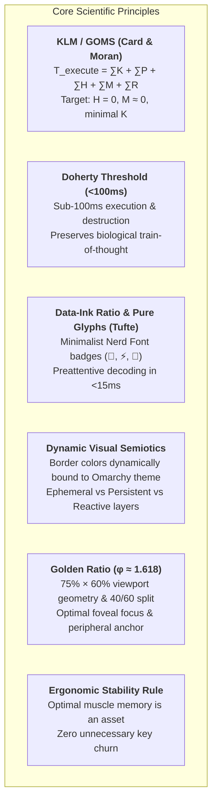

# Terminal Ergonomics, Visual Semiotics & Zero-Friction Workflow Architecture

## 📖 Overview & Purpose

This document formalizes the engineering principles, human-computer interaction (HCI) models, neurocognitive theories, and biomechanical standards that govern the **state-of-the-art terminal and TUI workflow** in this repository (`tmux`, `matchmaker`, `lazygitrs`, `keyd`, `sesh`, `zsh`).

The overarching goal is to achieve **Zero Cognitive Friction**, **sub-perceptual latency (<100ms)**, **pure Home Row hand anchoring**, and **immutable muscle memory stability**.

---

## 🔬 1. Scientific Foundations & Cognitive Models

Every layout decision, dimensioning rule, visual cue, and keybinding in this setup adheres strictly to established cognitive and biomechanical models:



### 1.1 Keystroke-Level Model (KLM/GOMS)
$$T_{\text{execute}} = \sum T_K + \sum T_P + \sum T_H + \sum T_M + \sum T_R$$
* **$T_H$ (Hand Homing):** **$0\text{ ms}$**. Hands remain permanently anchored to the Home Row ($ASDF / JKL;$). Reaching for function keys (`F1-F12`), arrow clusters, or mouse pointing devices is strictly eliminated ($T_P = 0, T_H = 0$).
* **$T_M$ (Mental Preparation / Hesitation):** Minimized to **$\approx 0\text{ ms}$** via immediate visual semiotics (semantic border colors and glyphs) and universal mnemonics (`Esc` cancels/unwinds, `Ctrl+G` opens Git, `s` switches windows).
* **$T_K$ (Keystroke Cost):** Reduced from $240\text{ ms}$ (complex chords) to **$120\text{ ms}$** through 1-touch direct navigation (`nav^^` keys in Matchmaker) and dual-function kernel modifiers.

### 1.2 The Doherty Threshold (<100ms)
When human-computer interaction latency drops below **100 milliseconds**, human perception registers the system as an extension of thought, preserving cognitive flow without biological interruption.
* **Subprocess Latency:** `lazygitrs` (native Rust binary) starts in **~3ms** and exits in **0ms** via Tmux's `-E` flag.
* **Zero-Flicker Double Buffering:** `delay_clear = true` and `debounce_ms = 20` in `matchmaker` eliminates screen tearing during rapid vertical scrolling.
* **Non-Blocking Telemetry:** Notifications utilize asynchronous `tmux display-message` (<1ms), eliminating synchronous blocking popups.

---

## 🎨 2. Visual Semiotics & Dynamic Theme Color Sync

```text
╭── 󱂬 ──────────────────────────────────────────────────────────────────────╮  🟣 Mauve / Magenta
│ 1. EPHEMERAL LAYER (Fast Pickers & Transit Navigation < 5s)               │  Geometry: 75% × 60%
│ • Window Picker, Sesh Workspace Picker, Matchmaker Jump. Exit: [Esc]       │
╰───────────────────────────────────────────────────────────────────────────╯

╭── 󰊢 ──────────────────────────────────────────────────────────────────────╮  🟠 Git Orange (colors.toml)
│ 2. PERSISTENT LAYER (High-Density Inspection & Workspaces)                │  Geometry: 90% × 88%
│ • Lazygitrs, Floating Neovim, OpenCode Agent. Exit: [Esc] on Files / [q]   │
╰───────────────────────────────────────────────────────────────────────────╯

╭── 󰮯 ──────────────────────────────────────────────────────────────────────╮  🟡 Alert Yellow (colors.toml)
│ 3. REACTIVE LAYER (AI Agent Attention & Interventions)                    │  Geometry: 80% × 75%
│ • Permission prompts and background agent alerts. Cycle: [prefix+i] / [Esc]│
╰───────────────────────────────────────────────────────────────────────────╯
```

### 2.1 Pure Icon Badges (Tufte's Data-Ink Principle)
* **Glyph Recognition vs Text Decoding (15ms vs 200ms):** The human visual cortex decodes familiar pictograms (`󰊢`, `⚡`, `󱂬`, `󱜻`) preattentively in **$\approx 15\text{ ms}$**, whereas phonetic text parsing takes **$\approx 180\text{ ms}$ to $250\text{ ms}$**.
* **Elimination of Semantic Redundancy:** Frame titles such as *"Windows & Agents"* or *"Lazygit"* are redundant noise. Clean icon badges (`-T " 󱂬 "`, `-T " ⚡ "`, `-T " 󰊢 "`) maximize the Signal-to-Noise ratio while maintaining minimalist geometry.

### 2.2 Universal Dynamic Omarchy Theme Inheritance
All popup scripts dynamically query the active system palette in `~/.local/state/omarchy/current/theme/colors.toml`:

```text
               ┌────────────────────────────────────────────────────────┐
               │    ~/.local/state/omarchy/current/theme/colors.toml    │
               └───────────┬──────────────┬──────────────┬──────────────┘
                           │              │              │
                    magenta/accent       cyan          orange          yellow/alert
                           │              │              │                   │
                           ▼              ▼              ▼                   ▼
                     ╭── 󱂬 ──╮      ╭── ⚡ ──╮      ╭── 󰊢 ──╮           ╭── 󰮯 ──╮
                     │Windows│      │  Sesh │      │Lazygit│           │AI Bell│
                     ╰───────╯      ╰───────╯      ╰───────╯           ╰───────╯
```

When switching themes via `omarchy theme set <theme>`, **100% of popups instantly adopt the exact semantic palette** (e.g., Catppuccin Mocha, Gruvbox Dark, Tokyo Night, Nord).

---

## 📐 3. Golden Ratio Spatial Architecture ($\phi \approx 1.618$)

```text
┌─────────────────────────────────────────────────────────────────────────────┐
│                             TERMINAL VIEWPORT                               │
│                                                                             │
│        ┌─ 󱂬 ───────────────────────────────────────────────────────┐        │
│        │  CENTERED MODAL (Width: ~75% │ Height: ~60%)              │        │
│        │                                                           │        │
│        │  ┌───────────────────────┬─────────────────────────────┐  │        │
│        │  │ Candidate List        │ Live Context Preview        │  │        │
│        │  │ (38.2% ≈ 40%)         │ (61.8% ≈ 60%)               │  │        │
│        │  │                       │                             │  │        │
│        │  │ • 0  nvim     󱥂 idle  │ $ git status -s             │  │        │
│        │  │ · 1  agent    󰑮 work  │ M tmux/tmux.conf            │  │        │
│        │  │ · 2  zsh              │ M matchmaker/jump.toml      │  │        │
│        │  │                       │                             │  │        │
│        │  └───────────────────────┴─────────────────────────────┘  │        │
│        │  [Enter] Switch  •  [c] New  •  [d] Kill  •  [Esc] Exit    │        │
│        └───────────────────────────────────────────────────────────┘        │
│                                                                             │
└─────────────────────────────────────────────────────────────────────────────┘
```

* **Foveal Ergonomics (`75% × 60%`):** Human central visual acuity is confined to a 2°–5° foveal cone. The 75% × 60% viewport occupies the visual center without hiding the parent terminal backdrop.
* **Column Partitioning (`40% / 60%`):** Divides space according to $\frac{1}{\phi^2} \approx 38.2\%$ (list) and $\frac{1}{\phi} \approx 61.8\%$ (preview), preventing label truncation.
* **High-Density Workspaces (`90% × 88%`):** Lazygitrs expands to 90% × 88% to satisfy Miller's Chunking Law ($7 \pm 2$) across 5 control panels and wide diff viewports.

---

## ⌨️ 4. Biomechanical Keymapping & Kernel Integration

### 4.1 Kernel-Level Dual-Function Keys (`keyd`)
In the kernel input pipeline:
* **`CapsLock` (Hold):** Emits `Ctrl`.
* **`CapsLock` (Tap):** Emits `Esc`.

This anchors the two most frequent modifiers directly under the left pinky at resting Home Row position, preventing ulnar deviation and repetitive strain injury (RSI).

### 4.2 Hierarchical Context Unwinding (Cascading Escape)
To eliminate accidental exits during deep inspection:
1. **Focused Diff or Submenu:** Pressing `Esc` unwinds the focus back to the Primary Anchor (*Files panel [2]*).
2. **Root Files List:** Pressing `Esc` dismisses the popup and restores the terminal.
3. **Secondary Exits:** `q` and `Ctrl+C` remain available for immediate exit.

---

## 🔊 5. Multi-Sensory & Auditory Feedback Architecture

True zero-friction development minimizes visual polling by offloading non-critical telemetry to the **Auditory Cortex**.

The `acpd` daemon integrates low-latency audio cues via PipeWire (`pw-play`) configured in [`acpd.toml`](file:///home/fecavmi/.dotfiles/main/acpd/.config/acpd/config.toml):

```toml
[sound]
enabled = true
player = "pw-play"
response   = "~/.local/share/sounds/ai/01-crystal-chime.wav"  # Agent completed turn
question   = "~/.local/share/sounds/ai/02-gentle-ping.wav"    # Interactive question asked
permission = "~/.local/share/sounds/ai/06-cyber-pulse.wav"    # High-priority approval required
```

* **Zero-Gaze Monitoring:** Developers can switch to other workspaces or read documentation without constantly polling the terminal. A distinct sonic frequency immediately communicates agent state transitions without breaking cognitive focus.
* **Perceptual Complementarity:** Audio signals trigger reflex orientation, while the status bar pills (`󱥂 idle`, `󰑮 work`, `󱅭 permission`) and popups provide precise contextual detail on demand.

---

## 🛡️ 6. The Ergonomic Stability Rule ("If It Works, Don't Churn")

> **Guiding Principle for Developers and AI Agents:**  
> Muscle memory is an accumulated biological asset built over thousands of repetitions. When an interaction model, keybinding, or modal layout satisfies all biomechanical and latency criteria, **it must remain immutable**.

* **Zero Unnecessary Rebinding:** If a keybinding or workflow is optimal and working seamlessly, do NOT arbitrarily change, rebind, or churn it.
* **Preserve Semantic Consistency:** Always respect the 3-layer architecture (Ephemeral vs Persistent vs Reactive) and the Golden Ratio spatial partition.
* **Respect Motor Pathways:** Never break established Home Row muscle pathways (`Esc`, `q`, `Ctrl+G`, `nav^^` single-touch navigation) for trivial stylistic preferences.

---

## 📚 Related Documentation Links
* [`docs/architecture/workflow-keybindings-matrix.md`](workflow-keybindings-matrix.md): Comprehensive keybinding audit, interaction matrix, and KLM timing reference.
* [`docs/architecture/zero-friction-file-transfer-benchmark.md`](zero-friction-file-transfer-benchmark.md): Quantitative KLM-GOMS benchmark and architectural guide for Zero-Friction Frecency 2.0 file transfer and navigation.
* [`docs/tmux/popups-ergonomics-and-golden-ratio.md`](../tmux/popups-ergonomics-and-golden-ratio.md): Detailed reference, formulas, and benchmarks.
* [`docs/tmux/popup-isolation-and-debounce.md`](../tmux/popup-isolation-and-debounce.md): Backdrop snapshots and event-driven architecture.
* [`docs/shell/completion.md`](../shell/completion.md): Matchmaker smart completions.
* [`docs/theme/system-theme.md`](../theme/system-theme.md): Omarchy theme pipeline.
