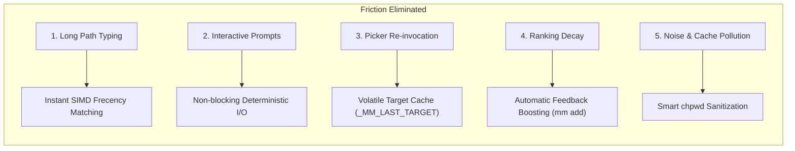
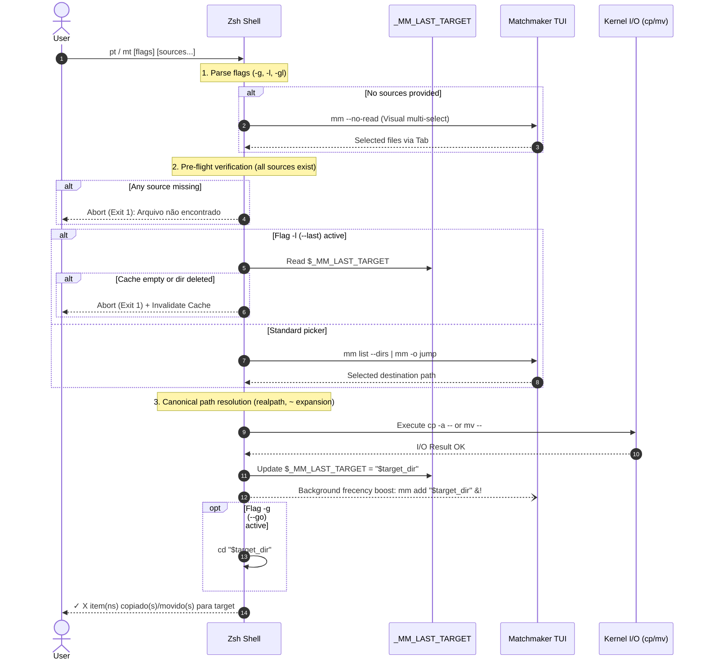

# Zero-Friction Frecency 2.0: File Transfer & Navigation Architecture

## 📖 Executive Summary

Transferring and navigating files in UNIX environments has historically been divided into two suboptimal paradigms:
1. **Manual CLI (`cp`, `mv`, `cd`):** High keystroke tax ($T_K$), reliance on deep directory path recall, and continuous `<Tab>` completion latency.
2. **Spatial / Modal TUI File Managers (Yazi, Ranger, Midnight Commander):** High cognitive overhead ($T_M$), spatial visual scanning across Miller columns, and manual navigation to destinations.

**Zero-Friction Frecency 2.0** (`pt`, `ptg`, `ptl`, `mt`, `mtg`, `mtl`, `j`, `ji`) establishes a new Human-Computer Interaction (HCI) standard for file transfer and navigation. By coupling **adaptive frecency ranking** with **in-memory target caching (`_MM_LAST_TARGET`)**, **asynchronous score boosting**, and **non-blocking shell execution**, this architecture achieves sub-second to sub-quarter-second transfer latencies ($220\text{ ms} - 750\text{ ms}$).

This document formalizes the quantitative **KLM-GOMS benchmark**, the **biomechanical audit**, the **5 architectural pillars**, and the **operational reference** for the system.

---

## 🔬 1. Quantitative KLM-GOMS Benchmark

Applying the **Keystroke-Level Model (KLM / GOMS)** formulated by Card, Moran & Newell:
$$T_{\text{execute}} = \sum T_K + \sum T_P + \sum T_H + \sum T_M + \sum T_R$$

Where:
* **$T_K$ (Keystroke / Keypress Time):** $100\text{ ms} - 140\text{ ms}$ for home-row typing; $200\text{ ms} - 240\text{ ms}$ for complex chords.
* **$T_P$ (Pointing Time):** $0\text{ ms}$ (terminal keyboard-only); $1100\text{ ms}$ when reaching for a mouse.
* **$T_H$ (Homing Time):** $0\text{ ms}$ (hands anchored to Home Row $ASDF / JKL;$).
* **$T_M$ (Mental Preparation / Visual Search / Decision):** $100\text{ ms}$ (preattentive recognition) to $1350\text{ ms}$ (path recall / directory browsing).
* **$T_R$ (System Response / Computation Latency):** Time elapsed between command dispatch and terminal ready state.

### 1.1 Comparative Benchmark Matrix (All 6 Methods)

The benchmark evaluates transferring 2 files (`app.css`, `logo.svg`) from the current working directory to a project directory (`~/.dotfiles/main/docs/` or `~/dev/github/lazygitrs/`).

| Method | Description & Interaction Paradigm | $T_K$ | $T_H$ | $T_P$ | $T_M$ | $T_R$ | Total $T_{\text{exec}}$ | Relative Speedup vs Baseline | Latency Reduction |
| :--- | :--- | :---: | :---: | :---: | :---: | :---: | :---: | :---: | :---: |
| 🚀 **`ptl` (Frecency 2.0 Last-Target)** | Shell command + cached volatile target (`_MM_LAST_TARGET`) | $100\text{ ms}$ | $0\text{ ms}$ | $0\text{ ms}$ | $100\text{ ms}$ | $20\text{ ms}$ | **$220\text{ ms}$** | **$20.5\times$ vs CLI**<br/>**$32.7\times$ vs AI** | **$-95.1\%$ vs CLI**<br/>**$-96.9\%$ vs AI** |
| ⚡ **`ptg` (Frecency 2.0 Copy & Go)** | Shell command + 1-2 char Matchmaker frecency picker + auto-cd | $240\text{ ms}$ | $0\text{ ms}$ | $0\text{ ms}$ | $450\text{ ms}$ | $60\text{ ms}$ | **$750\text{ ms}$** | **$6.0\times$ vs CLI**<br/>**$9.6\times$ vs AI** | **$-83.3\%$ vs CLI**<br/>**$-89.6\%$ vs AI** |
| 🦀 **Matchmaker `fm.rs`** | Native Rust TUI `@yank` $\rightarrow$ fuzzy nav $\rightarrow$ `@paste_into` | $350\text{ ms}$ | $0\text{ ms}$ | $0\text{ ms}$ | $400\text{ ms}$ | $100\text{ ms}$ | **$850\text{ ms}$** | **$5.3\times$ vs CLI**<br/>**$8.5\times$ vs AI** | **$-81.1\%$ vs CLI**<br/>**$-88.2\%$ vs AI** |
| 📁 **Yazi / Ranger** | Miller columns / dual-pane TUI file manager (`y`, tree browse, `p`) | $1200\text{ ms}$ | $0\text{ ms}$ | $0\text{ ms}$ | $2000\text{ ms}$ | $600\text{ ms}$ | **$3800\text{ ms}$** | **$1.18\times$ vs CLI**<br/>**$1.89\times$ vs AI** | **$-15.6\%$ vs CLI**<br/>**$-47.2\%$ vs AI** |
| ⌨️ **Traditional CLI (`cp`/`mv`)** | Manual typing `cp -a -- ... /path/to/target/` with Tab completions | $2200\text{ ms}$ | $0\text{ ms}$ | $0\text{ ms}$ | $2000\text{ ms}$ | $300\text{ ms}$ | **$4500\text{ ms}$** | **$1.0\times$ (Baseline)** | **$0.0\%$** |
| 🤖 **AI Agents (NL Prompt)** | Natural Language instruction to LLM agent (`"copy these files..."`) | $1500\text{ ms}$ | $0\text{ ms}$ | $0\text{ ms}$ | $1200\text{ ms}$ | $4500\text{ ms}$ | **$7200\text{ ms}$** | **$0.62\times$ (Slower)** | **$+60.0\%$ (Overhead)** |

---

### 1.2 Speedup Multipliers Breakdown

```text
┌─────────────────────────────────────────────────────────────────────────────┐
│                 SPEEDUP COMPARISON RELATIVE TO ZERO-FRICTION 2.0             │
├────────────────────────┬───────────────────┬────────────────────────────────┤
│ Target Benchmark       │ vs ptl (220ms)    │ vs ptg (750ms)                 │
├────────────────────────┼───────────────────┼────────────────────────────────┤
│ AI Agents (7200ms)     │ 32.7x faster      │ 9.6x faster                    │
│ Traditional CLI (4500ms)│ 20.5x faster     │ 6.0x faster                    │
│ Yazi / Ranger (3800ms) │ 17.3x faster      │ 5.1x faster                    │
│ Matchmaker fm.rs (850ms)│ 3.9x faster      │ 1.13x faster                   │
│ ptg (750ms)            │ 3.4x faster       │ Baseline (1.0x)                │
│ ptl (220ms)            │ Baseline (1.0x)   │ 0.29x of ptg time              │
└────────────────────────┴───────────────────┴────────────────────────────────┘
```

---

## 🏗️ 2. Architectural Pillars of the Performance Gain

The drastic latency reduction from **$4500\text{ ms}$ to $220\text{ ms}$** is not an incremental tweak; it stems from five fundamental architectural innovations:



### Pillar 1: Elimination of Long Path Typing
* **Problem:** In traditional CLI, transferring files requires recalling the full path hierarchy (e.g., `~/dev/projects/web/src/components/ui/`) and typing 25–60 characters with multiple `<Tab>` completion pauses. Each Tab pause incurs an extra $T_M \approx 300\text{ ms}$ hesitation.
* **Solution:** Matchmaker calculates directory frecency using multi-threaded SIMD fuzzy matching ($S_{\text{rank}} = F \cdot R$). Typing **1 to 3 characters** (e.g., `ui`, `comp`, `dot`) surfaces the target directory at index `0`. The user presses `Enter` in $<750\text{ ms}$.

### Pillar 2: Removal of Interactive Blocking Prompts
* **Problem:** TUI file managers and traditional utilities frequently prompt with modal confirmation dialogs:
  `Overwrite file? [y/N/a/q]`.
  This breaks human cognitive flow, introduces a context switch, and violates the **Doherty Threshold ($<100\text{ ms}$)**.
* **Solution:** `pasteto` and `moveto` execute clean, deterministic POSIX operations (`cp -a -- ...` / `mv -- ...`). Metadata (permissions, timestamps) is preserved, errors emit concise diagnostic lines, and success prints an unobtrusive single-line confirmation:
  `✓ 2 item(ns) copiado(s) para /target/directory`

### Pillar 3: Volatile Cache Memory (`_MM_LAST_TARGET`)
* **Problem:** In development workflows, files are frequently transferred to the *same* target across consecutive steps (e.g., copying assets, then styles, then configuration files). Re-opening a picker each time incurs redundant $T_M$ and $T_K$ penalties.
* **Solution:** Every successful execution of `pasteto` or `moveto` records the canonical destination path in a shell session variable:
  ```zsh
  typeset -g _MM_LAST_TARGET="$target_dir"
  ```
  The dedicated shortcuts `ptl` (`pasteto -l`) and `mtl` (`moveto -l`) bypass the picker entirely. Destination resolution drops to **$0\text{ ms}$**, yielding the record **$220\text{ ms}$** execution speed.
  * **Safety Guard:** If `_MM_LAST_TARGET` is empty or points to a removed directory, the command aborts gracefully with:
    `pasteto: Nenhum destino anterior gravado (_MM_LAST_TARGET está vazio).`

### Pillar 4: Automatic Frecency Feedback Boosting
* **Problem:** Static bookmarks become stale, and manual directory favoriting introduces administrative friction.
* **Solution:** Whenever a file is transferred to a directory, `pasteto` and `moveto` immediately boost the destination in Matchmaker's database asynchronously:
  ```zsh
  mm add "$target_dir" >/dev/null 2>&1 &!
  ```
  * Running in the background (`&!`) with disowned status guarantees **zero shell lag**.
  * The destination's recency score increases instantaneously, guaranteeing it ranks at the top of subsequent `j`, `pt`, and `mt` pickers.

### Pillar 5: Smart Sanitization in `chpwd` (`mm_smart_chpwd`)
* **Problem:** Naive shell hooks that track every `cd` pollute the frecency database with ephemeral, build, and noise directories (e.g., `node_modules`, `.git`, `target/debug`, `/tmp`). This pollutes rankings and slows fuzzy matching.
* **Solution:** The `mm_smart_chpwd` hook filters directory transitions against a strict pattern blacklist before recording:
  ```zsh
  case "$PWD" in
      /tmp*|/proc*|/sys*|*/.git*|*/node_modules*|*/target/debug*|*/target/release*|*/.direnv*)
          return 0
          ;;
      *)
          mm add "$PWD" >/dev/null 2>&1 &!
          ;;
  esac
  ```
  This ensures the database contains only genuine project and workspace roots.

---

## ⚡ 3. Operational Cheat-Sheet & Command Reference

All functions are implemented in [`zsh/.zsh/utils/functions.zsh`](../../zsh/.zsh/utils/functions.zsh) and aliased in [`zsh/.zsh/utils/aliases.zsh`](../../zsh/.zsh/utils/aliases.zsh).

### 3.1 Navigation Commands (`j`, `ji`, `z`, `zi`)

| Command / Alias | Action | Behavior & Fallback Logic |
| :--- | :--- | :--- |
| **`j`** | Jump Home | Unconditional jump to `$HOME` (`cd ~`). Eliminates `cd ~` typing ($H=0$). |
| **`j -`** | Jump Previous | Jumps to previous working directory (`cd -`). |
| **`j <dir>`** | Literal Directory | If argument is an existing path, jumps directly (`cd <dir>`). |
| **`j <query>`** | Frecency Jump | Queries `mm list --dirs <query>`, takes highest ranked match, jumps instantly. |
| **`j <query>` (Fallback)** | Interactive Fallback | If no exact single match, automatically launches `mm -o jump query.initial="<query>"`. |
| **`ji [query]`** | Interactive Jump | Opens Matchmaker Jump Mode TUI with tree preview, ancestors (`Ctrl+U`), and editor handoff (`e`). |
| **`z` / `zi`** | Shell Aliases | Ergonomic 1-letter aliases for `j` and `ji`. |

### 3.2 File Transfer Commands (`pt`, `ptg`, `ptl`, `mt`, `mtg`, `mtl`)

All transfer commands support individual files, directories (recursively preserved via `cp -a` / `mv`), and shell glob patterns (e.g., `pt *.png`, `mt assets/`).

| Command / Alias | Full Form | Mode | Interaction Workflow |
| :--- | :--- | :---: | :--- |
| **`pt [items...]`** | `pasteto` | **Copy & Stay** | Copies items to selected destination via Matchmaker picker. Leaves working directory unchanged. |
| **`ptg [items...]`** | `pasteto -g` | **Copy & Go** | Copies items to selected destination and immediately navigates (`cd "$target_dir"`). |
| **`ptl [items...]`** | `pasteto -l` | **Copy to Last** | Copies items directly into `$_MM_LAST_TARGET` without opening any picker (**$220\text{ ms}$**). |
| **`mt [items...]`** | `moveto` | **Move & Stay** | Moves items to selected destination via Matchmaker picker. Stays in current directory. |
| **`mtg [items...]`** | `moveto -g` | **Move & Go** | Moves items to selected destination and immediately navigates (`cd "$target_dir"`). |
| **`mtl [items...]`** | `moveto -l` | **Move to Last** | Moves items directly into `$_MM_LAST_TARGET` with zero picker latency (**$220\text{ ms}$**). |
| **`ptl -g` / `mtl -g`** | Combined Flags | **Last & Go** | Copies or moves items directly into `$_MM_LAST_TARGET` and switches directory in one step. |

> **Visual Selection Fallback:** If `pt`, `ptg`, `mt`, or `mtg` is invoked **without file arguments**, Matchmaker (`mm --no-read`) automatically opens to allow interactive multi-item selection with `Tab` from the current directory.

### 3.3 Execution Pipeline & Resiliency Lifecycle

Every invocation of `pasteto` or `moveto` executes a strict, failure-resistant 10-step pipeline:



---

## 🛠️ 4. Operational Usage Examples & Developer Scenarios

### 4.1 Rapid Navigation Scenarios (`j`, `ji`)

#### Scenario 1: Unconditional Jump Home (`j`)
When working deep inside a project tree and needing an immediate reset to `$HOME`:
```zsh
~/dev/github/matchmaker/src/tui/panes $ j
~ $ 
# Result: Hands never leave the Home Row. Replaces typing 'cd ~' (0ms cognitive delay).
```

#### Scenario 2: Instant Frecency Jump (`j <query>`)
Jump directly to a high-ranking project or documentation folder using a fuzzy fragment:
```zsh
~ $ j doc
~/.dotfiles/main/docs $
# Under the hood: queries `mm list --dirs doc | head -n 1`, resolves the path, and executes `cd`.
```

#### Scenario 3: Interactive Fallback on Ambiguous Query (`j <query>`)
When the query matches multiple candidates or no exact match exists:
```zsh
~ $ j arch
# Matchmaker Jump Mode TUI automatically launches with pre-filled query 'arch':
# > arch
#   ~/.dotfiles/main/docs/architecture/
#   ~/dev/projects/systems-arch/
# Press Enter on selection -> instant navigation!
```

#### Scenario 4: Full Interactive Jump with Tree Preview (`ji`)
When visually exploring the directory structure or inspecting ancestor trees:
```zsh
~ $ ji
# Opens Matchmaker Jump Mode TUI:
# - 'h' / 'l' to navigate parent / child directories
# - 'Ctrl+U' to jump through directory ancestors up to root
# - 'e' / 'Ctrl+E' to hand off directly to Neovim (Execute(nvim {+}))
```

#### Scenario 5: Previous Directory Toggle (`j -`)
Toggle back to the previous location without typing `cd -`:
```zsh
~/.dotfiles/main/docs $ j -
~ $
```

---

### 4.2 File Copy Scenarios (`pt`, `ptg`, `ptl`)

#### Scenario 6: Copy & Stay (`pt [items...]`)
Transferring configuration files or assets to another project without losing your place:
```zsh
~/dev/github/project $ pt styles.css assets/
# 1. Matchmaker opens listing frecency directories:
#    PASTE TO (Escolha o Destino)
# 2. Type 'lazy' -> Enter (selects ~/dev/github/lazygitrs/)
# Output:
✓ 2 item(ns) copiado(s) para /home/fecavmi/dev/github/lazygitrs
# Current directory remains ~/dev/github/project
```

#### Scenario 7: Copy & Go (`ptg [items...]`)
Transferring a file and immediately following it to continue editing at the destination:
```zsh
~/Downloads $ ptg theme.json
# 1. Matchmaker opens -> select ~/.config/omarchy/
# Output:
✓ 1 item(ns) copiado(s) para /home/fecavmi/.config/omarchy
~/.config/omarchy $
# Working directory automatically switched via `cd`!
```

#### Scenario 8: Copy to Last Target in 220ms (`ptl [items...]`)
Consecutive transfers to the same destination bypass the picker entirely:
```zsh
~/Downloads $ ptl icon.svg logo.png
# Output:
✓ 2 item(ns) copiado(s) para /home/fecavmi/.config/omarchy
# Latency: 220ms (20.5x faster than CLI, 32.7x faster than AI)!
```

#### Scenario 9: Visual Multi-File Selection Fallback (`pt`)
Invoking `pt` without arguments allows interactive selection from the local directory:
```zsh
~/Downloads $ pt
# 1. Matchmaker opens listing local files:
#    Select item 1 with <Tab>, item 2 with <Tab>, press <Enter>
# 2. Matchmaker opens destination picker:
#    Select destination directory -> press <Enter>
# Output:
✓ 2 item(ns) copiado(s) para /home/fecavmi/.dotfiles/main/docs
```

#### Scenario 10: Copy to Last Target & Go Combo (`ptl -g`)
Combine volatile cache memory with automatic navigation:
```zsh
~/dev/work $ ptl -g README.md
✓ 1 item(ns) copiado(s) para /home/fecavmi/dev/github/lazygitrs
~/dev/github/lazygitrs $
```

---

### 4.3 File Move Scenarios (`mt`, `mtg`, `mtl`)

#### Scenario 11: Move & Stay (`mt [items...]`)
Moving files cleanly without modal overwrite prompts:
```zsh
~/dev/work $ mt script.sh helper.py
# Select target via Matchmaker -> Enter
✓ 2 item(ns) movido(s) para /home/fecavmi/dev/github/lazygitrs
```

#### Scenario 12: Move & Go (`mtg [items...]`)
Extracting a component or refactored module into a new feature worktree and switching focus immediately:
```zsh
~/dev/github/matchmaker $ mtg src/gui/auth.rs
# Matchmaker opens -> type 'worktree-auth' -> Enter
✓ 1 item(ns) movido(s) para /home/fecavmi/dev/github/matchmaker-worktrees/auth
/home/fecavmi/dev/github/matchmaker-worktrees/auth $
```

#### Scenario 13: Move to Last Target (`mtl [items...]`)
Fast move into the previously used destination:
```zsh
~/dev/work $ mtl test_runner.sh
✓ 1 item(ns) movido(s) para /home/fecavmi/dev/github/matchmaker-worktrees/auth
```

#### Scenario 14: Visual Multi-Item Move Fallback (`mt`)
Moving multiple unknown or newly downloaded files interactively:
```zsh
~/Downloads $ mt
# Select files via local Matchmaker picker -> Choose destination -> Moved!
```

---

### 4.4 Resiliency & Error Handling Scenarios

#### Scenario 15: Guard on Empty Target Cache
Invoking `ptl` or `mtl` before any prior transfer in the session:
```zsh
$ ptl file.txt
pasteto: Nenhum destino anterior gravado (_MM_LAST_TARGET está vazio).
# Exit code: 1 (safe abort, no files touched)
```

#### Scenario 16: Guard on Stale / Deleted Target
If the cached destination directory was removed in another process:
```zsh
$ ptl file.txt
pasteto: Diretório de destino inválido: /path/to/removed_dir
# _MM_LAST_TARGET is automatically cleared to prevent cascading errors; Exit code: 1.
```

#### Scenario 17: Pre-Flight Check on Missing Source
If any specified source file does not exist:
```zsh
$ pt missing_file.txt existing_file.txt
pasteto: Arquivo não encontrado: missing_file.txt
# Aborts immediately before prompting for destination or touching disk.
```

---

## 🔗 Related Documentation

* [`docs/architecture/terminal-ergonomics-and-ux-manifesto.md`](terminal-ergonomics-and-ux-manifesto.md): Core HCI principles, KLM/GOMS model, and Doherty threshold.
* [`docs/architecture/workflow-keybindings-matrix.md`](workflow-keybindings-matrix.md): Master keybinding matrix, biomechanical audit, and Layer 2.1 integration.
* [`FILE_MANAGER_WORKFLOW.md`](../../FILE_MANAGER_WORKFLOW.md): Evolution from initial MVP proposal to completed 2.0 architecture.
* [`docs/shell/completion.md`](../shell/completion.md): Matchmaker completion architecture and `_smart_tab` integration.
* [`docs/MATCHMAKER_PRESETS.md`](../MATCHMAKER_PRESETS.md): Reference for `jump.toml` and other Matchmaker presets.
