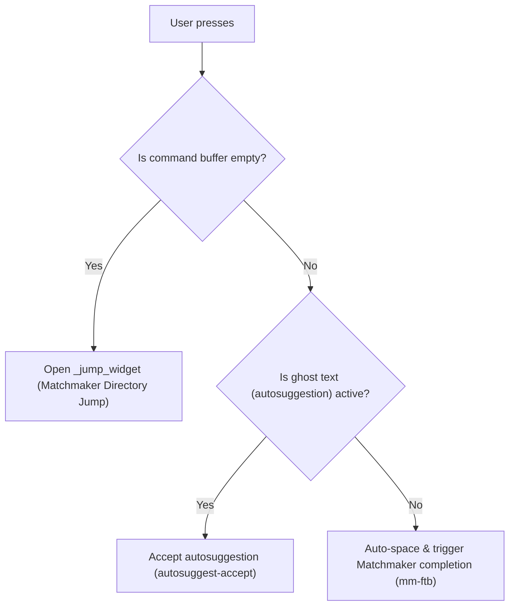

# Smart Tab Completion & Matchmaker Integration

The shell tab completion behavior in [`zsh/.zsh/utils/binds.zsh`](../../zsh/.zsh/utils/binds.zsh) provides context-aware logic (`_smart_tab`), automated command spacing, and full integration with the **Matchmaker** picker library.

---

## 1. Context-Aware Tab Behaviors (`<Tab>`)

The `_smart_tab` widget detects command-line state and dynamically routes the tab key:

- **Empty Line (`<Tab>`)**: Directly opens `_jump_widget` (Matchmaker / Zoxide directory selection) for zero-friction directory jumping without pre-typing `j`.
- **Autosuggestions**: If ghost text is visible, `<Tab>` accepts the suggestion immediately (`autosuggest-accept`).
- **Active Command Line (`<Tab>` with text)**: Executes Matchmaker-powered tab completion (`mm-ftb`).
- **Direct Hotkey (`Ctrl+T`)**: Unconditionally opens the Matchmaker directory jump interface at any prompt state.

---

## 2. Auto-Spacing on Aliases & Commands (`_auto_space_if_command`)

Eliminates the friction of having to manually type a trailing space before requesting argument or branch completion:

- **How it Works**: When you trigger completion directly on an exact alias (`gco`, `ga`, `gst`, `gp`), an executable binary (`cat`, `nvim`, `git`, `kill`), or a shell function without a trailing space, the widget automatically appends a space (`BUFFER="$BUFFER "`) and positions the cursor before delegating to Zsh completion.
- **Examples**:
  - `gco<Tab>` or `gco<Ctrl+N>` $\rightarrow$ immediately opens the Git branch picker without requiring `gco <Tab>`.
  - `cat<Ctrl+N>` $\rightarrow$ immediately lists files in the current directory.
  - `kill<Ctrl+N>` $\rightarrow$ immediately lists process PIDs.
  - Typing a partial word (e.g. `gi` or `ca`) completes the command name itself normally.

---

## 3. Dual Picker Backends (`Ctrl+N` vs `Ctrl+F`)

| Keybinding | Backend | Engine | Purpose |
| :--- | :--- | :--- | :--- |
| **`Ctrl+N`** / **`<Tab>`** | **Matchmaker** | [`mm-ftb`](../../matchmacker/.local/bin/mm-ftb) | High-performance Nucleo matching with preset [`ftb.toml`](../../matchmaker/.config/matchmaker/presets/ftb.toml) |
| **`Ctrl+F`** | **FZF** | `fzf` | Classic fzf fallback picker |

---

## 4. Matchmaker FZF-Tab Preset Highlights ([`ftb.toml`](../../matchmaker/.config/matchmaker/presets/ftb.toml))

The dedicated completion preset includes key UX optimizations:

- **Smart Sorting (`matcher.sort = "smart"`)**: Preserves natural stream insertion order (such as most recently committed Git branches) on an empty query, and switches to Nucleo fuzzy relevance scoring as you type.
- **Full-Width Candidate Columns**: Auxiliary prefix and suffix columns are set to `hidden = true`, giving the candidate column 100% of the horizontal window width so Git branch names, commit hashes, and commit messages display completely without truncation.
- **ANSI Color Parsing (`start.ansi = true`)**: Parses ANSI escape sequences emitted by Zsh completion functions and renders true colors.
- **On-Demand Preview (`Ctrl+P`)**: The picker starts compact and lightweight (`preview.show = false`). Pressing `Ctrl+P` (`SwitchPreview`) toggles a dynamic preview pane on the right:
  - **🌿 Git Branches & Commits**: Interactive `git log --graph --oneline` commit history.
  - **📄 Files**: Syntax-highlighted content via `bat`.
  - **📁 Directories**: Tree structure via `eza --tree`.
  - **⚙️ Processes (PIDs)**: Process status via `ps -fp`.
