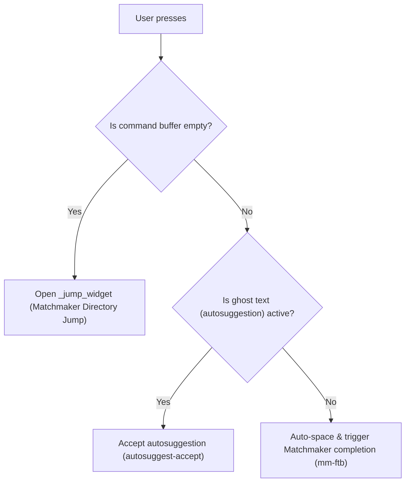

# Smart Tab Completion & Matchmaker Integration

The shell tab completion behavior in [`zsh/.zsh/utils/binds.zsh`](../../zsh/.zsh/utils/binds.zsh) provides context-aware logic (`_smart_tab`), automated command spacing, and full integration with the **Matchmaker** picker library.

---

## 1. Context-Aware Tab Behaviors (`<Tab>`)

The `_smart_tab` widget detects command-line state and dynamically routes the tab key:

- **Empty Line (`<Tab>`)**: Directly opens `_jump_widget` (Matchmaker frecency directory selection) for zero-friction directory jumping without pre-typing `j`.
- **Autosuggestions**: If ghost text is visible, `<Tab>` accepts the suggestion immediately (`autosuggest-accept`).
- **Active Command Line (`<Tab>` with text)**: Executes Matchmaker-powered tab completion (`mm-ftb`).
- **Direct Hotkey (`Ctrl+T`)**: Unconditionally opens the Matchmaker directory jump interface at any prompt state.

---

## 2. Auto-Spacing on Aliases & Commands (`_auto_space_if_command`)

Eliminates the friction of having to manually type a trailing space before requesting argument or branch completion:

- **How it Works**: When you trigger completion directly on an exact alias (`gco`, `ga`, `gst`, `gp`), an executable binary (`cat`, `nvim`, `git`, `kill`), or a shell function without a trailing space, the widget automatically appends a space (`BUFFER="$BUFFER "`) and positions the cursor before delegating to Zsh completion.
- **Examples**:
  - `gco<Tab>` or `gco<Ctrl+N>` $\rightarrow$ immediately opens the Git branch picker without requiring `gco <Tab>`.
  - `cat<Ctrl+N>` $\rightarrow$ immediately lists files in the current directory.
  - `kill<Ctrl+N>` $\rightarrow$ immediately lists process PIDs.
  - Typing a partial word (e.g. `gi` or `ca`) completes the command name itself normally.

---

## 3. Dual Picker Backends (`Ctrl+N` vs `Ctrl+F`)

| Keybinding | Backend | Engine | Purpose |
| :--- | :--- | :--- | :--- |
| **`Ctrl+N`** / **`<Tab>`** | **Matchmaker** | [`mm-ftb`](../../matchmacker/.local/bin/mm-ftb) | High-performance Nucleo matching with preset [`ftb.toml`](../../matchmaker/.config/matchmaker/presets/ftb.toml) |
| **`Ctrl+F`** | **FZF** | `fzf` | Classic fzf fallback picker |

---

## 4. Matchmaker FZF-Tab Preset Highlights ([`ftb.toml`](../../matchmaker/.config/matchmaker/presets/ftb.toml))

The dedicated completion preset includes key UX optimizations:

- **Smart Sorting (`matcher.sort = "smart"`)**: Preserves natural stream insertion order (such as most recently committed Git branches) on an empty query, and switches to Nucleo fuzzy relevance scoring as you type.
- **Full-Width Candidate Columns**: Auxiliary prefix and suffix columns are set to `hidden = true`, giving the candidate column 100% of the horizontal window width so Git branch names, commit hashes, and commit messages display completely without truncation.
- **ANSI Color Parsing (`start.ansi = true`)**: Parses ANSI escape sequences emitted by Zsh completion functions and renders true colors.
- **On-Demand Preview (`Ctrl+P`)**: Pressing `Ctrl+P` (`SwitchPreview`) toggles a dynamic preview pane on the right:
  - **🌿 Git Branches & Commits**: Interactive `git log --graph --oneline` commit history.
  - **📄 Files**: Syntax-highlighted content via `bat`.
  - **📁 Directories**: Tree structure via `eza --tree`.
  - **⚙️ Processes (PIDs)**: Process status via `ps -fp`.
- **Footer Hints (`[footer]`)**: Displays subtle keyboard navigation hints at the bottom of the picker interface.

---

## 5. Matchmaker Jump Mode ([`jump.toml`](../../matchmaker/.config/matchmaker/presets/jump.toml))

Triggered on empty prompt via `<Tab>` or directly with `Ctrl+T`. Optimized for directory traversal, frecency ranking, and subfolder navigation:

- **Seamless Traversal (`Ctrl+L` / `Ctrl+H`)**:
  - **`Ctrl+L`**: Enters the highlighted directory immediately (`ChDir({=})`), clears the filter input (`Cancel`), and reloads the file list (`Reload`) without needing to switch focus to the results pane with `Tab`.
  - **`Ctrl+H`**: Steps up to the parent directory (`ChDir(..)`), clears the filter query, and reloads.
- **Ancestor Jump (`Ctrl+U` / `u`)**:
  - Instantly generates and streams the entire upward directory hierarchy (from the current directory up to `/`).
  - Selecting any ancestor directory and pressing `Enter` or `Ctrl+L` jumps straight to that level in 1 step.
  
  > [!TIP]
  > #### 🌟 Onde o Ancestor Jump Brilha:
  > - **Monorepos e Árvores Profundas**: Quando você está 5 ou 6 níveis adentro (ex: `~/dev/github/matchmaker/matchmaker-lib/src/render/widgets/`) e quer voltar para a raiz do repositório (`~/dev/github/matchmaker/`) em 1 único passo, sem apertar `h` ou `cd ..` repetidamente.
  > - **Troca de Projetos Irmãos**: Permite subir rapidamente até uma pasta mãe comum (ex: `~/dev/github/` ou `~/dev/`) para navegar até outro projeto sem sair da sessão do Matchmaker.
  > - **Auditoria com Preview**: Enquanto você percorre a lista de pastas ancestrais com `j/k`, o painel de preview da direita exibe a árvore de cada pasta pai, permitindo inspecionar o contexto antes de confirmar o salto.
  > - **Sem Modificador `Alt`**: O atalho `Ctrl+U` (Input) ou a tecla `u` (Results) proporciona uma experiência ergonômica e imediata associada a **"Upward / Upper Hierarchy"**.
- **Cycle Mode (`Ctrl+F` / `f`)**: Cycles between local directory entries and global frecency directories (`mm list --dirs`).
- **Toggle Preview (`Ctrl+P` / `p`)**: Shows/hides directory tree (`mm tree` / `eza`) and file syntax previews.

---

## 6. Keyboard Shortcuts Reference

### Autocomplete Mode (`ftb.toml` / `Ctrl+N` / `<Tab>`)

| Shortcut | Mode | Action | Description |
| :--- | :--- | :--- | :--- |
| **`Ctrl+P`** | All | `SwitchPreview` | **Toggle preview pane on / off** |
| **`Tab`** / **`Ctrl+J`** | All | `Down` | Move selection down |
| **`Shift+Tab`** / **`Ctrl+K`** | All | `Up` | Move selection up |
| **`Enter`** | All | `Accept` | Confirm selection and insert into prompt |
| **`Esc`** / **`Ctrl+C`** | All | `Abort` | Cancel completion |

### Jump Mode (`jump.toml` / `<Tab>` / `Ctrl+T`)

| Shortcut | Mode | Action | Description |
| :--- | :--- | :--- | :--- |
| **`Ctrl+L`** | Input & Results | `ChDir + Cancel + Reload` | **Enter selected directory seamlessly** |
| **`Ctrl+H`** | Input & Results | `ChDir(..) + Cancel + Reload` | **Go to parent directory seamlessly** |
| **`Ctrl+U`** / **`u`** | Input & Results | `Reload(ancestor hierarchy)` | **Open ancestor directory picker** |
| **`Ctrl+P`** / **`p`** | Input & Results | `SwitchPreview` | **Toggle directory/file preview pane** |
| **`Ctrl+F`** / **`f`** | Input & Results | `ReloadNext` | **Cycle between local files & frecency history** |
| **`Ctrl+E`** / **`e`** | Input & Results | `Execute(nvim {+})` | **Open selected item(s) in Neovim with frecency boost** |
| **`Tab`** / **`Shift+Tab`** | Input & Results | `ToggleSelect` | **Multi-select multiple files or directories** |
| **`h` / `l`** | Results (Nav) | `ChDir` | Vim-style directory navigation |
| **`j` / `k`** | Results (Nav) | `Down / Up` | Vim-style list navigation |
| **`Enter`** | All | `Accept` | Change shell working directory to selection |
