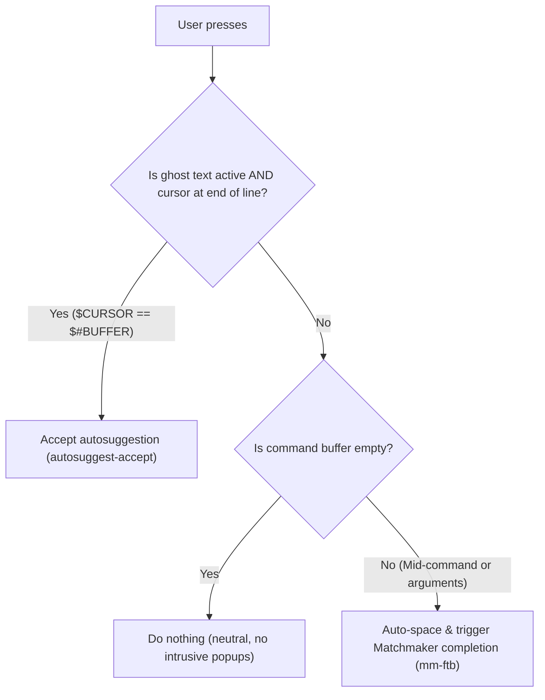
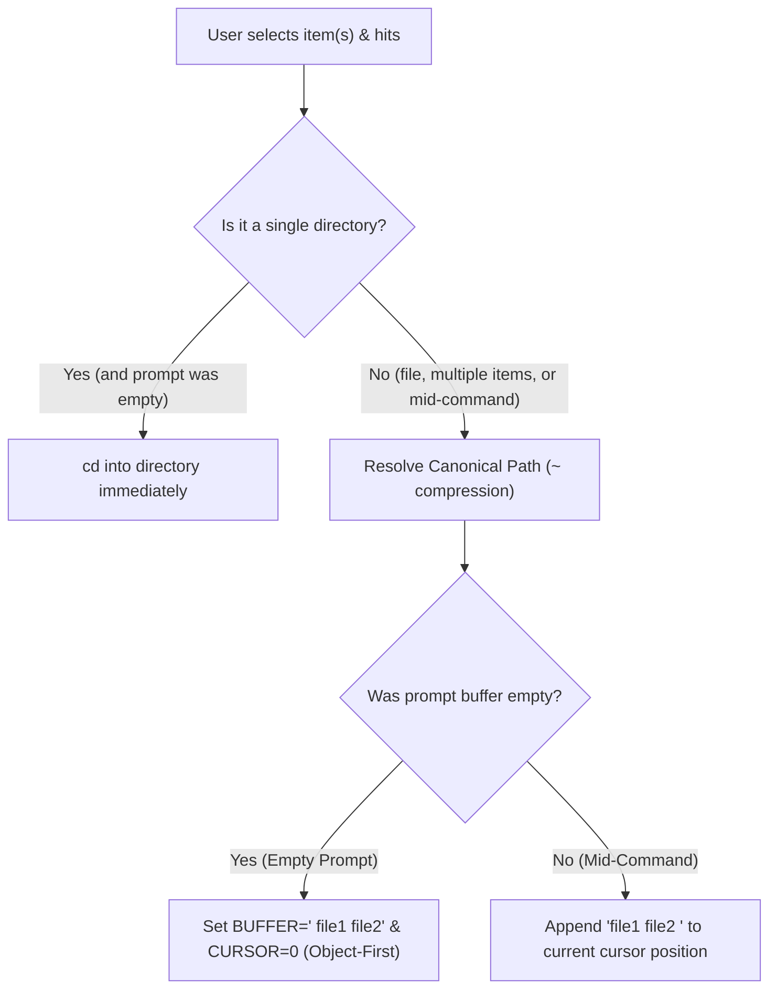

# Smart Tab Completion & Matchmaker Integration

The shell tab completion behavior in [`zsh/.zsh/utils/binds.zsh`](../../zsh/.zsh/utils/binds.zsh) provides context-aware logic (`_smart_tab`), automated command spacing, and full integration with the **Matchmaker** picker library.

---

## 1. Context-Aware Tab Behaviors (`<Tab>`)

The `_smart_tab` widget detects command-line state and dynamically routes the tab key:



- **Empty Line (`<Tab>`)**: Neutral; does nothing to prevent accidental popups when idle.
- **Autosuggestions at End of Line**: If ghost text is visible and the cursor is at the end of the line (`$CURSOR -eq $#BUFFER`), `<Tab>` accepts the suggestion immediately (`autosuggest-accept`).
- **Middle-of-Line / Arguments (`<Tab>` with text)**: When editing in the middle of a command, `<Tab>` bypasses ghost text and opens Matchmaker-powered tab completion (`mm-ftb`) for the specific argument at the cursor.
- **Direct Hotkey (`Ctrl+F`)**: Opens the Matchmaker Jump directory interface (`mm -o jump`) at any prompt state.

### 1.1. Deep-Dive: Por que `$CURSOR -eq $#BUFFER` Revoluciona a Edição no Meio da Linha

A checagem `$CURSOR -eq $#BUFFER` no `_smart_tab` resolve um dos maiores problemas de usabilidade (UX) em terminais que utilizam `zsh-autosuggestions` junto com menu de autocompletação (`fzf-tab` / `mm-ftb`): **o sequestro da linha pelo ghost-text durante a edição no meio do buffer**.

Abaixo estão **5 exemplos reais do dia a dia de desenvolvimento** contrastando o comportamento anterior versus o atual:

---

#### 📌 Exemplo 1: Corrigir ou Adicionar Flag no Meio de um `git commit`

Você está compondo um commit longo e move o cursor para o meio para adicionar a flag `--amend`:

```text
Buffer digitado:
$ git commit --am█ -m "fix(auth): correct token refresh" ░--no-verify░ (sugestão cinza do histórico)
                ▲
         $CURSOR está aqui (no meio da linha)
```

* **❌ Como era antes (`[[ -n "$POSTDISPLAY" ]]`):**  
  Ao apertar `<Tab>` em `--am█`, o Zsh detectava texto cinza no final, **aceitava o ghost text**, colava `--no-verify`, jogava o cursor para o fim da linha e **não completava** o `--amend`.
* **✅ Como ficou agora (`$CURSOR -eq $#BUFFER`):**  
  Como `$CURSOR < $#BUFFER`, o widget ignora o ghost text e abre o Matchmaker (`mm-ftb`) para autocompletar `--amend` exatamente na posição do cursor sem alterar o restante da linha.

---

#### 📌 Exemplo 2: Completar Caminhos de Origem em Comandos de Cópia (`cp` / `mv` / `rsync`)

Você está copiando um arquivo específico para uma pasta de backup:

```text
Buffer digitado:
$ cp src/comp█/Modal.tsx /tmp/backup/ ░src/components/Button/ /tmp/backup-old/░
            ▲
     $CURSOR está aqui
```

* **❌ Como era antes:**  
  Ao apertar `<Tab>` para autocompletar `src/components/`, o Zsh aceitava a cauda antiga do histórico, misturando os dois caminhos e corrompendo o comando:  
  `$ cp src/comp/Modal.tsx /tmp/backup/ src/components/Button/ /tmp/backup-old/`
* **✅ Como ficou agora:**  
  O `<Tab>` expande cirurgicamente `src/comp` $\rightarrow$ `src/components/` sem tocar no destino `/tmp/backup/` e sem puxar argumentos antigos.

---

#### 📌 Exemplo 3: Alterar Volumes, Portas ou Imagens no Meio de um `docker run`

Você reaproveitou um comando de container do histórico e voltou para alterar o volume montado:

```text
Buffer digitado:
$ docker run -it -v $(pwd)/di█:/app -p 3000:3000 node:20 ░--rm nginx:alpine░
                           ▲
                    $CURSOR está aqui
```

* **❌ Como era antes:**  
  Ao apertar `<Tab>` para completar a pasta `dist/`, o Zsh aceitava a cauda antiga (`--rm nginx:alpine`) e deixava `di` sem completar.
* **✅ Como ficou agora:**  
  O `<Tab>` lista e autocompleta os diretórios locais correspondentes a `$(pwd)/dist/` via `mm-ftb`, mantendo as flags posteriores intactas.

---

#### 📌 Exemplo 4: Editar Nomes de Arquivos Antes de Flags Extras no Editor (`nvim` / `bat` / `cat`)

Você está abrindo um arquivo de configuração passando parâmetros adicionais no final:

```text
Buffer digitado:
$ nvim matchmaker/.config/matchmaker/presets/jum█.toml --clean ░presets/backgrounds.toml░
                                               ▲
                                        $CURSOR está aqui
```

* **❌ Como era antes:**  
  O `<Tab>` ignorava `jum` e aceitava `presets/backgrounds.toml`, sobrescrevendo o caminho que você pretendia abrir.
* **✅ Como ficou agora:**  
  O `<Tab>` completa `jump.toml` com precisão, mantendo a flag `--clean` intacta.

---

#### 📌 Exemplo 5: Autocompletação de Pacotes em Monorepos e CLIs (`cargo`, `bun`, `pnpm`, `wt`)

Ao rodar testes em pacotes específicos de um monorepo:

```text
Buffer digitado:
$ cargo test --package match█ --test integration ░--package matchmaker-lib -- --nocapture░
                            ▲
                     $CURSOR está aqui
```

* **❌ Como era antes:**  
  O `<Tab>` colava a cauda `-- --nocapture` no final da linha, exigindo apagar o texto indesejado manualmente.
* **✅ Como ficou agora:**  
  O `<Tab>` abre o seletor com a lista de pacotes do workspace (`matchmaker-cli`, `matchmaker-lib`, etc.) para seleção instantânea com preview.

---

#### 📊 Resumo da Matriz de Decisão do `_smart_tab`:

| Posição do Cursor | Intenção do Desenvolvedor | Ação Executada |
| :--- | :--- | :--- |
| **Linha Vazia (`$#BUFFER == 0`)** | Sem ação intrusiva (neutro) | Mantém o prompt limpo sem abrir popups acidentais (use **`Ctrl+F`** para o Matchmaker Jump). |
| **Fim da Linha (`$CURSOR == $#BUFFER`)** | Aceitar a sugestão do histórico | Executa **`autosuggest-accept`** instantaneamente. |
| **Meio do Comando (`$CURSOR < $#BUFFER`)** | Autocompletar o argumento/pasta sob o cursor | Abre o **`fzf-tab` com Matchmaker (`mm-ftb`)** sem poluir o restante da linha. |


---

## 2. Auto-Spacing on Aliases & Commands (`_auto_space_if_command`)

Eliminates the friction of having to manually type a trailing space before requesting argument or branch completion:

- **How it Works**: When you trigger completion directly on an exact alias (`gco`, `ga`, `gst`, `gp`), an executable binary (`cat`, `nvim`, `git`, `kill`), or a shell function without a trailing space, the widget automatically appends a space (`BUFFER="$BUFFER "`) and positions the cursor before delegating to Zsh completion.
- **Examples**:
  - `gco<Tab>` or `gco<Ctrl+N>` $\rightarrow$ immediately opens the Git branch picker without requiring `gco <Tab>`.
  - `cat<Ctrl+N>` $\rightarrow$ immediately lists files in the current directory.
  - `kill<Ctrl+N>` $\rightarrow$ immediately lists process PIDs.
  - Typing a partial word (e.g. `gi` or `ca`) completes the command name itself normally.

---

## 3. Dual Picker Backends (`Ctrl+N` vs `Ctrl+F`)

| Keybinding | Backend | Engine | Architecture & Purpose |
| :--- | :--- | :--- | :--- |
| **`Ctrl+N`** / **`<Tab>`** | **Matchmaker** | [`mm-ftb`](../../matchmaker/.local/bin/mm-ftb) | **Zero-Fork & Zero-Disk I/O**: Direct in-memory streaming with preset [`ftb.toml`](../../matchmaker/.config/matchmaker/presets/ftb.toml) (<2ms latency) |
| **`Ctrl+F`** | **FZF** | `fzf` | Classic fzf fallback picker |

---

## 4. Matchmaker FZF-Tab Preset Highlights ([`ftb.toml`](../../matchmaker/.config/matchmaker/presets/ftb.toml))

The dedicated completion preset includes key UX optimizations:

- **Smart Sorting (`matcher.sort = "smart"`)**: Preserves natural stream insertion order (such as most recently committed Git branches) on an empty query, and switches to Nucleo fuzzy relevance scoring as you type.
- **Full-Width Candidate Columns**: Auxiliary prefix and suffix columns are set to `hidden = true`, giving the candidate column 100% of the horizontal window width so Git branch names, commit hashes, and commit messages display completely without truncation.
- **ANSI Color Parsing (`start.ansi = true`)**: Parses ANSI escape sequences emitted by Zsh completion functions and renders true colors.
- **On-Demand Preview (`Ctrl+P`)**: Pressing `Ctrl+P` (`SwitchPreview`) toggles a dynamic preview pane on the right:
  - **🌿 Git Branches & Commits**: Interactive `git log --graph --oneline` commit history.
  - **📄 Files**: Syntax-highlighted content via `bat`.
  - **📁 Directories**: Tree structure via `eza --tree`.
  - **⚙️ Processes (PIDs)**: Process status via `ps -fp`.
- **Footer Hints (`[footer]`)**: Displays subtle keyboard navigation hints at the bottom of the picker interface.

---

## 5. Matchmaker Jump Mode ([`jump.toml`](../../matchmaker/.config/matchmaker/presets/jump.toml))

Triggered directly with `Ctrl+F`. Optimized for directory traversal, frecency ranking, and subfolder navigation:

- **Seamless Traversal (`Ctrl+L` / `Ctrl+H`)**:
  - **`Ctrl+L`**: Enters the highlighted directory immediately (`ChDir({=})`), clears the filter input (`Cancel`), and reloads the file list (`Reload`) without needing to switch focus to the results pane with `Tab`.
  - **`Ctrl+H`**: Steps up to the parent directory (`ChDir(..)`), clears the filter query, and reloads.
- **Ancestor Jump (`Ctrl+U` / `u`)**:
  - Instantly generates and streams the entire upward directory hierarchy (from the current directory up to `/`).
  - Selecting any ancestor directory and pressing `Enter` or `Ctrl+L` jumps straight to that level in 1 step.
  
  > [!TIP]
  > #### 🌟 Onde o Ancestor Jump Brilha:
  > - **Monorepos e Árvores Profundas**: Quando você está 5 ou 6 níveis adentro (ex: `~/dev/github/matchmaker/matchmaker-lib/src/render/widgets/`) e quer voltar para a raiz do repositório (`~/dev/github/matchmaker/`) em 1 único passo, sem apertar `h` ou `cd ..` repetidamente.
  > - **Troca de Projetos Irmãos**: Permite subir rapidamente até uma pasta mãe comum (ex: `~/dev/github/` ou `~/dev/`) para navegar até outro projeto sem sair da sessão do Matchmaker.
  > - **Auditoria com Preview**: Enquanto você percorre a lista de pastas ancestrais com `j/k`, o painel de preview da direita exibe a árvore de cada pasta pai, permitindo inspecionar o contexto antes de confirmar o salto.
  > - **Sem Modificador `Alt`**: O atalho `Ctrl+U` (Input) ou a tecla `u` (Results) proporciona uma experiência ergonômica e imediata associada a **"Upward / Upper Hierarchy"**.
- **Cycle Mode (`Ctrl+F` / `f`)**: Cycles between local directory entries and global frecency directories (`mm list --dirs`).
- **Toggle Preview (`Ctrl+P` / `p`)**: Shows/hides directory tree (`mm tree` / `eza`) and file syntax previews.

---

## 6. Keyboard Shortcuts Reference

### Autocomplete Mode (`ftb.toml` / `Ctrl+N` / `<Tab>`)

| Shortcut | Mode | Action | Description |
| :--- | :--- | :--- | :--- |
| **`Ctrl+P`** | All | `SwitchPreview` | **Toggle preview pane on / off** |
| **`Tab`** / **`Ctrl+J`** | All | `Down` | Move selection down |
| **`Shift+Tab`** / **`Ctrl+K`** | All | `Up` | Move selection up |
| **`Enter`** | All | `Accept` | Confirm selection and insert into prompt |
| **`Esc`** / **`Ctrl+C`** | All | `Abort` | Cancel completion |

### Jump Mode (`jump.toml` / `Ctrl+F`)

| Shortcut | Mode | Action | Description |
| :--- | :--- | :--- | :--- |
| **`Ctrl+L`** | Input & Results | `ChDir + Cancel + Reload` | **Enter selected directory seamlessly** |
| **`Ctrl+H`** | Input & Results | `ChDir(..) + Cancel + Reload` | **Go to parent directory seamlessly** |
| **`Ctrl+U`** / **`u`** | Input & Results | `Reload(ancestor hierarchy)` | **Open ancestor directory picker** |
| **`Ctrl+P`** / **`p`** | Input & Results | `SwitchPreview` | **Toggle directory/file preview pane** |
| **`Ctrl+F`** / **`f`** | Input & Results | `ReloadNext` | **Cycle between local files & frecency history** |
| **`Ctrl+E`** / **`e`** | Input & Results | `Execute(nvim {+})` | **Open selected item(s) in Neovim with frecency boost** |
| **`Tab`** / **`Shift+Tab`** | Input & Results | `ToggleSelect` | **Multi-select multiple files or directories** |
| **`h` / `l`** | Results (Nav) | `ChDir` | Vim-style directory navigation |
| **`j` / `k`** | Results (Nav) | `Down / Up` | Vim-style list navigation |
| **`Enter`** | All | `Accept` | Change shell working directory to selection |

---

## 7. Zero-Friction & Object-First Buffer Ergonomics

When you exit Matchmaker (`_jump_widget`), the widget handles output using **Context-Aware Buffer Placement** and **Canonical Path Resolution**:



### 1. Object-First Command Composition (`CURSOR=0` on Empty Buffer)
When starting from an empty prompt (e.g. hitting `Ctrl+F`), the mental model is **"Object First, Verb Second"**:
1. You open Matchmaker and pick `completion.md` (or multiple files).
2. The widget places the cursor at index `0` with a leading space:
   ```zsh
   ❯ █ ~/.dotfiles/main/docs/shell/completion.md
   ```
3. You immediately type your desired tool (`nvim`, `cat`, `rm`, `bat`) and hit `Enter`:
   ```zsh
   ❯ nvim ~/.dotfiles/main/docs/shell/completion.md [ENTER]
   ```
4. **Zero Cursor Navigation**: In Zsh, pressing `Enter` executes the full line buffer regardless of cursor position. No `Home`, `Ctrl+A`, or cursor repositioning keystrokes required.

### 2. Context-Aware Mid-Command Appending
If you invoked the widget while already typing a command (e.g. `git add ` or `cp `):
- The widget appends the formatted selection directly at your active cursor with a trailing space:
  ```zsh
  ❯ git add ~/.dotfiles/main/docs/shell/completion.md █
  ```
- Ready for further flags or immediate execution.

### 3. Smart Path Formatting (Local Relative vs. Global Tilde)
- **Files inside current working directory (`$PWD`)**: Formatted as clean, direct relative paths (e.g. `completion.md` or `docs/shell/completion.md`), eliminating unnecessary path noise.
- **Files outside `$PWD`**: Formatted with canonical tilde compression (`~/.dotfiles/...` instead of full absolute `/home/user/...`), preserving screen real-estate while maintaining universal shell portability and preventing side-effect `cd` execution on file selections.
