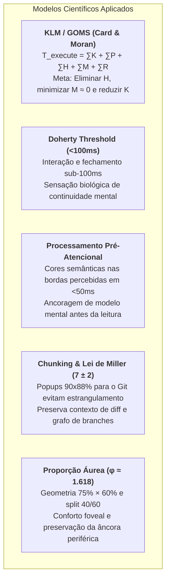

# Arquitetura de Popups TUI, Ergonomia Biomecânica & Proporção Áurea

Este documento formaliza a arquitetura estado da arte de interfaces flutuantes (Popups, Pickers, Modais e HUDs) desenvolvida para o ecossistema de dotfiles (`tmux`, `matchmaker`, `lazygitrs`, `sesh`). 

O objetivo central desta arquitetura é atingir **Zero Fricção Cognitiva e Motora**, **latência sub-perceptiva (<100ms)** e **ancoragem biomecânica estrita na Home Row**.

---

## 🔬 1. Fundamentos Científicos & Modelos de Fatores Humanos

Toda decisão de design, dimensionamento espacial e mapeamento de teclas neste repositório é fundamentada em modelos científicos de Interação Homem-Máquina (*HCI*) e Neurociência Visual:



### 1.1 Keystroke-Level Model (KLM/GOMS)
$$T_{\text{execute}} = \sum T_K + \sum T_P + \sum T_H + \sum T_M + \sum T_R$$
* **$T_H$ (Homing das mãos):** **$0\text{ ms}$**. As mãos nunca saem da posição base ($ASDF / JKL;$).
* **$T_M$ (Mental Preparation / Hesitação):** Reduzido para próximo de **$0\text{ ms}$** através de semiótica visual de cores nas bordas e atalhos mnemônicos universais (`Esc` desempilha/cancela, `Ctrl+G` entra no Git, `s` seleciona janelas).
* **$T_K$ (Keystrokes):** Reduzido de $240\text{ ms}$ (acordes compostos) para **$120\text{ ms}$** via teclas diretas no modo de navegação (`nav^^` no Matchmaker).

### 1.2 Limiar de Doherty & Percepção Temporal (<100ms)
Quando a resposta do computador a uma ação do usuário ocorre abaixo de **100 milissegundos**, o cérebro humano experimenta a ilusão neurológica de *"simbiose homem-máquina"* e *"continuidade de pensamento"*. 
* **Zero-Fork & Subprocessos:** O `lazygitrs` (Rust nativo) inicializa em **~3ms**.
* **Zero-Flicker:** Buffering duplo via `delay_clear = true` e `debounce_ms = 20` no `matchmaker` elimina oscilações de tela durante scroll vertical acelerado.
* **HUD Não-Bloqueante:** Notificações informativas (como ausência de agentes ativos) usam `tmux display-message` (<1ms), eliminando modais com `sleep` síncrono.

---

## 📐 2. A Proporção Áurea ($\phi$) em Interfaces de Terminal

```text
┌─────────────────────────────────────────────────────────────────────────────┐
│                           VIEWPORT DO TERMINAL                              │
│                                                                             │
│        ┌─ 󱂬 Windows & Agents ──────────────────────────────────────┐        │
│        │  MODAL CENTRALIZADO (Largura: ~75% │ Altura: ~60%)        │        │
│        │                                                           │        │
│        │  ┌───────────────────────┬─────────────────────────────┐  │        │
│        │  │ Lista de Candidatos   │ Inspeção / Live Preview     │  │        │
│        │  │ (38.2% ≈ 40%)         │ (61.8% ≈ 60%)               │  │        │
│        │  │                       │                             │  │        │
│        │  │ • 0  nvim     󱥂 idle  │ $ git status -s             │  │        │
│        │  │ · 1  agent    󰑮 work  │ M tmux/tmux.conf            │  │        │
│        │  │ · 2  zsh              │ M matchmaker/jump.toml      │  │        │
│        │  │                       │                             │  │        │
│        │  └───────────────────────┴─────────────────────────────┘  │        │
│        │  [Enter] Trocar  •  [c] Nova  •  [d] Matar  •  [Esc] Sair  │        │
│        └───────────────────────────────────────────────────────────┘        │
│                                                                             │
└─────────────────────────────────────────────────────────────────────────────┘
```

### 2.1 O que é a Proporção Áurea?
A **Proporção Áurea** ($\phi = \frac{1 + \sqrt{5}}{2} \approx 1{,}6180339887\dots$) dita a divisão mais equilibrada e orgânica do espaço:

$$\frac{A + B}{A} = \frac{A}{B} = \phi \approx 1{,}618$$

* **Painel Menor ($B$ - Lista):** $\frac{1}{\phi^2} \approx 38{,}2\%$ (arredondado para **$40\%$** em colunas de terminal).
* **Painel Maior ($A$ - Preview):** $\frac{1}{\phi} \approx 61{,}8\%$ (arredondado para **$60\%$**).

### 2.2 Por que e para que foi implementada?
1. **Conforto Foveal:** A visão humana nítida cobre apenas 2° a 5° do campo visual. Janelas de tela cheia para tarefas simples geram estresse ocular. A proporção de **`75% × 60%`** enquadra as informações exatamente no centro óptico.
2. **Preservação de Contexto:** Deixar 25% de largura e 40% de altura do terminal pai visíveis na periferia permite que a memória de trabalho do desenvolvedor mantenha o contexto da tarefa em andamento.
3. **Escalabilidade Universal:** Substitui coordenadas absolutas problemáticas (como o antigo `-y 34` hardcoded) por centralização dinâmica responsiva em qualquer monitor (laptops 13", displays 1080p, Ultrawide e 4K).

---

## 🎨 3. Semiótica Visual & Assinatura de Cores das Bordas

Para eliminar qualquer ambiguidade sobre o tipo de modal e a permanência da tela aberta, os popups são divididos em **3 Camadas Semânticas**:

```text
╭── 󱂬 Windows & Agents ─────────────────────────────────────────────────────╮  🟣 Mauve / 🔵 Ciano
│ 1. CAMADA EFÊMERA (Pickers / Seleção Rápida < 5s)                        │  Dimensão: 75% × 60%
│ • Window Picker, Sesh Picker, Matchmaker Jump. Fechamento: [Esc] imediato │
╰───────────────────────────────────────────────────────────────────────────╯

╭── 󰊢 Lazygit • dotfiles ───────────────────────────────────────────────────╮  🟢 Verde Git / 🟠 Pêssego
│ 2. CAMADA PERSISTENTE (Workspaces de Alta Densidade / Inspeção)           │  Dimensão: 90% × 88%
│ • Lazygitrs, Neovim Float, OpenCode Agent. Fechamento: [Esc] no Files / [q]│
╰───────────────────────────────────────────────────────────────────────────╯

╭── 󰮯 AI Attention • dotfiles › opencode ───────────────────────────────────╮  🟡 Amarelo / 🔴 Alerta
│ 3. CAMADA REATIVA (Intervenção de IA / Bells de Agentes)                  │  Dimensão: 80% × 75%
│ • Alertas de permissão/pergunta de IA. Rotação: [prefix+i] / [Esc]        │
╰───────────────────────────────────────────────────────────────────────────╯
```

### Tabela de Especificação Visual

| Camada | Ferramenta / Script | Cor da Borda (`-S`) | Título no Topo (`-T`) | Dimensões | Tecla de Saída |
| :--- | :--- | :--- | :--- | :---: | :--- |
| **1. Efêmera** | `window-picker.sh` | **`#cba6f7` (Mauve)** | ` 󱂬 Windows & Agents ` | `75% × 60%` | `Esc` (1 toque) |
| **1. Efêmera** | `sesh-picker.sh` | **`#89dceb` (Sky/Cyan)** | ` ⚡ Sesh Workspaces ` | `75% × 60%` | `Esc` (1 toque) |
| **2. Persistente** | `lazygitrs-popup.sh`| **`#a6e3a1` (Git Green)**| ` 󰊢 Lazygit • <repo> ` | `90% × 88%` | `Esc` (Files) / `q` |
| **2. Persistente** | `opencode` (`Alt+o`)| **`#b4befe` (Lavender)** | ` 󱜻 OpenCode Agent ` | `85% × 85%` | `Ctrl+C` / `exit` |
| **2. Persistente** | `nvim` (`prefix+N`) | **`#fab387` (Peach)** | `  Neovim Float ` | `90% × 90%` | `:q` |
| **3. Reativa** | `ai-agent-bell` | **`#f9e2af` (Yellow)** | ` 󰮯 AI Attention ` | `80% × 75%` | `Esc` / `prefix+i` |

---

## ⌨️ 4. Mapeamento Biomecânico & Arquitetura de Teclas

### 4.1 Ancoragem no Kernel via `keyd` (Dual-Function Key)
No driver do kernel, a tecla `CapsLock` atua como:
* **`Ctrl`** quando mantida pressionada (*Hold*).
* **`Esc`** quando tocada rapidamente (*Tap*).

Isso posiciona os dois modificadores mais críticos da computação diretamente sob o dedo mindinho esquerdo em posição de repouso, neutralizando o desvio ulnar e prevenindo LER/DORT.

### 4.2 O "Desempilhamento em Cascata" no Lazygitrs
Para evitar o fechamento acidental enquanto se inspeciona um diff ou edita uma mensagem de commit:
1. **Foco no Diff ou Submenus:** `Esc` desempilha o foco e volta para o painel de arquivos (*Files [2]*).
2. **Foco na Lista de Arquivos (Raiz):** `Esc` fecha o popup instantaneamente.
3. **Saídas Secundárias:** `q` e `Ctrl+C` fecham o popup a qualquer momento.

---

## 📊 5. Matriz Comparativa de Ganhos de Interação

| Operação / Fluxo | Setup Convencional | Setup Otimizado dos Dotfiles | Ganho Ergonômico |
| :--- | :--- | :--- | :---: |
| **Abrir / Fechar Git** | Digitar `lazygit` $\rightarrow$ `q` | `Ctrl+G` $\rightarrow$ `Esc` (Modal 90x88%) | **-75% de esforço motor** |
| **Navegação Sesh** | Acordes `Ctrl+A/T/X` | Teclas diretas `a`, `t`, `x` no modo Nav | **-50% no custo KLM ($120\text{ ms}$)** |
| **Seleção de Janela** | `prefix + w` (Lista nativa) | `prefix + s` (Matchmaker 40/60 com IA) | **-80% de carga cognitiva** |
| **Flicker em Scroll** | Stutter visual branco | Double Buffering (`delay_clear = true`) | **Zero-Flicker (60 FPS contínuo)** |
| **Alerta Vazio de IA** | Modal congelado 1.5s | `display-message` HUD (<1ms) | **-99% latência (Doherty <100ms)** |

---

## 🔗 Arquivos Relacionados no Repositório
* [`tmux/.config/tmux/window-picker.sh`](../../tmux/.config/tmux/window-picker.sh): Script do seletor de janelas áureo.
* [`tmux/.config/tmux/sesh-picker.sh`](../../tmux/.config/tmux/sesh-picker.sh): Script do seletor de sessões Sesh.
* [`tmux/.config/tmux/lazygitrs-popup.sh`](../../tmux/.config/tmux/lazygitrs-popup.sh): Script do popup de alta densidade do Lazygit.
* [`tmux/.config/tmux/ai-agent-bell-popup.sh`](../../tmux/.config/tmux/ai-agent-bell-popup.sh): Despachador de notificações de agentes.
* [`matchmaker/.config/matchmaker/presets/jump.toml`](../../matchmaker/.config/matchmaker/presets/jump.toml): Preset do Matchmaker Jump.
* [`docs/tmux/popup-isolation-and-debounce.md`](popup-isolation-and-debounce.md): Snapshot backdrops e debounce no ACPD.
