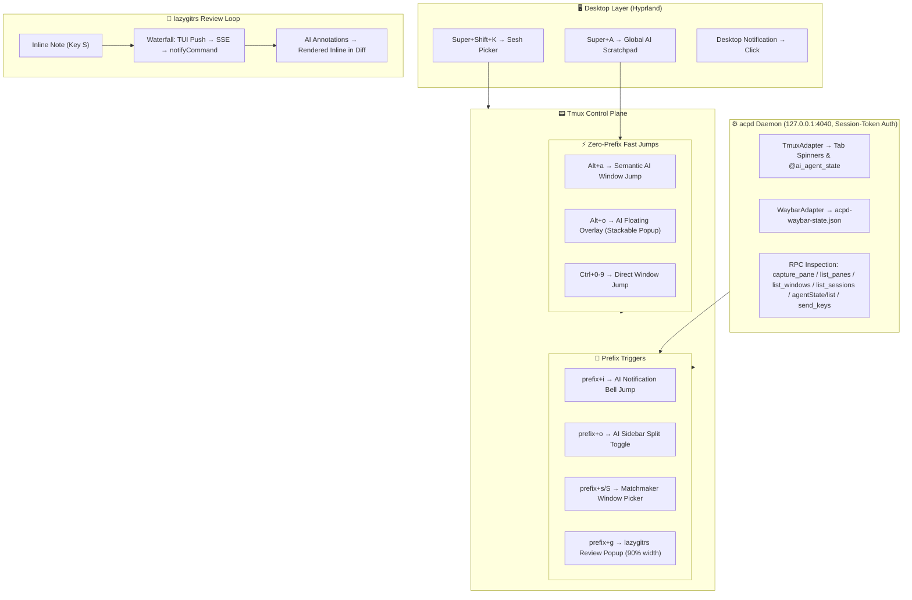

# TUI Workflows for AI Session Navigation & Control Plane

> **Goal**: Get to the app or agent you want without thinking — one keymap, zero friction.

---

## Table of Contents

- [Overview & Navigation Layers](#overview--navigation-layers)
- [Keybinding Reference Map](#keybinding-reference-map)
- [AI Agent Bell Notification & ACPD Architecture](#ai-agent-bell-notification--acpd-architecture)
- [Window Picker & Live AI State Icons](#window-picker--live-ai-state-icons)
- [Bidirectional Code Review Loop (lazygitrs)](#bidirectional-code-review-loop-lazygitrs)
  - [How the Loop Works Step-by-Step](#how-the-loop-works-step-by-step)
  - [What You Gain From This Loop](#what-you-gain-from-this-loop)
  - [Conditional Trade-off: Would herdr be worth it without this loop?](#conditional-trade-off-would-herdr-be-worth-it-without-this-loop)
- [Zero-Friction Ergonomic Patterns (Quick Wins)](#zero-friction-ergonomic-patterns-quick-wins)
  - [1. Contextual Overlay (Alt+o) & Popup Coexistence with lazygitrs](#1-the-contextual-overlay-alto--popup-coexistence-with-lazygitrs)
  - [2. The Semantic Jump (Alt+a)](#2-the-semantic-jump-alta)
  - [3. The Sidebar Toggle (prefix+o)](#3-the-sidebar-toggle-prefixo)
  - [4. Global Desktop Scratchpad (Super+A)](#4-global-desktop-scratchpad-supera)
- [Workflow Pattern Comparison](#workflow-pattern-comparison)
- [Keypress-to-Screen Matrix](#keypress-to-screen-matrix)
- [System Architecture & State Flow Diagrams](#system-architecture--state-flow-diagrams)
- [Platform Integration Notes](#platform-integration-notes)

---

## Overview & Navigation Layers

The control plane spans **4 navigation layers**, each with a distinct scope:

| Layer | Tool | Scope | Primary Entry Point |
|---|---|---|---|
| **Desktop** | Hyprland + Walker/Fuzzel | Any desktop app or session | `Super+Space`, `Super+Shift+K` |
| **Global Overlay** | Ghostty + Hyprland Float | Global omniscient AI scratchpad | `Super+A` |
| **Terminal / Session** | sesh + tmux + Matchmaker | Switch between project sessions | `Alt+s` (zsh), `prefix+T` (popup) |
| **Window & Pane** | tmux windows + popups | Switch within session (editor, AI, git) | `Ctrl+0-9`, `Alt+a`, `Alt+o`, `prefix+i` |

---

## Keybinding Reference Map

```
┌─────────────────────────────────────────────────────────────────┐
│ DESKTOP LAYER (Hyprland)                                        │
│  Super+Space ......... Walker launcher (apps, sesh, calc, etc.) │
│  Super+Shift+K ....... Sesh picker via fuzzel/walker            │
│  Super+Return ........ New terminal (ghostty)                   │
│  Super+A ............. Global AI Dropdown Scratchpad (popup)    │
│  Super+1-9 ........... Switch Hyprland workspace                │
├─────────────────────────────────────────────────────────────────┤
│ TMUX SESSION LAYER (sesh)                                       │
│  Alt+s ............... Sesh picker (from zsh, fzf popup)        │
│  prefix+T ............ Sesh picker (Matchmaker, 80x35% popup)   │
│  prefix+L ............ Last session (sesh last)                 │
│  prefix+H / L ........ Prev / next session                      │
├─────────────────────────────────────────────────────────────────┤
│ TMUX WINDOW & FAST JUMP LAYER (Zero Prefix)                     │
│  Alt+a ............... Semantic AI window jump (create-or-switch)│
│  Alt+o ............... Floating AI overlay popup (toggle)       │
│  Ctrl+0-9 ............ Direct window jump 0-9                   │
│  Ctrl+Shift+0-9 ...... Move window to position 0-9              │
│  prefix+l / h ........ Next / prev window                       │
├─────────────────────────────────────────────────────────────────┤
│ TMUX POPUPS & PANES                                             │
│  prefix+i ............ AI Agent bell jump (attach notifying pane│
│  prefix+o ............ AI Sidebar split toggle (35% width)      │
│  prefix+s / S ........ Window picker (Matchmaker + acpd state)  │
│  prefix+g ............ lazygitrs popup (review loop)            │
│  prefix+B / Y / N .... btop / yazi / nvim popups (90x90%)       │
└─────────────────────────────────────────────────────────────────┘
```

---

## AI Agent Bell Notification & ACPD Architecture

State management is centralized by **`acpd`** (Agent Client Protocol Daemon), a headless Rust daemon listening at `127.0.0.1:4040` protected by session-token authentication (`$XDG_RUNTIME_DIR/acpd/token` with `0600` permissions). Thin client hooks (`hooker.ts` for OpenCode, `tmux-hook.mjs` for Antigravity / Gemini CLI) send state events (`working`, `idle`, `awaiting_input`, `permission`, `error`, `closed`) to `acpd`.

### Event Flow:
1. Agent emits state event → Hook POSTs to `http://127.0.0.1:4040/api/status` or `/rpc` with `Authorization: Bearer <token>`.
2. `acpd`'s `TmuxAdapter` sets `@ai_agent_last_bell` to the target pane and updates `@ai_agent_bell` in status-right (auto-clears after 7 seconds).
3. User presses `prefix+i` → `ai-agent-bell-popup.sh`:
   - Same session: directly selects the notifying window.
   - Different session: opens a 90×90% popup attaching directly to the notifying window.

### JSON-RPC 2.0 Surface (`POST /rpc`):

| Method | Type | Parameters | Purpose |
|---|---|---|---|
| `agentState/update` | Mutation | `{pane_id, state, timestamp?}` | Update pane AI state (strict validation) |
| `agentState/list` | Inspection | *None* | List all registered agent states across all panes |
| `tmux.split_pane` | Mutation | `{command?, target_pane?, vertical?}` | Split tmux window |
| `tmux.new_window` | Mutation | `{name?, target?, command?}` | Create tmux window |
| `tmux.new_session` | Mutation | `{name, directory?, command?}` | Create detached session |
| `tmux.kill_pane` / `kill_window` / `kill_session` | Teardown | `{target}` | Terminate target |
| `tmux.capture_pane` | Inspection | `{target?, start_line?, end_line?, escape_sequences?}` | Capture pane text buffer |
| `tmux.list_panes` | Inspection | `{target?, all?}` | List panes in JSON format |
| `tmux.list_windows` | Inspection | `{target?}` | List windows in JSON format |
| `tmux.list_sessions` | Inspection | *None* | List active tmux sessions in JSON format |
| `tmux.send_keys` | Control | `{target?, keys: [], literal?}` | Send keystrokes/commands to pane |

---

## Window Picker & Live AI State Icons

**Binding**: `prefix+s` (popup 80×35%) / `prefix+S` (fullscreen split) → `window-picker.sh`

Powered by **Matchmaker** (`mm`), the window picker lists **all sessions and windows** grouped by session, displaying real-time AI state icons set by `acpd` (`@ai_agent_state_raw`):

```
┌─ 󰧞  windows ──────────────────────────────────────────────────┐
│                                          ┆                     │
│  #  dotfiles                             ┆  [pane preview]     │
│     • 2  opencode  󰑮                      ┆                     │
│     · 1  nvim                            ┆  > analyzing...     │
│     · 0  zsh                             ┆                     │
│                                          ┆                     │
│  #  webapp                               ┆                     │
│     · 2  opencode  󱥂                      ┆                     │
│     · 1  nvim                            ┆                     │
└────────────────────────────────────────────────────────────────┘
```

---

## Bidirectional Code Review Loop (lazygitrs)

The **`lazygitrs`** review loop is the primary differentiator of this control plane:

### How the Loop Works Step-by-Step

```
┌─────────────────────────────────────────────────────────────────────────────┐
│ 1. HUMAN REVIEWER (in lazygitrs)                                           │
│    Inspect Git diff ➔ Position cursor on target line ➔ Press 'S'           │
│    Enter note: "Refactor this function to handle empty list gracefully"     │
└──────────────────────┬──────────────────────────────────────────────────────┘
                       │
                       ▼ (Transport Waterfall)
┌─────────────────────────────────────────────────────────────────────────────┐
│ 2. DELIVERY WATERFALL (HTTP Push / SSE / Bracketed-Paste)                   │
│    lazygitrs passes prompt + file path + line context to active AI session  │
│    Priority 1: HTTP Push (/tui/append-prompt) | Priority 2: SSE | P3: Paste│
└──────────────────────┬──────────────────────────────────────────────────────┘
                       │
                       ▼
┌─────────────────────────────────────────────────────────────────────────────┐
│ 3. AI AGENT (OpenCode / Antigravity)                                        │
│    Parses line context ➔ Refactors codebase ➔ POSTs response JSON to        │
│    lazygitrs session-api (http://127.0.0.1:47657/session-api)               │
└──────────────────────┬──────────────────────────────────────────────────────┘
                       │
                       ▼
┌─────────────────────────────────────────────────────────────────────────────┐
│ 4. INLINE RENDERING (in lazygitrs TUI)                                      │
│    lazygitrs updates diff ➔ Renders AI response directly INLINE under the   │
│    annotated diff line. Note status: New ➔ Sent ➔ Addressed (Resolved).     │
└─────────────────────────────────────────────────────────────────────────────┘
```

1. **Human Review**: Highlight diff lines inside `lazygitrs` → press `S` to add an inline review note.
2. **Delivery Waterfall** ([`src/gui/mod.rs:7957`](file:///home/fecavmi/dev/github/lazygitrs/ai-notes/src/gui/mod.rs#L7957)):
   - **Priority 1 (HTTP Push)**: `POST /tui/append-prompt` + `POST /tui/submit-prompt` directly to OpenCode's TUI API.
   - **Priority 2 (SSE Broadcast)**: Broadcast `note-sent` JSON payload to active SSE listeners.
   - **Priority 3 (Subprocess Fallback)**: Execute `notifyCommand` (`lazygit-tmux-injector.sh` using bracketed paste).
3. **Port Scanning**: `lazygitrs` HTTP server binds on ports `47657..47756` (100 ports). Client hook `lazygit-hook.mjs` scans all 100 ports to discover active sessions across concurrent workspaces.
4. **Inline Rendering**: AI processes note → POSTs structured annotations back to `/session-api` → `lazygitrs` renders AI responses inline inside the diff view. Note status transitions: `New → Sent → Addressed`.

---

## Zero-Friction Ergonomic Patterns (Quick Wins)

These bindings eliminate guesswork and decision latency:

### 1. The Contextual Overlay (`Alt+o`) & Popup Coexistence with lazygitrs
- Drops an 80% popup with OpenCode overlaying current work. Dismiss with `Alt+o` or `Esc`.
- **tmux.conf**: `bind-key -n M-o display-popup -E -w 80% -h 80% -b rounded -T " OpenCode " "opencode"`
- **Coexistence with `lazygitrs` popup (`prefix+g`)**:
  - In tmux 3.2+, root keybindings (`bind-key -n`) like `Alt+o` function seamlessly even when another popup is open.
  - If you are inside the `lazygitrs` popup (`prefix+g`) and press `Alt+o`, tmux overlay-stacks the AI popup (`80%` width) over `lazygitrs` (`90%` width).
  - Pressing `Esc` or `Alt+o` dismisses the AI overlay, returning focus **immediately back to your active `lazygitrs` diff review session** without closing or interrupting `lazygitrs`.

### 2. The Semantic Jump (`Alt+a`)
- Jumps directly to window `ai` in the current session. If it doesn't exist, creates it automatically.
- **tmux.conf**: `bind-key -n M-a run-shell 'tmux select-window -t ai 2>/dev/null || tmux new-window -n ai "opencode"'`

### 3. The Sidebar Toggle (`prefix+o`)
- Toggles a 35% horizontal split pane with OpenCode for side-by-side pair programming.
- **tmux.conf**: `bind-key o run-shell 'pane_cnt=$(tmux list-panes | wc -l); if [ "$pane_cnt" -gt 1 ]; then tmux kill-pane -t :.+; else tmux split-window -h -l 35% "opencode"; fi'`

### 4. Global Desktop Scratchpad (`Super+A`)
- Spawns a floating centered terminal anywhere in the OS running a persistent `global-ai` session.

---

## Keypress-to-Screen Matrix

| From ↓ / To → | Same-session AI window | Other-session AI | AI float overlay | Desktop app |
|---|---|---|---|---|
| **Editing in nvim** | 1 (`Alt+a` or `Ctrl+2`) | 2 (`Alt+s` → pick) | 1 (`Alt+o` toggle) | 2 (`Super+Shift+K`) |
| **Inside lazygitrs popup** | 1 (`Alt+a`) | 2 (`Alt+s` → pick) | 1 (`Alt+o` overlay) | 2 |
| **Different tmux session** | 2 (`Alt+s` → pick, `Alt+a`) | 2 (`Alt+s` → pick) | 1 (`Alt+o`) | 2 |
| **Desktop (no focus)** | 2 (`Super+Shift+K` → pick) | 2 | 1 (`Super+A`) | 1 |
| **AI notification bell** | 1 (`prefix+i`) | 1 (`prefix+i`) | 0 (visible) | 1 (click notif) |

---

## System Architecture & State Flow Diagrams



---

## Platform Integration Notes

### Omarchy (Arch Linux)
- Walker + Fuzzel desktop-level session picker (`Super+Shift+K`) ✅
- `omarchy-launch-sesh` script handles Fuzzel to `sesh` flow ✅

### GNOME (Red Hat / Fedora)
- Use **rofi** or **dmenu** as Fuzzel replacement.
- GNOME **Switcher** extension (`Super+W`) for app-level fuzzy search.
- Bind shortcut to `gnome-sesh-picker` script.

---
*Document Location: [`/home/fecavmi/.dotfiles/main/docs/tui-ai-workflows.md`](file:///home/fecavmi/.dotfiles/main/docs/tui-ai-workflows.md)*
