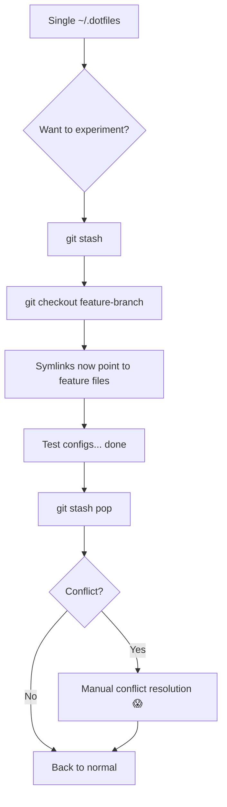
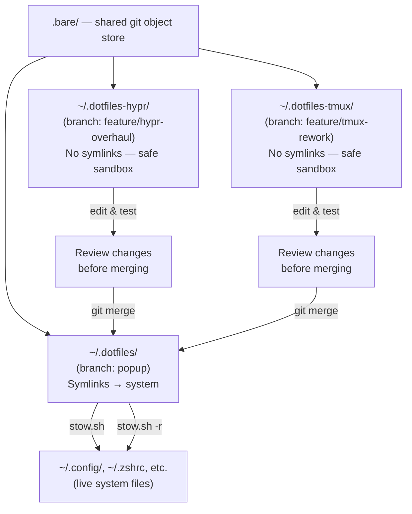
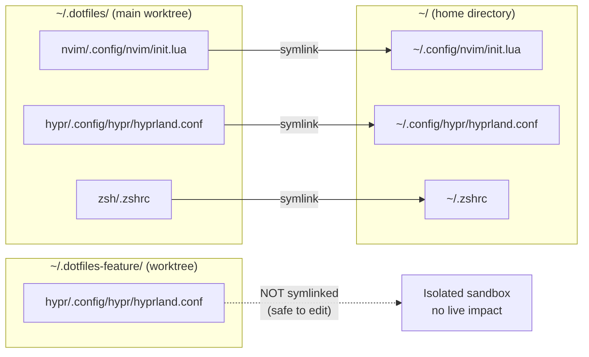

# Dotfiles with Git Worktrees — A Complete Guide

> How this repository was migrated to a bare-repo + worktree layout, integrated with GNU Stow symlinks and `sesh` for instant tmux context-switching.

---

## Table of Contents

1. [The Problem with the Classic Workflow](#1-the-problem-with-the-classic-workflow)
2. [What Is a Bare Repository?](#2-what-is-a-bare-repository)
3. [What Are Git Worktrees?](#3-what-are-git-worktrees)
4. [How This Repo Is Structured](#4-how-this-repo-is-structured)
5. [Old Workflow vs New Workflow](#5-old-workflow-vs-new-workflow)
6. [Adding a New Worktree](#6-adding-a-new-worktree)
7. [Merging a Worktree Back](#7-merging-a-worktree-back)
8. [Stow After a Merge](#8-stow-after-a-merge)
9. [Using sesh with Worktrees](#9-using-sesh-with-worktrees)
10. [Advantages of This Workflow](#10-advantages-of-this-workflow)

---

## 1. The Problem with the Classic Workflow

In a standard dotfiles repo, you have one working directory — `~/.dotfiles` — checked out on one branch at a time. Switching between experiments (e.g. testing a new Hyprland config, or a new tmux layout) means:

```
git stash              # save your current uncommitted changes
git checkout feature   # lose your current symlinked files
git stash pop          # restore — hoping stash doesn't conflict
```

While symbolic links created by GNU Stow still point to `~/.dotfiles/<package>/...`, checking out a different branch **changes the files those symlinks point to live**. You cannot have two branches active at once and cannot compare live configs across branches without stashing constantly.

---

## 2. What Is a Bare Repository?

A **bare repository** stores only the git object database (`.git/` contents) — without a working tree. Normally you use bare repos only as a remote server. But here we repurpose this concept: we keep the bare data in a hidden folder (`.bare/`) inside the repo directory and let the repo directory itself serve as the primary worktree.

The key files:

| Path | Role |
|---|---|
| `~/.dotfiles/.bare/` | The actual git object database (was `.git/`) |
| `~/.dotfiles/.git` | A **file** (not a folder) containing `gitdir: ./.bare` — the worktree pointer |

Git reads `.git` as a file, resolves the path, and correctly treats `~/.dotfiles` as the working tree. All existing tools (`git`, `lazygit`, IDE integrations) continue to work without any changes.

---

## 3. What Are Git Worktrees?

A **git worktree** is an additional working directory linked to the same repository. Unlike cloning, worktrees share the same `.bare/` object store — no redundant history or objects are duplicated.

- One repository → many simultaneous checked-out branches
- Each worktree is a separate directory with its own `HEAD`
- Changes in one worktree do not affect another
- You can have `nvim` open in two worktrees editing different configs at the same time

---

## 4. How This Repo Is Structured

```
~/.dotfiles/
├── .bare/           ← Git object database (was .git/)
│   ├── config       ← Includes core.worktree = /home/fecavmi/.dotfiles
│   ├── HEAD
│   ├── objects/
│   └── refs/
├── .git             ← File (not folder): "gitdir: ./.bare"
├── .gitignore       ← Includes .bare
├── stow.sh          ← .bare is in IGNORE_DIRS, never stowed
├── nvim/
├── hypr/
├── tmux/
├── sesh/
│   └── .config/
│       └── sesh/
│           └── sesh.toml   ← dotfiles session registered here
└── ...              ← All other stow packages
```

When a new worktree is added (e.g. for branch `feature/hypr-overhaul`), git creates a sibling directory:

```
~/.dotfiles/                 ← main worktree (branch: popup)
~/.dotfiles-hypr-overhaul/   ← worktree (branch: feature/hypr-overhaul)
```

Each directory has its own `.git` file pointing back to `~/.dotfiles/.bare/`.

---

## 5. Old Workflow vs New Workflow

### Old Workflow (Single Checkout)



### New Workflow (Bare Repo + Worktrees)



### Stow Symlink Architecture



---

## 6. Adding a New Worktree

### Create a worktree from an existing branch

```bash
git -C ~/.dotfiles worktree add ~/dotfiles-hypr feature/hypr-overhaul
```

### Create a worktree with a **new** branch

```bash
git -C ~/.dotfiles worktree add -b feature/tmux-rework ~/dotfiles-tmux
```

This creates `~/dotfiles-tmux/` checked out on the new `feature/tmux-rework` branch, sharing the `.bare/` object store. You can now edit files there freely without touching any stow symlinks.

### List all active worktrees

```bash
git -C ~/.dotfiles worktree list
```

### Remove a worktree when done

```bash
git -C ~/.dotfiles worktree remove ~/dotfiles-tmux
# Or force-remove if there are untracked files
git -C ~/.dotfiles worktree remove --force ~/dotfiles-tmux
```

> **Note:** Worktree directories placed outside `~/.dotfiles/` (like `~/dotfiles-hypr`) are never seen by stow.sh because `get_packages()` only iterates `~/.dotfiles/*/`. They are completely isolated.

---

## 7. Merging a Worktree Back

Once you're satisfied with changes in a feature worktree, merge them into the main worktree.

### Fast-forward merge (clean linear history)

```bash
# From the main worktree
cd ~/.dotfiles
git merge feature/hypr-overhaul --ff-only
```

### Merge with a commit (to preserve context)

```bash
cd ~/.dotfiles
git merge feature/hypr-overhaul --no-ff -m "feat: merge hypr overhaul"
```

### Rebase instead (clean history, no merge commits)

```bash
cd ~/dotfiles-hypr
git rebase popup          # rebase feature branch on top of popup
cd ~/.dotfiles
git merge feature/hypr-overhaul --ff-only
```

### Resolving merge conflicts

Conflicts will appear in the main worktree (`~/.dotfiles/`). Since this is your working tree, you can resolve them normally:

```bash
cd ~/.dotfiles
git merge feature/hypr-overhaul
# Edit conflicted files...
git add <resolved-files>
git merge --continue
```

After a successful merge, the files in `~/.dotfiles/` are updated. Stow symlinks already point here, so **most config changes are live immediately** — no restow needed for files that already had symlinks.

---

## 8. Stow After a Merge

GNU Stow symlinks already point to `~/.dotfiles/<package>/...`, so editing and merging tracked files requires **no stow action** — the symlinks are live.

However, you do need to restow in these specific situations:

### New files were added to a package

If the merged branch added new config files to an existing package:

```bash
cd ~/.dotfiles
./stow.sh nvim         # restow the specific package
```

Or restow everything:

```bash
./stow.sh              # stow all unstowed packages
./stow.sh -r           # restow all (refreshes all symlinks)
```

### New package directory was added

If the merged branch introduced an entirely new stow package (e.g. a new `opencode/` directory):

```bash
cd ~/.dotfiles
./stow.sh opencode
```

### How to check what changed after a merge

```bash
# See what files the merge touched
git show --stat HEAD

# Dry-run stow to see what new symlinks would be created
./stow.sh -n

# Show currently stowed packages via lock file
./stow.sh -s
```

### The complete post-merge checklist

```bash
cd ~/.dotfiles
git merge feature/my-branch
git show --stat HEAD           # review changed files
./stow.sh -n                   # dry-run: any new symlinks needed?
./stow.sh -r <package>         # restow if new files were added
```

---

## 9. Using sesh with Worktrees

`sesh` is configured in [sesh/.config/sesh/sesh.toml](sesh/.config/sesh/sesh.toml) (stowed to `~/.config/sesh/sesh.toml`).

### Current sesh configuration

```toml
[[session]]
name = "dotfiles"
path = "~/.dotfiles"
startup_command = "nvim ."

[[session]]
name = "Downloads 📥"
path = "~/Downloads"
startup_command = "yazi"
```

### Connecting to the dotfiles session

```bash
sesh connect dotfiles
```

This opens `~/.dotfiles` in a dedicated tmux session with `nvim .` running, ready to browse all packages.

### Registering a feature worktree as a sesh session

When you create a long-lived worktree, add it to `sesh.toml`:

```toml
[[session]]
name = "dotfiles/hypr-overhaul"
path = "~/dotfiles-hypr"
startup_command = "nvim ."
```

Then connect directly:

```bash
sesh connect dotfiles/hypr-overhaul
```

### Using the sesh fuzzy picker (zellij / tmux)

The sesh plugin in [sesh/config.toml](sesh/config.toml) is bound to `;s ` and lists all sessions with:

```toml
src_once = "sesh list -d -c -t -T"
```

This lists directories (`-d`), zoxide (`-z`), tmux sessions (`-t`), and tmux windows (`-T`) — your worktrees registered in `sesh.toml` appear alongside all regular sessions.

### The complete worktree + sesh flow

```mermaid
sequenceDiagram
    participant You
    participant sesh
    participant tmux
    participant git
    participant stow

    You->>sesh: ;s  → type "hypr-overhaul" → Enter
    sesh->>tmux: create session "dotfiles/hypr-overhaul"
    tmux->>You: open ~/dotfiles-hypr in nvim

    You->>git: edit hypr configs, commit
    You->>sesh: ;s  → type "dotfiles" → Enter
    sesh->>tmux: switch to existing "dotfiles" session
    You->>git: git merge feature/hypr-overhaul
    You->>stow: ./stow.sh -r hypr
    stow->>You: ~/.config/hypr/ symlinks refreshed ✓
```

---

## 10. Advantages of This Workflow

### vs. classic single-checkout dotfiles

| | Classic | Bare + Worktrees |
|---|---|---|
| Work on two configs simultaneously | ❌ | ✅ |
| Risk of breaking live system while experimenting | ✅ High | ✅ Low (worktrees not stowed) |
| stash/pop cycles | ✅ Required | ❌ Never needed |
| tmux session per branch | ❌ | ✅ via sesh |
| History comparison across branches | ❌ Manual | ✅ `git diff popup..feature/x` |
| Merge conflicts risk | Higher (stash conflicts) | Lower (clean merge base) |

### vs. maintaining separate clones

| | Multiple Clones | Bare + Worktrees |
|---|---|---|
| Disk space | ❌ Duplicated objects | ✅ Shared `.bare/` |
| Branch sync | ❌ Manual `git fetch` per clone | ✅ Automatic |
| Stow compatibility | ❌ Multiple stow sources | ✅ One source of truth |

### Key practical benefits

1. **Zero-risk experimentation** — Worktrees created outside `~/.dotfiles/` have no stow symlinks. Your live system is unchanged while you experiment in a sandbox.

2. **Instant context switching** — `sesh connect dotfiles/feature-x` puts you in a tmux session with `nvim` open at the exact branch you need, with no checkout penalty.

3. **Parallel development** — You can have `popup` branch powering your symlinks while simultaneously editing `feature/hypr-overhaul` in another tmux session. Both are visible. No juggling.

4. **Clean merge history** — Because each feature lives in its own directory, you can rebase and clean up commits before merging — then fast-forward merge with a linear history.

5. **stow stays predictable** — The symlink source is always `~/.dotfiles/`. No matter how many worktrees exist, the system only reads files from the main worktree. Running `./stow.sh -r` is always safe and idempotent.

---

## Quick Reference

```bash
# Create a new worktree for experimentation
git -C ~/.dotfiles worktree add -b feature/my-config ~/dotfiles-my-config

# Jump to it with sesh (after adding to sesh.toml)
sesh connect dotfiles/my-config

# List all active worktrees
git -C ~/.dotfiles worktree list

# Merge a feature back into main worktree
cd ~/.dotfiles && git merge feature/my-config --no-ff

# Restow affected packages after merge
./stow.sh -r <package-name>

# Remove the worktree when done
git -C ~/.dotfiles worktree remove ~/dotfiles-my-config
git -C ~/.dotfiles branch -d feature/my-config
```
