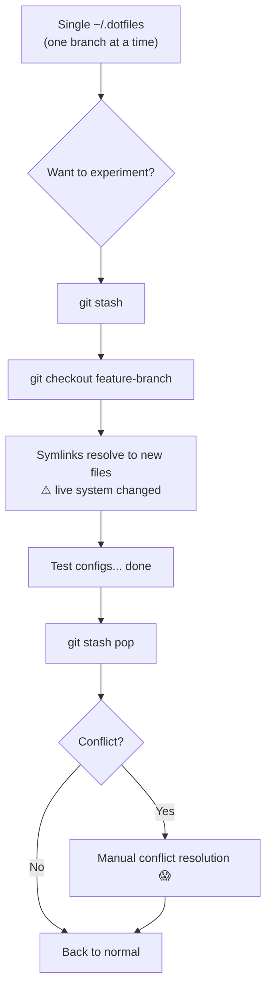
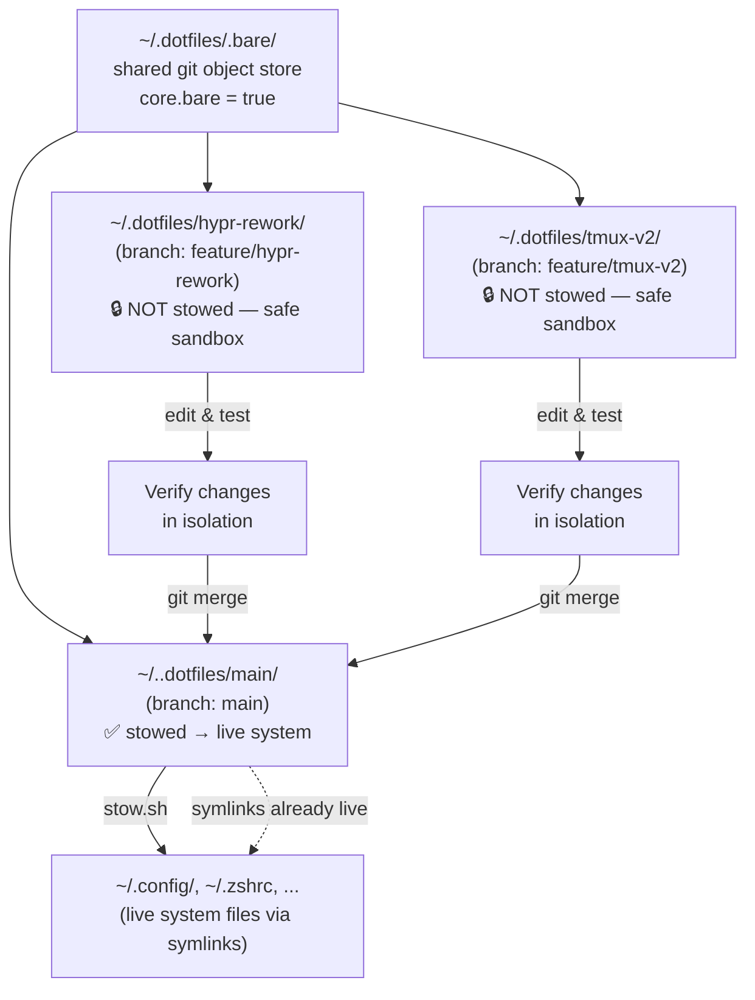
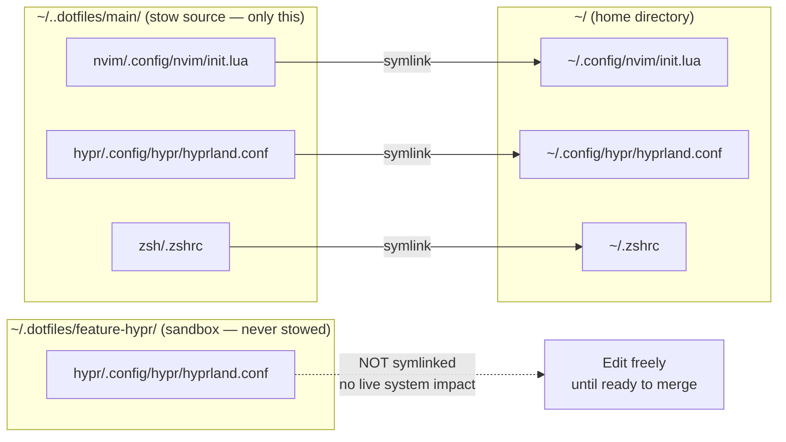

# Dotfiles with Git Worktrees — A Complete Guide

> How this repository is structured as a bare-repo + worktree layout, integrated with GNU Stow symlinks and `sesh` for instant tmux context-switching.

---

## Table of Contents

1. [The Problem with the Classic Workflow](#1-the-problem-with-the-classic-workflow)
2. [What Is a Bare Repository?](#2-what-is-a-bare-repository)
3. [What Are Git Worktrees?](#3-what-are-git-worktrees)
4. [How This Repo Is Structured](#4-how-this-repo-is-structured)
5. [Old Workflow vs New Workflow](#5-old-workflow-vs-new-workflow)
6. [Adding a New Worktree](#6-adding-a-new-worktree)
7. [Merging a Worktree Back](#7-merging-a-worktree-back)
8. [Stow After a Merge](#8-stow-after-a-merge)
9. [Using sesh with Worktrees](#9-using-sesh-with-worktrees)
10. [Advantages of This Workflow](#10-advantages-of-this-workflow)

---

## 1. The Problem with the Classic Workflow

In a standard dotfiles repo, you have one working directory — `~/.dotfiles` — checked out on one branch at a time. Switching between experiments (e.g. testing a new Hyprland config, or a new tmux layout) means:

```
git stash              # save your current uncommitted changes
git checkout feature   # the files those symlinks point to CHANGE live
git stash pop          # restore — hoping stash doesn't conflict
```

While symbolic links created by GNU Stow still point to `~/.dotfiles/<package>/...`, checking out a different branch **changes the files those symlinks resolve to immediately**. You cannot have two branches active at once and cannot compare live configs across branches without stashing constantly.

---

## 2. What Is a Bare Repository?

A **bare repository** stores only the git object database — without a working tree. Here we use a bare repo (`~/.dotfiles/.bare/`) as the single source of truth, with explicit worktrees added as peer directories.

Setting `core.bare = true` tells git there is no implicit main working directory; all working trees are registered explicitly via `git worktree add`. This is the key that makes the sibling-directory layout possible.

| Path | Role |
|---|---|
| `~/.dotfiles/.bare/` | Git object database: history, refs, objects |
| `~/..dotfiles/main/` | Primary worktree — the only one stowed to `~/` |
| `~/.dotfiles/<feature>/` | Feature worktrees — isolated sandboxes, never stowed |

---

## 3. What Are Git Worktrees?

A **git worktree** is an additional working directory linked to the same repository. Unlike cloning, worktrees share the same `.bare/` object store — no redundant history or objects are duplicated.

- One `.bare/` → many simultaneous checked-out branches
- Each worktree is a separate directory with its own `HEAD`
- Changes in one worktree do not affect another
- You can have `nvim` open in `main` and `feature/hypr-rework` at the same time

---

## 4. How This Repo Is Structured

```
~/.dotfiles/
├── .bare/                   ← Git object database (bare = true)
│   ├── config               ← core.bare = true
│   ├── HEAD
│   ├── objects/
│   ├── refs/
│   └── worktrees/
│       └── main/            ← Tracking info for the main worktree
│
├── main/                    ← PRIMARY worktree (branch: main)
│   ├── .git                 ← file: "gitdir: ../../dotfiles/.bare/worktrees/main"
│   ├── stow.sh              ← DOTFILES_DIR auto-detects to ~/..dotfiles/main/
│   ├── nvim/
│   ├── hypr/
│   ├── tmux/
│   ├── sesh/
│   │   └── .config/sesh/sesh.toml
│   └── ...                  ← All stow packages live here
│
└── feature-hypr/            ← FEATURE worktree (branch: feature/hypr-rework)
    ├── .git                 ← file pointing to .bare/worktrees/feature-hypr
    ├── nvim/
    └── hypr/                ← edit freely, zero system impact
```

Stow reads from `~/..dotfiles/main/` only. Feature worktrees are invisible to stow — they live outside the `~/..dotfiles/main/` tree and `stow.sh` never traverses them.

---

## 5. Old Workflow vs New Workflow

### Old Workflow (Single Checkout)



### New Workflow (Bare Repo + Sibling Worktrees)



### Stow Symlink Architecture



---

## 6. Adding a New Worktree

### Create a worktree from an existing remote branch

```bash
git -C ~/.dotfiles/.bare worktree add ~/.dotfiles/hypr-rework feature/hypr-rework
```

### Create a worktree with a brand-new branch

```bash
git -C ~/.dotfiles/.bare worktree add -b feature/tmux-v2 ~/.dotfiles/tmux-v2
```

This creates `~/.dotfiles/tmux-v2/` checked out on `feature/tmux-v2`, sharing the `.bare/` store. Edit freely — no symlinks are created, the live system is untouched.

### List all active worktrees

```bash
git -C ~/.dotfiles/.bare worktree list
# ~/.dotfiles/.bare  (bare)
# ~/..dotfiles/main   abc1234 [main]
# ~/.dotfiles/tmux-v2  def5678 [feature/tmux-v2]
```

### Remove a worktree when done

```bash
git -C ~/.dotfiles/.bare worktree remove ~/.dotfiles/tmux-v2
# Force-remove if there are untracked files
git -C ~/.dotfiles/.bare worktree remove --force ~/.dotfiles/tmux-v2
# Then delete the branch if no longer needed
git -C ~/.dotfiles/.bare branch -d feature/tmux-v2
```

> **Isolation guarantee:** `stow.sh` derives `DOTFILES_DIR` from `$(dirname "${BASH_SOURCE[0]}")`, which is always `~/..dotfiles/main/`. No matter how many sibling worktrees exist, only `main/` is ever stowed.

---

## 7. Merging a Worktree Back

Once you're satisfied with changes in a feature worktree, merge into `main/`.

### Fast-forward merge (clean linear history)

```bash
cd ~/..dotfiles/main
git merge feature/tmux-v2 --ff-only
```

### Merge with a commit (preserves branch context)

```bash
cd ~/..dotfiles/main
git merge feature/tmux-v2 --no-ff -m "feat: tmux v2 layout"
```

### Rebase first (cleanest history)

```bash
# From inside the feature worktree
cd ~/.dotfiles/tmux-v2
git rebase main

# Back in main, now it's a clean fast-forward
cd ~/..dotfiles/main
git merge feature/tmux-v2 --ff-only
```

### Resolving merge conflicts

```bash
cd ~/..dotfiles/main
git merge feature/hypr-rework
# Edit conflicted files in ~/..dotfiles/main/...
git add <resolved-files>
git merge --continue
```

After merge, files in `~/..dotfiles/main/` update immediately. All existing symlinks already point here, so **config changes are live the moment merge completes** — no restow needed for existing files.

---

## 8. Stow After a Merge

GNU Stow symlinks point to `~/..dotfiles/main/<package>/...`, so editing and merging tracked files requires **no stow action** — changes are live the instant git writes to disk.

You only need to restow in these situations:

### New files added to an existing package

```bash
cd ~/..dotfiles/main
./stow.sh nvim          # restow the specific package
./stow.sh -r nvim       # or restow (refresh) to be safe
```

### New stow package directory added

```bash
cd ~/..dotfiles/main
./stow.sh newapp        # stow the new package
```

### Post-merge checklist

```bash
cd ~/..dotfiles/main
git merge feature/my-branch

git show --stat HEAD    # review what changed
./stow.sh -n            # dry-run: any new symlinks needed?
./stow.sh -r <pkg>      # restow only if new files were added
```

---

## 9. Using sesh with Worktrees

`sesh` is configured at [sesh/.config/sesh/sesh.toml](sesh/.config/sesh/sesh.toml) (stowed to `~/.config/sesh/sesh.toml`).

### Current sesh configuration

```toml
[[session]]
name = ".dotfiles/main"
path = "~/..dotfiles/main"
startup_command = "nvim ."

[[session]]
name = "Downloads 📥"
path = "~/Downloads"
startup_command = "yazi"
```

### Jump to the primary dotfiles session

```bash
sesh connect .dotfiles/main
```

Opens `~/..dotfiles/main` in a dedicated tmux session with `nvim .` ready.

### Register a feature worktree as a sesh session

Add to `sesh.toml` (in `~/..dotfiles/main/sesh/.config/sesh/sesh.toml`):

```toml
[[session]]
name = "dotfiles/tmux-v2"
path = "~/.dotfiles/tmux-v2"
startup_command = "nvim ."
```

Then connect directly:

```bash
sesh connect dotfiles/tmux-v2
```

### The fuzzy picker

The sesh plugin (bound to `;s `) lists all sessions. Your worktrees registered in `sesh.toml` appear alongside tmux sessions and zoxide directories — type the branch name to jump.

### Complete worktree + sesh flow

```mermaid
sequenceDiagram
    participant You
    participant sesh
    participant tmux
    participant git
    participant stow

    You->>sesh: ;s  → "tmux-v2" → Enter
    sesh->>tmux: create session "dotfiles/tmux-v2"
    tmux->>You: ~/.dotfiles/tmux-v2 in nvim

    You->>git: edit tmux configs, commit
    You->>sesh: ;s  → ".dotfiles/main" → Enter
    sesh->>tmux: switch to existing ".dotfiles/main" session
    You->>git: git merge feature/tmux-v2 --ff-only
    Note over git,stow: Merge writes to ~/..dotfiles/main/tmux/
    Note over stow: Symlinks are already live ✓
    You->>stow: ./stow.sh -r tmux  (only if new files added)
```

---

## 10. Advantages of This Workflow

### vs. classic single-checkout `~/.dotfiles`

| | Classic | Bare + Sibling Worktrees |
|---|---|---|
| Work on two configs simultaneously | ❌ | ✅ |
| Live system modified when switching branches | ✅ Always | ❌ Never |
| stash/pop cycles | ✅ Required | ❌ Never needed |
| tmux session per branch | ❌ | ✅ via sesh |
| Compare branches live | ❌ Manual | ✅ Two nvim windows, two `~/.dotfiles/<branch>/` dirs |
| Risk of stash conflicts | ✅ High | ❌ Zero |

### vs. keeping sibling clones

| | Multiple Clones | Bare + Worktrees |
|---|---|---|
| Disk usage | ❌ Full history per clone | ✅ One shared `.bare/` |
| Branch sync | ❌ `git fetch` per clone | ✅ Automatic via shared object store |
| Stow source of truth | ❌ Ambiguous | ✅ Always `~/..dotfiles/main/` |
| `git log` history | ❌ Diverges | ✅ Unified |

### Key practical benefits

1. **Zero-risk experimentation** — Feature worktrees are never stowed. Your live system (`~/.config/`, `~/.zshrc`, etc.) is backed by `~/..dotfiles/main/` exclusively. A half-finished experiment in `~/.dotfiles/tmux-v2/` cannot affect it at all.

2. **Instant context switching** — `sesh connect dotfiles/feature-x` puts you in a tmux session with `nvim` open in the exact branch you need. No checkout, no stash.

3. **Parallel development** — `main` runs your live system while you simultaneously edit `feature/hypr-rework` in another session. Both are visible, fully functional, no overlap.

4. **Changes land immediately** — Because symlinks already point into `~/..dotfiles/main/`, merging a feature branch makes those config changes live the instant git writes the file. No manual symlink refresh needed for existing files.

5. **stow stays predictable** — `stow.sh` resolves its `DOTFILES_DIR` from its own location (the script is in `~/..dotfiles/main/`). It always stows from `~/..dotfiles/main/` regardless of how many worktrees exist. Running `./stow.sh -r` is always safe and idempotent.

---

## Quick Reference

```bash
# ── Worktrees ──────────────────────────────────────────────
# Create a new feature worktree
git -C ~/.dotfiles/.bare worktree add -b feature/my-thing ~/.dotfiles/my-thing

# List all worktrees
git -C ~/.dotfiles/.bare worktree list

# Remove when done
git -C ~/.dotfiles/.bare worktree remove ~/.dotfiles/my-thing
git -C ~/.dotfiles/.bare branch -d feature/my-thing

# ── sesh ──────────────────────────────────────────────────
# Jump to main
sesh connect .dotfiles/main

# Jump to a feature worktree (after registering in sesh.toml)
sesh connect dotfiles/my-thing

# ── Merge & Stow ──────────────────────────────────────────
# Merge feature back into main
cd ~/..dotfiles/main
git merge feature/my-thing --ff-only

# Check if new symlinks are needed
git show --stat HEAD
./stow.sh -n

# Restow a package if new files were added
./stow.sh -r <package-name>
```
