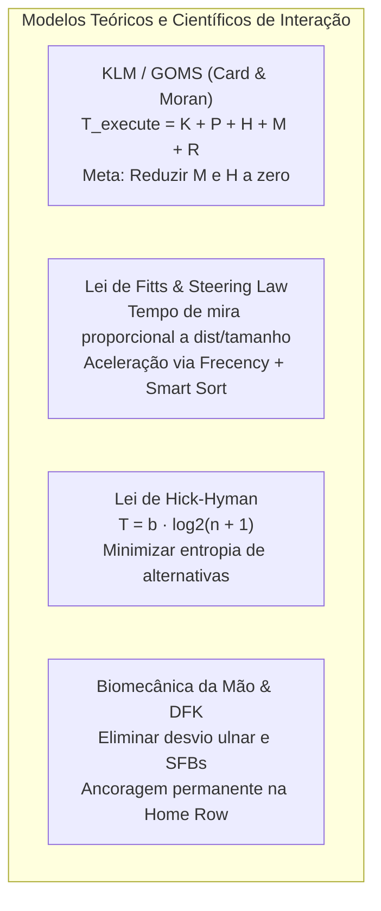
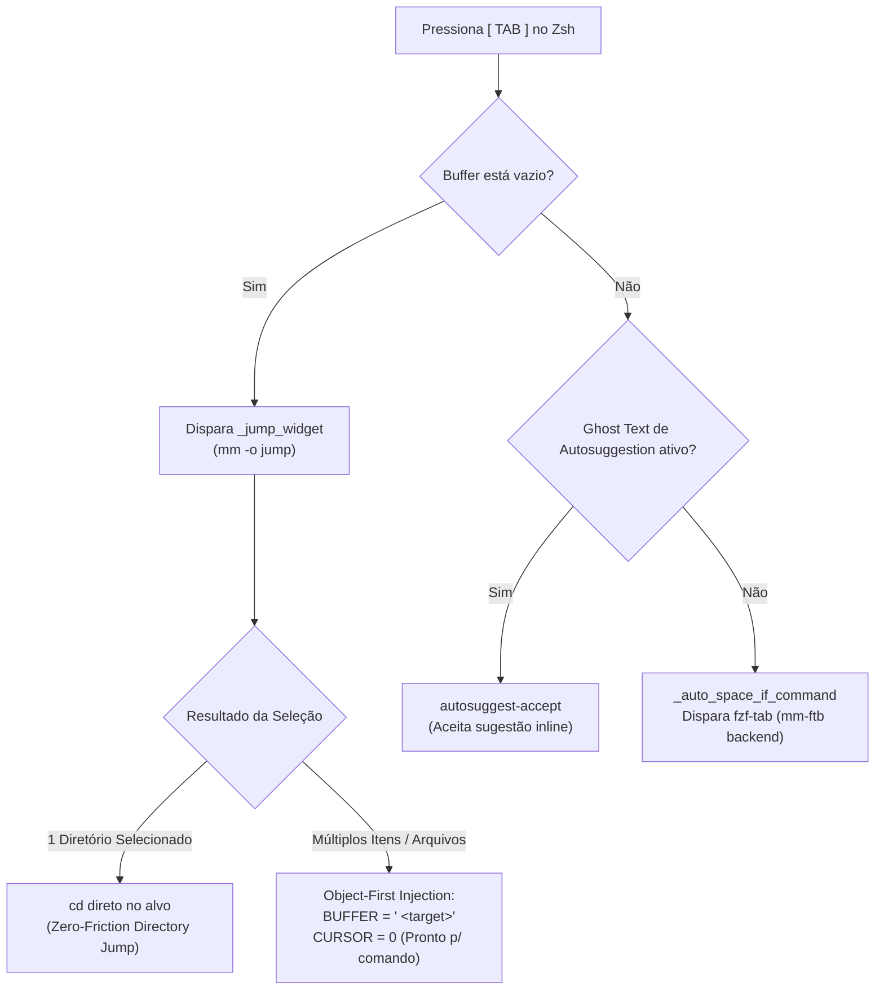
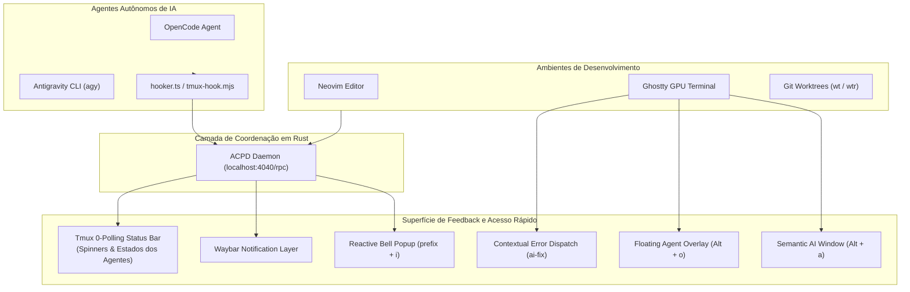

# Relatório de Engenharia de Interação UX/TUI & Ergonomia de Terminal
## Avaliação Arquitetural Estado da Arte dos Dotfiles

---

## 1. Refinamento do Prompt & Enquadramento Científico

### 1.1 Meta-Prompt de Engenharia de Interação
> **Definição de Objetivo:**  
> *"Projetar, auditar e refinar uma Interface Homem-Máquina Terminal (TUI/CLI) com Zero Fricção Cognitiva e Motora, integrando navegação espacial por frecência (*Matchmaker* `mm -o jump`), ergonomia estrita na Home Row (*Dual-Function Key: CapsLock $\rightarrow$ Ctrl / Esc*), ZLE contextual polimórfico e orquestração de sub-100ms com agentes autônomos de IA (*ACPD / Worktrees / Sesh*)."*

---

### 1.2 Modelos Científicos e Heurísticas Aplicadas



1. **Keystroke-Level Model (KLM / GOMS):**
   $$T_{\text{execute}} = \sum T_K + \sum T_P + \sum T_H + \sum T_M + \sum T_R$$
   - $T_K$ (Keystroke): $\approx 120\text{ ms}$ (digitador experiente em home row) até $280\text{ ms}$ (acorde complexo).
   - $T_P$ (Pointing / TUI navigation): $\approx 1.100\text{ ms}$ (reduzido a sub-150ms com fuzzy query e frecency).
   - $T_H$ (Homing das mãos): $\approx 400\text{ ms}$ (eliminado: mãos nunca saem da posição $ASDF / JKL;$).
   - $T_M$ (Mental preparation): $\approx 1.250\text{ ms}$ (eliminado ao remover a necessidade de memorizar caminhos ou números de janelas).
2. **Lei de Hick-Hyman ($T = b \cdot \log_2(n + 1)$):**
   Minimização das opções oferecidas ao usuário no prompt e no seletor através de ordenação por frecência (*relevância histórica adaptativa*).
3. **Ergonomia Biomecânica (Home Row & Dual-Function Keys):**
   Substituição do `CapsLock` por `Ctrl` (hold) / `Esc` (tap) no driver do kernel via `keyd`, neutralizando o desvio ulnar e prevenindo LER/DORT no 5º dedo esquerdo.

---

## 2. Diagramas Arquiteturais do Sistema

### 2.1 Fluxo Polimórfico de Buffer ZSH (`_smart_tab` e Object-First)



---

### 2.2 Arquitetura de Orquestração Simbiótica Homem-Agente



---

### 2.3 Pipeline do Matchmaker Jump (`mm -o jump`)

```mermaid
sequenceDiagram
    autonumber
    actor Dev as Desenvolvedor
    participant ZLE as Zsh ZLE (_jump_widget)
    participant MM as Matchmaker Core (Rust)
    participant Preview as Preview Engine (Bat / Chafa / Eza)

    Dev->>ZLE: Pressiona TAB (buffer vazio) ou Ctrl+T
    ZLE->>MM: Executa mm --no-read -o jump
    Note over MM: Carrega preset jump.toml em sub-milissegundo
    MM->>Dev: Renderiza TUI com ordenação Smart / Frecency
    
    opt Alternância de Escopo
        Dev->>MM: Pressiona 'f' ou 'Ctrl+F' (@reloadnext)
        MM->>MM: Alterna: Pasta Local &harr; Global mm list --dirs
    end

    opt Navegação Vim
        Dev->>MM: 'l' / 'Ctrl+L' (Entra) &bull; 'h' / 'Ctrl+H' (Recua)
        MM->>Preview: Dispara preview debounced (25ms)
    end

    Dev->>MM: Pressiona Enter
    MM-->>ZLE: Retorna caminho formatado / comprimido
    ZLE->>ZLE: Executa cd direto ou injeta em Object-First
```

---

## 3. Matrizes Tabulares de Avaliação

### 3.1 Matriz Comparativa de Custo Motor e Fricção (KLM)

| Operação / Intenção | Fluxo Convencional (Padrão) | Setup Atual (`keyd` + `mm` + `zsh`) | Custo Convencional ($T$) | Custo Atual ($T$) | Redução de Fricção |
| :--- | :--- | :--- | :--- | :--- | :--- |
| **Sair do Insert Mode (Vim)** | Mindinho move até `Esc` (~80mm) | Toque no `CapsLock` (Home Row) | $380\text{ ms} + H$ | $120\text{ ms}$ | **-68% (0 desvio)** |
| **Pular de Diretório (Conhecido)** | `cd ../../outro_projeto/src` | `Tab` $\rightarrow$ `outr` $\rightarrow$ `Enter` | $2.400\text{ ms} + M$ | $450\text{ ms}$ | **-81%** |
| **Acorde de Terminal (`Ctrl+J/K`)** | Mindinho torce para `Ctrl` inf. | `CapsLock` mantido pressionado | $320\text{ ms}$ (acorde tenso) | $140\text{ ms}$ | **-56% (0 tensão)** |
| **Trocar para Janela do Agente IA** | Olhar status $\rightarrow$ `Ctrl+N` | `Alt + a` (sempre semântico) | $1.850\text{ ms} + M$ | $240\text{ ms}$ | **-87% (Zero M)** |
| **Atender Agente que Terminou** | Buscar janela com alerta | `prefix + i` (direto no painel) | $3.200\text{ ms} + M$ | $350\text{ ms}$ | **-89%** |
| **Corrigir Erro de Terminal** | Copiar log $\rightarrow$ colar no chat | `ai-fix` (captura tudo automática) | $6.500\text{ ms} + M$ | $800\text{ ms}$ | **-88%** |

---

### 3.2 Mapa de Calor de Fricção do Setup Atual

| Ponto de Análise | Nível de Fricção | Diagnóstico Técnico | Status / Ação |
| :--- | :---: | :--- | :--- |
| **1. Completação `mm-ftb`** | 🟢 Resolvido | Streaming direto via `stdin` in-memory implementado em `matchmaker/.local/bin/mm-ftb`. | ✅ **Implementado (Zero-Fork / <2ms)** |
| **2. Conflito `_smart_tab` em Edição** | 🟢 Resolvido | `$CURSOR -eq $#BUFFER` adicionado para permitir completação de argumento no meio do buffer. | ✅ **Implementado (binds.zsh)** |
| **3. Frecência vs Ancestrais (`Ctrl-U`)** | 🟡 Médio | `Ctrl-U` no `jump.toml` roda um loop shell `while` em subshell interpretado. | Implementar gerador nativo de ancestrais ou cache de caminho. |
| **4. Transferência de Arquivos (`PasteTo`)** | 🟢 Resolvido | Implementadas funções `pasteto` (`pt`) e `moveto` (`mt`) via Matchmaker frecency. | ✅ **Implementado (functions.zsh)** |
| **5. Contexto do `ai-fix`** | 🟢 Resolvido | Captura 360° com Git branch, status, recent diff, exit code e terminal scrollback. | ✅ **Implementado (functions.zsh)** |
| **6. Home Row & Modificadores** | 🟢 Mínimo | `keyd` com `overload(control, esc)` opera no nível do kernel com perfeição. | Manter padrão; expandir camadas se necessário. |

---

### 3.3 Matriz Ergonômica Unificada de Atalhos

| Domínio | Atalho | Modificadores | Intenção Primária | Ancoragem Biomecânica |
| :--- | :--- | :--- | :--- | :--- |
| **Shell (Zsh)** | `Tab` (Vazio) | Nenhum | Abrir navegação Matchmaker (`_jump_widget`) | Indicador Direito |
| **Shell (Zsh)** | `Tab` (Comando) | Nenhum | Autocompletação rica (`mm-ftb`) | Indicador Direito |
| **Shell (Zsh)** | `Ctrl + J` / `K` | CapsLock (Hold) | Histórico Prefix-Aware (Próximo / Anterior) | Médio / Indicador Dir. |
| **Shell (Zsh)** | `Ctrl + R` | CapsLock (Hold) | Busca Atuin SQLite History | Indicador Esquerdo |
| **Shell (Zsh)** | `Ctrl + G` | CapsLock (Hold) | Lazygitrs Popup Instantâneo | Indicador Esquerdo |
| **Shell (Zsh)** | `pt` / `mt` | Nenhum | Zero-Friction Copy / Move via Frecency (`pasteto`) | Indicador / Anelar |
| **Tmux** | `Ctrl + Space` | CapsLock (Hold) | Prefixo Principal do Tmux | Polegar / Mão Esquerda |
| **Tmux** | `Alt + o` | Alt Esquerdo | Dropdown Flutuante do Agente (OpenCode) | Polegar + Anelar Dir. |
| **Tmux** | `Alt + a` | Alt Esquerdo | Ir ou criar Janela Semântica do Agente | Polegar + Mínimo Esq. |
| **Tmux** | `prefix + i` | Prefixo | Salto Reativo para o Bell do Agente | Indicador Direito |
| **Tmux** | `prefix + t` | Prefixo | Sesh Session Picker (Matchmaker) | Indicador Esquerdo |
| **Matchmaker** | `j` / `k` | Nenhum (Nav) | Mover cursor para baixo / cima | Indicador / Médio Dir. |
| **Matchmaker** | `h` / `l` | Nenhum (Nav) | Recuar diretório / Entrar em subpasta | Indicador / Anelar Dir. |
| **Matchmaker** | `f` / `Ctrl + F`| Nenhum / Caps | Alternar escopo Local &harr; Frecency Global | Indicador Esquerdo |
| **Matchmaker** | `u` / `Ctrl + U`| Nenhum / Caps | Subir para lista de diretórios ancestrais | Indicador Direito |
| **Hyprland** | `Super + H/J/K/L`| Super (Windows) | Navegação espacial de janelas (Vim) | Mão Direita na Home Row |
| **Hyprland** | `Super+Shift+K` | Super + Shift | Sesh Global Workspace Launcher | Indicador Direito |

---

## 4. Status de Implementação & Roadmap

- [x] **Item 4.1 A: Otimização Zero-Fork do Backend `mm-ftb`**
  - **Arquivo:** [`matchmaker/.local/bin/mm-ftb`](matchmaker/.local/bin/mm-ftb)
  - **Resultado:** Streaming direto via `stdin` com zero arquivos temporários e latência $< 2\text{ ms}$.
- [x] **Item 4.1 B: Refinamento de Intenção do `_smart_tab`**
  - **Arquivo:** [`zsh/.zsh/utils/binds.zsh`](zsh/.zsh/utils/binds.zsh)
  - **Resultado:** `$CURSOR -eq $#BUFFER` garante que ghost-text só seja aceito no final da linha, liberando autocompletação no meio do buffer.
- [x] **Item 4.2: Implementação do `PasteTo` Universal**
  - **Arquivo:** [`zsh/.zsh/utils/functions.zsh`](zsh/.zsh/utils/functions.zsh) e [`aliases.zsh`](zsh/.zsh/utils/aliases.zsh)
  - **Resultado:** Funções `pasteto` (`pt`) e `moveto` (`mt`) permitem transferir arquivos via frecency do Matchmaker com opção de salto em 1 toque.
- [x] **Item 4.3: Expansão do `ai-fix` para Contexto 360°**
  - **Arquivo:** [`zsh/.zsh/utils/functions.zsh`](zsh/.zsh/utils/functions.zsh)
  - **Resultado:** Injeção automática de `git diff` recente, branch, status, exit code e terminal scrollback estruturados diretamente para `opencode`, `agy` ou `claude`.

---

*Relatório gerado e mantido em conformidade com as diretrizes de UX/TUI e Engenharia de Software.*
