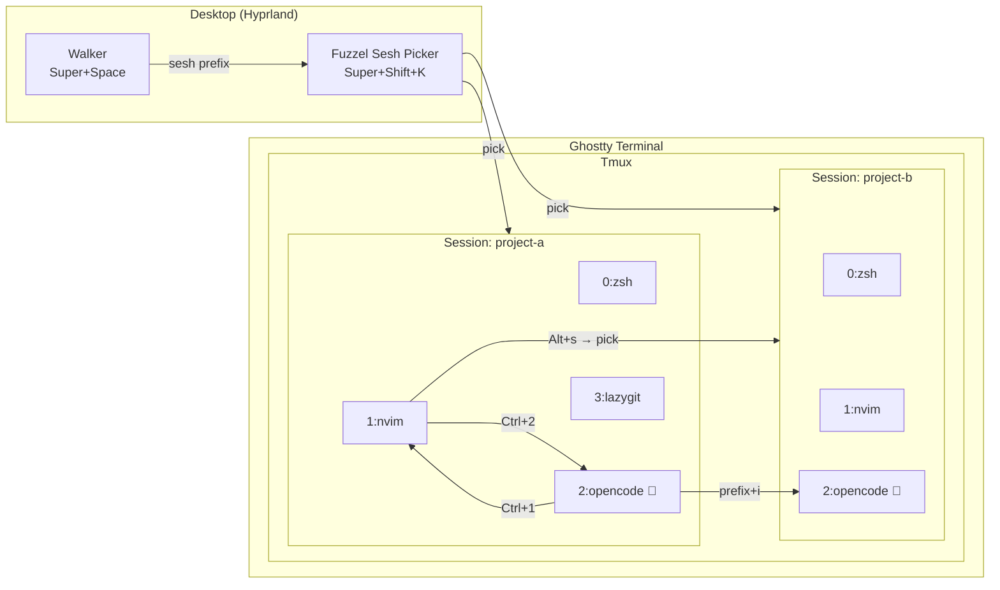
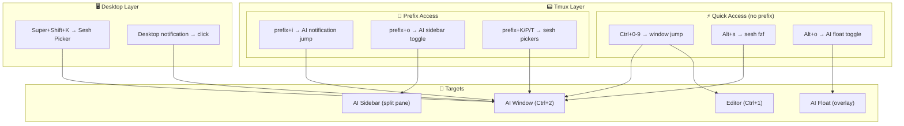
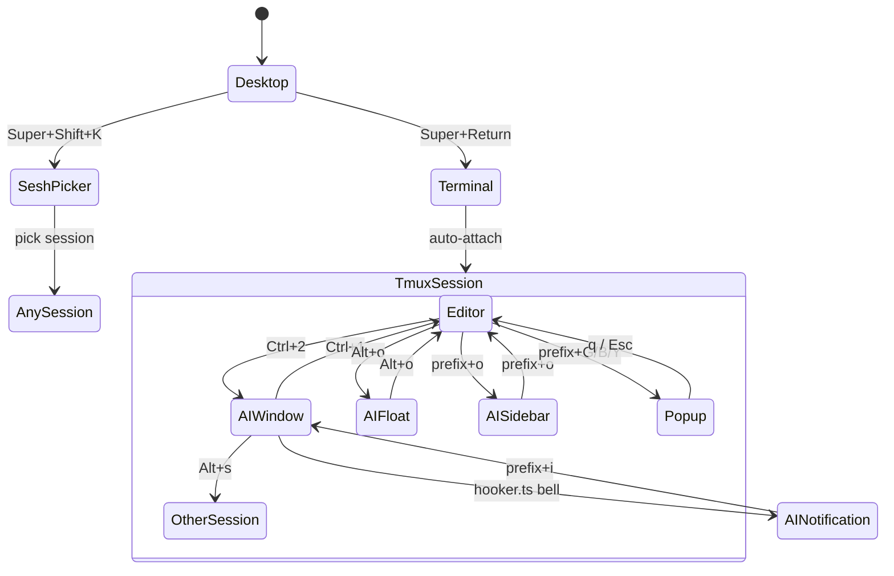

# TUI Workflows for AI Session Navigation

> **Goal**: Get to the app you want without thinking — one keymap, zero friction.

## Table of Contents

- [Current Setup Overview](#current-setup-overview)
- [Navigation Layers](#navigation-layers)
- [Workflow Comparison](#workflow-comparison)
  - [A. Sesh + Tmux Windows (Current)](#a-sesh--tmux-windows-current)
  - [B. Floating Panes (FloaX)](#b-floating-panes-floax)
  - [C. Sidebar Pattern](#c-sidebar-pattern)
  - [D. Desktop Launcher Integration](#d-desktop-launcher-integration)
- [Keypress-to-Screen Matrix](#keypress-to-screen-matrix)
- [Diagrams](#diagrams)
- [Recommendations](#recommendations)

---

## Current Setup Overview

The stack currently spans **4 navigation layers**, each with its own reach:

| Layer | Tool | Scope | Entry Point |
|-------|------|-------|-------------|
| **Desktop** | Hyprland + Walker/Fuzzel | Any app, any workspace | `Super+Space`, `Super+Shift+K` |
| **Terminal** | Ghostty | Spawns tmux context | `Super+Return` |
| **Session** | sesh + tmux | Switch between project sessions | `Alt+s`, `prefix+K/P/T` |
| **Window** | tmux windows | Switch within a session (editor, AI, git, etc.) | `Ctrl+0-9` (no prefix) |

### Current Keybinding Map

```
┌─────────────────────────────────────────────────────────────────┐
│ DESKTOP (Hyprland)                                              │
│  Super+Space ......... Walker launcher (apps, sesh, calc, etc.) │
│  Super+Shift+K ....... Sesh picker via fuzzel/walker            │
│  Super+Return ........ New terminal (ghostty)                   │
│  Super+Alt+Return .... New terminal + tmux new                  │
│  Super+1-9 ........... Switch Hyprland workspace                │
├─────────────────────────────────────────────────────────────────┤
│ TMUX SESSION (sesh)                                             │
│  Alt+s ............... Sesh picker (from zsh, fzf, 40% height)  │
│  prefix+K ............ Sesh picker (gum, small popup)           │
│  prefix+P ............ Sesh picker (fzf, large popup, preview)  │
│  prefix+T ............ Sesh picker (fzf-tmux, 80x70% overlay)  │
│  prefix+L ............ Last session (sesh last)                 │
│  prefix+H / L ....... Prev / next session                      │
├─────────────────────────────────────────────────────────────────┤
│ TMUX WINDOW                                                     │
│  Ctrl+0-9 ........... Jump to window 0-9 (NO prefix)            │
│  prefix+l / h ........ Next / prev window                       │
│  prefix+Tab .......... Last window                              │
│  prefix+i ............ Jump to OpenCode notification window     │
├─────────────────────────────────────────────────────────────────┤
│ TMUX POPUP                                                      │
│  prefix+B ............ btop (90x90%)                            │
│  prefix+G ............ lazygit (90x90%)                         │
│  prefix+Y ............ yazi (90x90%)                            │
│  prefix+N ............ nvim (90x90%)                            │
└─────────────────────────────────────────────────────────────────┘
```

---

## Navigation Layers

```
 ┌──────────────────────────────────────────────────────┐
 │             DESKTOP (Hyprland workspaces)            │
 │  Super+Shift+K → sesh picker (fuzzel/walker)        │
 │  Super+Space   → walker (all apps)                  │
 │                                                      │
 │  ┌──────────────────────────────────────────────┐    │
 │  │         TERMINAL (Ghostty)                   │    │
 │  │                                              │    │
 │  │  ┌──────────────────────────────────────┐    │    │
 │  │  │      TMUX SESSION (sesh)             │    │    │
 │  │  │  Alt+s / prefix+K/P/T → pick        │    │    │
 │  │  │                                      │    │    │
 │  │  │  ┌──────────────────────────────┐    │    │    │
 │  │  │  │    TMUX WINDOWS              │    │    │    │
 │  │  │  │  Ctrl+0-9 → direct jump      │    │    │    │
 │  │  │  │  prefix+i → AI notification   │    │    │    │
 │  │  │  │                              │    │    │    │
 │  │  │  │  [0:zsh] [1:nvim] [2:oc]    │    │    │    │
 │  │  │  │  [3:git] [4:tests] ...      │    │    │    │
 │  │  │  └──────────────────────────────┘    │    │    │
 │  │  └──────────────────────────────────────┘    │    │
 │  └──────────────────────────────────────────────┘    │
 └──────────────────────────────────────────────────────┘
```

---

## Workflow Comparison

### A. Sesh + Tmux Windows (Current)

**Model**: Sessions = projects, Windows = tasks within a project. Direct window jump via `Ctrl+N`.

```
Session: dotfiles          Session: webapp          Session: api
├── 0:zsh                  ├── 0:zsh                ├── 0:zsh
├── 1:nvim                 ├── 1:nvim               ├── 1:nvim
├── 2:opencode ← Ctrl+2   ├── 2:opencode           ├── 2:opencode
├── 3:lazygit              ├── 3:tests              └── 3:lazygit
└── 4:tests                └── 4:lazygit
```

| Metric | Score |
|--------|-------|
| **Keypresses to reach AI** | **1** (Ctrl+2 if in same session) or **2** (Alt+s → pick session, then Ctrl+2) |
| **Context switch cost** | Low — windows preserve scroll, state, CWD |
| **Visual awareness** | Status bar shows window names + OpenCode spinner icon |
| **AI notification** | prefix+i jumps to OpenCode bell window (1 keypress from prefix) |
| **Discovery** | sesh picker shows all sessions with icons; fzf for filtering |
| **Multi-project** | Excellent — each project is an isolated session |

**Strengths**:
- Ctrl+0-9 is instant (no prefix, no picker, no delay)
- OpenCode hooker.ts provides live status in tmux status bar
- `prefix+i` to jump to AI notification = reactive workflow
- sesh picker from desktop (Super+Shift+K) means you can reach any session from anywhere

**Weaknesses**:
- AI chat is a full window — can't see code and AI simultaneously without splits
- Window numbers are positional, not semantic (Ctrl+2 = opencode only if you always open it third)
- No persistent sidebar for AI — must window-switch back and forth

---

### B. Floating Panes (FloaX)

**Model**: AI session floats on top of current work. Toggle with one key. Overlay, not a window.

```
┌──────────────────────────────────────────────┐
│  nvim (editing code)                         │
│                                              │
│  ┌──────────────────────────────┐            │
│  │  FloaX popup: opencode      │            │
│  │  (80x80%, floating pane)    │            │
│  │                              │            │
│  │  > Analyzing your code...   │            │
│  │                              │            │
│  └──────────────────────────────┘            │
│                                              │
└──────────────────────────────────────────────┘
```

| Metric | Score |
|--------|-------|
| **Keypresses to reach AI** | **1** (toggle binding, e.g. `Alt+p`) |
| **Context switch cost** | None — floating, dismiss/toggle instantly |
| **Visual awareness** | Overlay is visible while coding (if semi-transparent) |
| **AI notification** | Can combine with hooker.ts to auto-show on notification |
| **Discovery** | N/A — single purpose overlay |
| **Multi-project** | Limited — floax session is per-attached-client |

**How it would work with current setup**:
```bash
# Add to tmux.conf
set -g @plugin 'omerxx/tmux-floax'
set -g @floax-bind '-n M-o'          # Alt+o toggles AI float
set -g @floax-width '45%'
set -g @floax-height '90%'
set -g @floax-session-name 'ai-float'
set -g @floax-change-path 'true'     # follows project CWD
```

**Strengths**:
- True one-key toggle with no prefix
- Can see underlying code while AI is working (if sized correctly)
- No window management needed — just appears and disappears
- Great for quick questions / inline AI usage

**Weaknesses**:
- Obscures part of the editor when visible
- FloaX uses a separate tmux session (`scratch`) — OpenCode state tracking would need adaptation
- No concept of "sidebar" — it overlays, doesn't live beside
- Can't easily have code + AI visible at the same time for extended work

---

### C. Sidebar Pattern

**Model**: AI lives in a persistent pane beside your editor. Always visible. Think IDE integrated terminal.

```
┌──────────────────────────┬───────────────────┐
│                          │                   │
│  nvim (main editor)      │  opencode         │
│  70% width               │  30% width        │
│                          │                   │
│                          │  > AI response... │
│                          │                   │
│                          │                   │
└──────────────────────────┴───────────────────┘
```

**Implementation approaches**:

#### C1. Manual tmux split
```bash
# Script: ai-sidebar.sh
#!/bin/bash
# Toggle AI sidebar in current window
PANE_COUNT=$(tmux list-panes | wc -l)
if [ "$PANE_COUNT" -gt 1 ]; then
  # Sidebar exists — close it
  tmux kill-pane -t :.+
else
  # Open sidebar with opencode
  tmux split-window -h -l 35% "opencode"
fi
```
```bash
# tmux.conf binding
bind-key o run-shell "~/.local/bin/ai-sidebar.sh"
```

#### C2. Display-popup as pseudo-sidebar
```bash
# tmux.conf — right-anchored popup that acts like a sidebar
bind-key -n M-o display-popup -E -h 100% -w 40% -x R "opencode"
```

#### C3. Dedicated layout via sesh window config
```toml
# sesh.toml — every project auto-creates an AI window
[default_session]
startup_command = "nvim"

[[window]]
name = "ai"
startup_command = "opencode"
```

| Metric | Score |
|--------|-------|
| **Keypresses to reach AI** | **0** (always visible) or **1** (toggle sidebar pane) |
| **Context switch cost** | Zero — code and AI are on screen together |
| **Visual awareness** | Maximum — see AI state while editing |
| **AI notification** | Not needed — you see it happen |
| **Discovery** | N/A — permanent fixture |
| **Multi-project** | Each session has its own sidebar pane |

**Strengths**:
- No context switching at all — code and AI live side by side
- Can read AI output while continuing to edit
- Natural "pair programming" feel
- Tmux pane resizing (`prefix+Ctrl+Shift+H/L`) adjusts the split dynamically

**Weaknesses**:
- Eats screen real estate permanently (35% of width)
- On smaller monitors (<27"), code area becomes cramped
- Pane state can be lost if you accidentally close it
- Not as clean as a dedicated window for long AI conversations

---

### D. Desktop Launcher Integration

**Model**: AI sessions reachable from the desktop layer without touching tmux first.

#### D1. Omarchy (Arch Linux) — Walker/Fuzzel

Already configured! `Super+Shift+K` → fuzzel/walker sesh picker.

```
Walker (Super+Space)
├── type "sesh " → sesh plugin activates
│   └── pick session → sesh connect → ghostty + tmux
├── type app name → launch app
└── type "=" → calculator
```

The `omarchy-launch-sesh` script handles the flow:
1. Lists sessions via `sesh list -d -c -t -T -z`
2. Shows in fuzzel (or walker dmenu fallback)
3. If session exists → `sesh connect --switch`
4. If new → spawns ghostty + sesh connect

#### D2. GNOME (Red Hat / Fedora) — Switcher Extension

For GNOME desktops, the **Switcher** extension provides a similar app-level launcher:

| Feature | Walker (Omarchy) | GNOME Switcher |
|---------|-------------------|---------------|
| Session picker | `sesh ` prefix in walker | Custom script via `gnome-extensions` |
| Keybinding | `Super+Space` / `Super+Shift+K` | `Super+W` (default) or custom |
| Integration | Native (walker plugin for sesh) | Needs wrapper script |
| Preview | Walker theme, icons | Plain text list |

**GNOME integration script**:
```bash
#!/bin/bash
# ~/.local/bin/gnome-sesh-picker
# Use with: gnome keyboard shortcut → this script
selection=$(sesh list -d -c -t -T -z | rofi -dmenu -p "Sesh" -theme-str 'window {width: 40%;}')
[ -z "$selection" ] && exit 0
sesh connect --switch -- "$selection" 2>/dev/null && exit 0
# If not attached to tmux, open terminal + sesh
gnome-terminal -- sesh connect -- "$selection"
```

| Metric | Score |
|--------|-------|
| **Keypresses to reach AI** | **2** (Super+Shift+K → pick AI session) |
| **Context switch cost** | Medium — desktop-level jump, new focus context |
| **Visual awareness** | None until you land in the session |
| **AI notification** | Desktop notification via hooker.ts (already works) |
| **Discovery** | Full session list with fuzzel/walker/rofi |
| **Multi-project** | Excellent — any session reachable from desktop |

---

## Keypress-to-Screen Matrix

How many keypresses to reach each target from each starting context:

| From ↓ / To → | Same-session AI window | Other-session AI | AI float/sidebar | Desktop app |
|----------------|----------------------|-----------------|-----------------|-------------|
| **Editing in nvim** | 1 (`Ctrl+2`) | 2 (`Alt+s` → pick) | 1 (`Alt+o` toggle) | 2 (`Super+Shift+X`) |
| **Different tmux session** | 2 (`Alt+s` → pick, `Ctrl+2`) | 2 (`Alt+s` → pick) | 1 (`Alt+o`) | 2 |
| **Desktop (no terminal focus)** | 2 (`Super+Shift+K` → pick) | 2 | 3 | 1 |
| **AI responding (notification)** | 1 (`prefix+i`) | 1 (`prefix+i`) | 0 (visible) | 1 (desktop notif click) |

### Verdict: Which Pattern for Which Situation?

```
┌─────────────────────────────────────────────────────────────┐
│                 DECISION TREE                                │
│                                                              │
│  Need to see code + AI simultaneously?                       │
│  ├── YES, extended work ──→ SIDEBAR (C)                      │
│  ├── YES, quick question ──→ FLOAT (B)                       │
│  └── NO                                                      │
│      ├── Same project? ──→ CTRL+N WINDOW (A)                 │
│      └── Different project? ──→ SESH PICKER (A/D)            │
│                                                              │
│  Want AI always visible?                                     │
│  ├── YES ──→ SIDEBAR (C)                                     │
│  └── NO ──→ WINDOW (A) + notifications (prefix+i)           │
│                                                              │
│  Small monitor (<24")?                                       │
│  ├── YES ──→ FLOAT (B) or WINDOW (A)                         │
│  └── NO ──→ SIDEBAR (C)                                      │
└─────────────────────────────────────────────────────────────┘
```

---

## Diagrams

### Current Workflow (Sesh + Windows)



### Proposed Hybrid Workflow



### State Transitions: Where Am I → Where Do I Want To Go



---

## Recommendations

### Minimum Change — Maximum Impact

The current setup already has excellent navigation. The single highest-leverage additions:

1. **Add FloaX for quick AI overlay** (`Alt+o`) — keeps current window system but adds a fast toggle for quick AI questions without leaving your editor view.

2. **Standardize AI window position** — Use sesh `[[wildcard]]` config to always create opencode as window 2:
   ```toml
   [[wildcard]]
   pattern = "~/*"
   windows = ["ai"]

   [[window]]
   name = "ai"
   startup_command = "opencode"
   ```
   Now `Ctrl+2` = AI in EVERY project. Muscle memory, no thinking.

3. **Add sidebar toggle script** for extended code+AI sessions on large monitors.

### Full Integration Map (All Patterns Combined)

| Binding | Action | Pattern | When |
|---------|--------|---------|------|
| `Ctrl+2` | Jump to AI window | A (window) | Same session, quick switch |
| `Alt+o` | Toggle AI float | B (float) | Quick question, small screen |
| `prefix+o` | Toggle AI sidebar | C (sidebar) | Extended pair programming |
| `Alt+s` | Sesh picker | A (session) | Different project |
| `prefix+i` | AI notification jump | A (window) | Reactive — AI finished |
| `Super+Shift+K` | Desktop sesh picker | D (desktop) | From any desktop context |

This gives you **every pattern accessible by muscle memory**, each optimized for a different situation.

---

## Platform Notes

### Omarchy (Arch Linux)
- Walker + fuzzel for desktop-level session picking ✅ (already configured)
- `omarchy-launch-sesh` script handles the fuzzel→sesh flow ✅

### GNOME (Red Hat / Fedora)
- Use **rofi** or **dmenu** as fuzzel replacement
- GNOME **Switcher** extension (`Super+W`) provides app-level fuzzy search
- For sesh integration: bind a keyboard shortcut to `gnome-sesh-picker` script (see Desktop Launcher Integration section)
- Native GNOME Activities (`Super`) can also be configured with custom search providers

### Common (Both Platforms)
- tmux + sesh + ghostty workflow is identical
- hooker.ts desktop notifications work on both (libnotify)
- `Ctrl+0-9` window switching is terminal-agnostic (uses CSI u sequences from ghostty)
